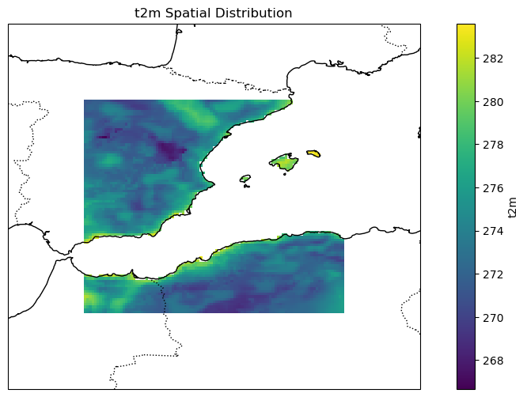

# Part 2: Aggregation via Fishnet


<!-- WARNING: THIS FILE WAS AUTOGENERATED! DO NOT EDIT! -->

``` python
import geopandas as gpd
import os 
import glob
# xarray makes working with labelled multi-dimensional arrays in Python simple, efficient, and fun!
import xarray
# The rioxarray package is an extension of xarray designed
# for working with raster (geospatial) data in Python. 
# It provides an easy way to read, write, and manipulate GeoTIFF and other raster formats while maintaining spatial metadata.
import rioxarray
# for geometric operations on vector data (points, lines, polygons). It allows users to create, manipulate, and analyze geometric shapes in 2D space
import shapely
from shapely.geometry import Polygon
import numpy
# you need to install gdal here, not osgeo
# gdal is generally a translator library for raster and vector geospatial data formats
from osgeo import gdal, ogr
```

``` python
# create a fishnet grid using GDAL
def make_fishnet(outputGridfn,xmin,xmax,ymin,ymax,rows,cols):
    # Calculate grid parameters
    xmin = float(xmin)
    xmax = float(xmax)
    ymin = float(ymin)
    ymax = float(ymax)
    gridWidth = float((xmax-xmin) / cols)
    gridHeight = float((ymax-ymin) / rows)

    # Start grid cell envelope
    ringXleftOrigin = xmin
    ringXrightOrigin = xmin + gridWidth
    ringYtopOrigin = ymax
    ringYbottomOrigin = ymax-gridHeight

    # Create the output shapefile
    outDriver = ogr.GetDriverByName('ESRI Shapefile')
    if os.path.exists(outputGridfn):
        os.remove(outputGridfn)
    outDataSource = outDriver.CreateDataSource(outputGridfn)
    outLayer = outDataSource.CreateLayer(outputGridfn, geom_type=ogr.wkbPolygon)
    # Add fields to the layer
    featureDefn = outLayer.GetLayerDefn()

    # Create grid cells
    countcols = 0
    while countcols < cols:
        countcols += 1

        # Reset envelope for rows
        ringYtop = ringYtopOrigin
        ringYbottom =ringYbottomOrigin
        countrows = 0

        while countrows < rows:
            countrows += 1
            ring = ogr.Geometry(ogr.wkbLinearRing)
            ring.AddPoint(ringXleftOrigin, ringYtop)
            ring.AddPoint(ringXrightOrigin, ringYtop)
            ring.AddPoint(ringXrightOrigin, ringYbottom)
            ring.AddPoint(ringXleftOrigin, ringYbottom)
            ring.AddPoint(ringXleftOrigin, ringYtop)
            poly = ogr.Geometry(ogr.wkbPolygon)
            poly.AddGeometry(ring)

            # Add new geom to layer
            outFeature = ogr.Feature(featureDefn)
            outFeature.SetGeometry(poly)
            outLayer.CreateFeature(outFeature)
            outFeature = None

            # New envelope for next poly
            ringYtop = ringYtop - gridHeight
            ringYbottom = ringYbottom - gridHeight

        # New envelope for next poly
        ringXleftOrigin = ringXleftOrigin + gridWidth
        ringXrightOrigin = ringXrightOrigin + gridWidth

    # Save and close DataSources
    outDataSource = None
```

``` python
from pyprojroot import here
```

``` python
era_dir = here("data/ERA5_out")
```

``` python
temp_file = xarray.open_dataset(os.path.join(era_dir, "2000_01.nc"), decode_coords="all")
```

``` python
t0='2000-01-01T00:00:00.000000000'
temp_file['t2m']['valid_time'][0]
```

<div><svg style="position: absolute; width: 0; height: 0; overflow: hidden">
<defs>
<symbol id="icon-database" viewBox="0 0 32 32">
<path d="M16 0c-8.837 0-16 2.239-16 5v4c0 2.761 7.163 5 16 5s16-2.239 16-5v-4c0-2.761-7.163-5-16-5z"></path>
<path d="M16 17c-8.837 0-16-2.239-16-5v6c0 2.761 7.163 5 16 5s16-2.239 16-5v-6c0 2.761-7.163 5-16 5z"></path>
<path d="M16 26c-8.837 0-16-2.239-16-5v6c0 2.761 7.163 5 16 5s16-2.239 16-5v-6c0 2.761-7.163 5-16 5z"></path>
</symbol>
<symbol id="icon-file-text2" viewBox="0 0 32 32">
<path d="M28.681 7.159c-0.694-0.947-1.662-2.053-2.724-3.116s-2.169-2.030-3.116-2.724c-1.612-1.182-2.393-1.319-2.841-1.319h-15.5c-1.378 0-2.5 1.121-2.5 2.5v27c0 1.378 1.122 2.5 2.5 2.5h23c1.378 0 2.5-1.122 2.5-2.5v-19.5c0-0.448-0.137-1.23-1.319-2.841zM24.543 5.457c0.959 0.959 1.712 1.825 2.268 2.543h-4.811v-4.811c0.718 0.556 1.584 1.309 2.543 2.268zM28 29.5c0 0.271-0.229 0.5-0.5 0.5h-23c-0.271 0-0.5-0.229-0.5-0.5v-27c0-0.271 0.229-0.5 0.5-0.5 0 0 15.499-0 15.5 0v7c0 0.552 0.448 1 1 1h7v19.5z"></path>
<path d="M23 26h-14c-0.552 0-1-0.448-1-1s0.448-1 1-1h14c0.552 0 1 0.448 1 1s-0.448 1-1 1z"></path>
<path d="M23 22h-14c-0.552 0-1-0.448-1-1s0.448-1 1-1h14c0.552 0 1 0.448 1 1s-0.448 1-1 1z"></path>
<path d="M23 18h-14c-0.552 0-1-0.448-1-1s0.448-1 1-1h14c0.552 0 1 0.448 1 1s-0.448 1-1 1z"></path>
</symbol>
</defs>
</svg>
<style>/* CSS stylesheet for displaying xarray objects in jupyterlab.
 *
 */
&#10;:root {
  --xr-font-color0: var(--jp-content-font-color0, rgba(0, 0, 0, 1));
  --xr-font-color2: var(--jp-content-font-color2, rgba(0, 0, 0, 0.54));
  --xr-font-color3: var(--jp-content-font-color3, rgba(0, 0, 0, 0.38));
  --xr-border-color: var(--jp-border-color2, #e0e0e0);
  --xr-disabled-color: var(--jp-layout-color3, #bdbdbd);
  --xr-background-color: var(--jp-layout-color0, white);
  --xr-background-color-row-even: var(--jp-layout-color1, white);
  --xr-background-color-row-odd: var(--jp-layout-color2, #eeeeee);
}
&#10;html[theme="dark"],
html[data-theme="dark"],
body[data-theme="dark"],
body.vscode-dark {
  --xr-font-color0: rgba(255, 255, 255, 1);
  --xr-font-color2: rgba(255, 255, 255, 0.54);
  --xr-font-color3: rgba(255, 255, 255, 0.38);
  --xr-border-color: #1f1f1f;
  --xr-disabled-color: #515151;
  --xr-background-color: #111111;
  --xr-background-color-row-even: #111111;
  --xr-background-color-row-odd: #313131;
}
&#10;.xr-wrap {
  display: block !important;
  min-width: 300px;
  max-width: 700px;
}
&#10;.xr-text-repr-fallback {
  /* fallback to plain text repr when CSS is not injected (untrusted notebook) */
  display: none;
}
&#10;.xr-header {
  padding-top: 6px;
  padding-bottom: 6px;
  margin-bottom: 4px;
  border-bottom: solid 1px var(--xr-border-color);
}
&#10;.xr-header > div,
.xr-header > ul {
  display: inline;
  margin-top: 0;
  margin-bottom: 0;
}
&#10;.xr-obj-type,
.xr-array-name {
  margin-left: 2px;
  margin-right: 10px;
}
&#10;.xr-obj-type {
  color: var(--xr-font-color2);
}
&#10;.xr-sections {
  padding-left: 0 !important;
  display: grid;
  grid-template-columns: 150px auto auto 1fr 0 20px 0 20px;
}
&#10;.xr-section-item {
  display: contents;
}
&#10;.xr-section-item input {
  display: inline-block;
  opacity: 0;
  height: 0;
}
&#10;.xr-section-item input + label {
  color: var(--xr-disabled-color);
}
&#10;.xr-section-item input:enabled + label {
  cursor: pointer;
  color: var(--xr-font-color2);
}
&#10;.xr-section-item input:focus + label {
  border: 2px solid var(--xr-font-color0);
}
&#10;.xr-section-item input:enabled + label:hover {
  color: var(--xr-font-color0);
}
&#10;.xr-section-summary {
  grid-column: 1;
  color: var(--xr-font-color2);
  font-weight: 500;
}
&#10;.xr-section-summary > span {
  display: inline-block;
  padding-left: 0.5em;
}
&#10;.xr-section-summary-in:disabled + label {
  color: var(--xr-font-color2);
}
&#10;.xr-section-summary-in + label:before {
  display: inline-block;
  content: "►";
  font-size: 11px;
  width: 15px;
  text-align: center;
}
&#10;.xr-section-summary-in:disabled + label:before {
  color: var(--xr-disabled-color);
}
&#10;.xr-section-summary-in:checked + label:before {
  content: "▼";
}
&#10;.xr-section-summary-in:checked + label > span {
  display: none;
}
&#10;.xr-section-summary,
.xr-section-inline-details {
  padding-top: 4px;
  padding-bottom: 4px;
}
&#10;.xr-section-inline-details {
  grid-column: 2 / -1;
}
&#10;.xr-section-details {
  display: none;
  grid-column: 1 / -1;
  margin-bottom: 5px;
}
&#10;.xr-section-summary-in:checked ~ .xr-section-details {
  display: contents;
}
&#10;.xr-array-wrap {
  grid-column: 1 / -1;
  display: grid;
  grid-template-columns: 20px auto;
}
&#10;.xr-array-wrap > label {
  grid-column: 1;
  vertical-align: top;
}
&#10;.xr-preview {
  color: var(--xr-font-color3);
}
&#10;.xr-array-preview,
.xr-array-data {
  padding: 0 5px !important;
  grid-column: 2;
}
&#10;.xr-array-data,
.xr-array-in:checked ~ .xr-array-preview {
  display: none;
}
&#10;.xr-array-in:checked ~ .xr-array-data,
.xr-array-preview {
  display: inline-block;
}
&#10;.xr-dim-list {
  display: inline-block !important;
  list-style: none;
  padding: 0 !important;
  margin: 0;
}
&#10;.xr-dim-list li {
  display: inline-block;
  padding: 0;
  margin: 0;
}
&#10;.xr-dim-list:before {
  content: "(";
}
&#10;.xr-dim-list:after {
  content: ")";
}
&#10;.xr-dim-list li:not(:last-child):after {
  content: ",";
  padding-right: 5px;
}
&#10;.xr-has-index {
  font-weight: bold;
}
&#10;.xr-var-list,
.xr-var-item {
  display: contents;
}
&#10;.xr-var-item > div,
.xr-var-item label,
.xr-var-item > .xr-var-name span {
  background-color: var(--xr-background-color-row-even);
  margin-bottom: 0;
}
&#10;.xr-var-item > .xr-var-name:hover span {
  padding-right: 5px;
}
&#10;.xr-var-list > li:nth-child(odd) > div,
.xr-var-list > li:nth-child(odd) > label,
.xr-var-list > li:nth-child(odd) > .xr-var-name span {
  background-color: var(--xr-background-color-row-odd);
}
&#10;.xr-var-name {
  grid-column: 1;
}
&#10;.xr-var-dims {
  grid-column: 2;
}
&#10;.xr-var-dtype {
  grid-column: 3;
  text-align: right;
  color: var(--xr-font-color2);
}
&#10;.xr-var-preview {
  grid-column: 4;
}
&#10;.xr-index-preview {
  grid-column: 2 / 5;
  color: var(--xr-font-color2);
}
&#10;.xr-var-name,
.xr-var-dims,
.xr-var-dtype,
.xr-preview,
.xr-attrs dt {
  white-space: nowrap;
  overflow: hidden;
  text-overflow: ellipsis;
  padding-right: 10px;
}
&#10;.xr-var-name:hover,
.xr-var-dims:hover,
.xr-var-dtype:hover,
.xr-attrs dt:hover {
  overflow: visible;
  width: auto;
  z-index: 1;
}
&#10;.xr-var-attrs,
.xr-var-data,
.xr-index-data {
  display: none;
  background-color: var(--xr-background-color) !important;
  padding-bottom: 5px !important;
}
&#10;.xr-var-attrs-in:checked ~ .xr-var-attrs,
.xr-var-data-in:checked ~ .xr-var-data,
.xr-index-data-in:checked ~ .xr-index-data {
  display: block;
}
&#10;.xr-var-data > table {
  float: right;
}
&#10;.xr-var-name span,
.xr-var-data,
.xr-index-name div,
.xr-index-data,
.xr-attrs {
  padding-left: 25px !important;
}
&#10;.xr-attrs,
.xr-var-attrs,
.xr-var-data,
.xr-index-data {
  grid-column: 1 / -1;
}
&#10;dl.xr-attrs {
  padding: 0;
  margin: 0;
  display: grid;
  grid-template-columns: 125px auto;
}
&#10;.xr-attrs dt,
.xr-attrs dd {
  padding: 0;
  margin: 0;
  float: left;
  padding-right: 10px;
  width: auto;
}
&#10;.xr-attrs dt {
  font-weight: normal;
  grid-column: 1;
}
&#10;.xr-attrs dt:hover span {
  display: inline-block;
  background: var(--xr-background-color);
  padding-right: 10px;
}
&#10;.xr-attrs dd {
  grid-column: 2;
  white-space: pre-wrap;
  word-break: break-all;
}
&#10;.xr-icon-database,
.xr-icon-file-text2,
.xr-no-icon {
  display: inline-block;
  vertical-align: middle;
  width: 1em;
  height: 1.5em !important;
  stroke-width: 0;
  stroke: currentColor;
  fill: currentColor;
}
</style><pre class='xr-text-repr-fallback'>&lt;xarray.DataArray &#x27;valid_time&#x27; (valid_time: 744)&gt; Size: 6kB
array([&#x27;2000-01-01T00:00:00.000000000&#x27;, &#x27;2000-01-01T01:00:00.000000000&#x27;,
       &#x27;2000-01-01T02:00:00.000000000&#x27;, ..., &#x27;2000-01-31T21:00:00.000000000&#x27;,
       &#x27;2000-01-31T22:00:00.000000000&#x27;, &#x27;2000-01-31T23:00:00.000000000&#x27;],
      shape=(744,), dtype=&#x27;datetime64[ns]&#x27;)
Coordinates:
    number      int64 8B ...
  * valid_time  (valid_time) datetime64[ns] 6kB 2000-01-01 ... 2000-01-31T23:...
    expver      (valid_time) &lt;U4 12kB ...
Attributes:
    long_name:      time
    standard_name:  time</pre><div class='xr-wrap' style='display:none'><div class='xr-header'><div class='xr-obj-type'>xarray.DataArray</div><div class='xr-array-name'>'valid_time'</div><ul class='xr-dim-list'><li><span class='xr-has-index'>valid_time</span>: 744</li></ul></div><ul class='xr-sections'><li class='xr-section-item'><div class='xr-array-wrap'><input id='section-24e034a7-17bc-4371-ac57-0536258655bc' class='xr-array-in' type='checkbox' checked><label for='section-24e034a7-17bc-4371-ac57-0536258655bc' title='Show/hide data repr'><svg class='icon xr-icon-database'><use xlink:href='#icon-database'></use></svg></label><div class='xr-array-preview xr-preview'><span>2000-01-01 2000-01-01T01:00:00 ... 2000-01-31T23:00:00</span></div><div class='xr-array-data'><pre>array([&#x27;2000-01-01T00:00:00.000000000&#x27;, &#x27;2000-01-01T01:00:00.000000000&#x27;,
       &#x27;2000-01-01T02:00:00.000000000&#x27;, ..., &#x27;2000-01-31T21:00:00.000000000&#x27;,
       &#x27;2000-01-31T22:00:00.000000000&#x27;, &#x27;2000-01-31T23:00:00.000000000&#x27;],
      shape=(744,), dtype=&#x27;datetime64[ns]&#x27;)</pre></div></div></li><li class='xr-section-item'><input id='section-a4229369-604d-4aef-9d5d-4deaf948ce88' class='xr-section-summary-in' type='checkbox'  checked><label for='section-a4229369-604d-4aef-9d5d-4deaf948ce88' class='xr-section-summary' >Coordinates: <span>(3)</span></label><div class='xr-section-inline-details'></div><div class='xr-section-details'><ul class='xr-var-list'><li class='xr-var-item'><div class='xr-var-name'><span>number</span></div><div class='xr-var-dims'>()</div><div class='xr-var-dtype'>int64</div><div class='xr-var-preview xr-preview'>...</div><input id='attrs-b893011c-228d-4eff-a4bd-4abb5622f4b5' class='xr-var-attrs-in' type='checkbox' ><label for='attrs-b893011c-228d-4eff-a4bd-4abb5622f4b5' title='Show/Hide attributes'><svg class='icon xr-icon-file-text2'><use xlink:href='#icon-file-text2'></use></svg></label><input id='data-984b658b-6a2d-46fb-98fe-89037c2fe876' class='xr-var-data-in' type='checkbox'><label for='data-984b658b-6a2d-46fb-98fe-89037c2fe876' title='Show/Hide data repr'><svg class='icon xr-icon-database'><use xlink:href='#icon-database'></use></svg></label><div class='xr-var-attrs'><dl class='xr-attrs'><dt><span>long_name :</span></dt><dd>ensemble member numerical id</dd><dt><span>units :</span></dt><dd>1</dd><dt><span>standard_name :</span></dt><dd>realization</dd></dl></div><div class='xr-var-data'><pre>[1 values with dtype=int64]</pre></div></li><li class='xr-var-item'><div class='xr-var-name'><span class='xr-has-index'>valid_time</span></div><div class='xr-var-dims'>(valid_time)</div><div class='xr-var-dtype'>datetime64[ns]</div><div class='xr-var-preview xr-preview'>2000-01-01 ... 2000-01-31T23:00:00</div><input id='attrs-7594028c-3914-411b-a0a7-6583133e2414' class='xr-var-attrs-in' type='checkbox' ><label for='attrs-7594028c-3914-411b-a0a7-6583133e2414' title='Show/Hide attributes'><svg class='icon xr-icon-file-text2'><use xlink:href='#icon-file-text2'></use></svg></label><input id='data-ebea299c-ac08-4587-9c84-062637093c4b' class='xr-var-data-in' type='checkbox'><label for='data-ebea299c-ac08-4587-9c84-062637093c4b' title='Show/Hide data repr'><svg class='icon xr-icon-database'><use xlink:href='#icon-database'></use></svg></label><div class='xr-var-attrs'><dl class='xr-attrs'><dt><span>long_name :</span></dt><dd>time</dd><dt><span>standard_name :</span></dt><dd>time</dd></dl></div><div class='xr-var-data'><pre>array([&#x27;2000-01-01T00:00:00.000000000&#x27;, &#x27;2000-01-01T01:00:00.000000000&#x27;,
       &#x27;2000-01-01T02:00:00.000000000&#x27;, ..., &#x27;2000-01-31T21:00:00.000000000&#x27;,
       &#x27;2000-01-31T22:00:00.000000000&#x27;, &#x27;2000-01-31T23:00:00.000000000&#x27;],
      shape=(744,), dtype=&#x27;datetime64[ns]&#x27;)</pre></div></li><li class='xr-var-item'><div class='xr-var-name'><span>expver</span></div><div class='xr-var-dims'>(valid_time)</div><div class='xr-var-dtype'>&lt;U4</div><div class='xr-var-preview xr-preview'>...</div><input id='attrs-8ea1ae2e-6bc7-4f38-9fd8-e8a4ff8406bc' class='xr-var-attrs-in' type='checkbox' disabled><label for='attrs-8ea1ae2e-6bc7-4f38-9fd8-e8a4ff8406bc' title='Show/Hide attributes'><svg class='icon xr-icon-file-text2'><use xlink:href='#icon-file-text2'></use></svg></label><input id='data-efc0b79e-85a7-43ae-8ae3-3ef354de2912' class='xr-var-data-in' type='checkbox'><label for='data-efc0b79e-85a7-43ae-8ae3-3ef354de2912' title='Show/Hide data repr'><svg class='icon xr-icon-database'><use xlink:href='#icon-database'></use></svg></label><div class='xr-var-attrs'><dl class='xr-attrs'></dl></div><div class='xr-var-data'><pre>[744 values with dtype=&lt;U4]</pre></div></li></ul></div></li><li class='xr-section-item'><input id='section-8aaa0cd0-1591-44eb-b5f5-406a485f5fca' class='xr-section-summary-in' type='checkbox'  ><label for='section-8aaa0cd0-1591-44eb-b5f5-406a485f5fca' class='xr-section-summary' >Indexes: <span>(1)</span></label><div class='xr-section-inline-details'></div><div class='xr-section-details'><ul class='xr-var-list'><li class='xr-var-item'><div class='xr-index-name'><div>valid_time</div></div><div class='xr-index-preview'>PandasIndex</div><input type='checkbox' disabled/><label></label><input id='index-6fb7ef54-7e75-4b59-8044-e99ecce66187' class='xr-index-data-in' type='checkbox'/><label for='index-6fb7ef54-7e75-4b59-8044-e99ecce66187' title='Show/Hide index repr'><svg class='icon xr-icon-database'><use xlink:href='#icon-database'></use></svg></label><div class='xr-index-data'><pre>PandasIndex(DatetimeIndex([&#x27;2000-01-01 00:00:00&#x27;, &#x27;2000-01-01 01:00:00&#x27;,
               &#x27;2000-01-01 02:00:00&#x27;, &#x27;2000-01-01 03:00:00&#x27;,
               &#x27;2000-01-01 04:00:00&#x27;, &#x27;2000-01-01 05:00:00&#x27;,
               &#x27;2000-01-01 06:00:00&#x27;, &#x27;2000-01-01 07:00:00&#x27;,
               &#x27;2000-01-01 08:00:00&#x27;, &#x27;2000-01-01 09:00:00&#x27;,
               ...
               &#x27;2000-01-31 14:00:00&#x27;, &#x27;2000-01-31 15:00:00&#x27;,
               &#x27;2000-01-31 16:00:00&#x27;, &#x27;2000-01-31 17:00:00&#x27;,
               &#x27;2000-01-31 18:00:00&#x27;, &#x27;2000-01-31 19:00:00&#x27;,
               &#x27;2000-01-31 20:00:00&#x27;, &#x27;2000-01-31 21:00:00&#x27;,
               &#x27;2000-01-31 22:00:00&#x27;, &#x27;2000-01-31 23:00:00&#x27;],
              dtype=&#x27;datetime64[ns]&#x27;, name=&#x27;valid_time&#x27;, length=744, freq=None))</pre></div></li></ul></div></li><li class='xr-section-item'><input id='section-1dd4f7b0-bf71-414c-91f6-7e75ee020fe1' class='xr-section-summary-in' type='checkbox'  checked><label for='section-1dd4f7b0-bf71-414c-91f6-7e75ee020fe1' class='xr-section-summary' >Attributes: <span>(2)</span></label><div class='xr-section-inline-details'></div><div class='xr-section-details'><dl class='xr-attrs'><dt><span>long_name :</span></dt><dd>time</dd><dt><span>standard_name :</span></dt><dd>time</dd></dl></div></li></ul></div></div>

``` python
list(temp_file['t2m']['valid_time'].data)
```

    [np.datetime64('2000-01-01T00:00:00.000000000'),
     np.datetime64('2000-01-01T01:00:00.000000000'),
     np.datetime64('2000-01-01T02:00:00.000000000'),
     np.datetime64('2000-01-01T03:00:00.000000000'),
     np.datetime64('2000-01-01T04:00:00.000000000'),
     np.datetime64('2000-01-01T05:00:00.000000000'),
     np.datetime64('2000-01-01T06:00:00.000000000'),
     np.datetime64('2000-01-01T07:00:00.000000000'),
     np.datetime64('2000-01-01T08:00:00.000000000'),
     np.datetime64('2000-01-01T09:00:00.000000000'),
     np.datetime64('2000-01-01T10:00:00.000000000'),
     np.datetime64('2000-01-01T11:00:00.000000000'),
     np.datetime64('2000-01-01T12:00:00.000000000'),
     np.datetime64('2000-01-01T13:00:00.000000000'),
     np.datetime64('2000-01-01T14:00:00.000000000'),
     np.datetime64('2000-01-01T15:00:00.000000000'),
     np.datetime64('2000-01-01T16:00:00.000000000'),
     np.datetime64('2000-01-01T17:00:00.000000000'),
     np.datetime64('2000-01-01T18:00:00.000000000'),
     np.datetime64('2000-01-01T19:00:00.000000000'),
     np.datetime64('2000-01-01T20:00:00.000000000'),
     np.datetime64('2000-01-01T21:00:00.000000000'),
     np.datetime64('2000-01-01T22:00:00.000000000'),
     np.datetime64('2000-01-01T23:00:00.000000000'),
     np.datetime64('2000-01-02T00:00:00.000000000'),
     np.datetime64('2000-01-02T01:00:00.000000000'),
     np.datetime64('2000-01-02T02:00:00.000000000'),
     np.datetime64('2000-01-02T03:00:00.000000000'),
     np.datetime64('2000-01-02T04:00:00.000000000'),
     np.datetime64('2000-01-02T05:00:00.000000000'),
     np.datetime64('2000-01-02T06:00:00.000000000'),
     np.datetime64('2000-01-02T07:00:00.000000000'),
     np.datetime64('2000-01-02T08:00:00.000000000'),
     np.datetime64('2000-01-02T09:00:00.000000000'),
     np.datetime64('2000-01-02T10:00:00.000000000'),
     np.datetime64('2000-01-02T11:00:00.000000000'),
     np.datetime64('2000-01-02T12:00:00.000000000'),
     np.datetime64('2000-01-02T13:00:00.000000000'),
     np.datetime64('2000-01-02T14:00:00.000000000'),
     np.datetime64('2000-01-02T15:00:00.000000000'),
     np.datetime64('2000-01-02T16:00:00.000000000'),
     np.datetime64('2000-01-02T17:00:00.000000000'),
     np.datetime64('2000-01-02T18:00:00.000000000'),
     np.datetime64('2000-01-02T19:00:00.000000000'),
     np.datetime64('2000-01-02T20:00:00.000000000'),
     np.datetime64('2000-01-02T21:00:00.000000000'),
     np.datetime64('2000-01-02T22:00:00.000000000'),
     np.datetime64('2000-01-02T23:00:00.000000000'),
     np.datetime64('2000-01-03T00:00:00.000000000'),
     np.datetime64('2000-01-03T01:00:00.000000000'),
     np.datetime64('2000-01-03T02:00:00.000000000'),
     np.datetime64('2000-01-03T03:00:00.000000000'),
     np.datetime64('2000-01-03T04:00:00.000000000'),
     np.datetime64('2000-01-03T05:00:00.000000000'),
     np.datetime64('2000-01-03T06:00:00.000000000'),
     np.datetime64('2000-01-03T07:00:00.000000000'),
     np.datetime64('2000-01-03T08:00:00.000000000'),
     np.datetime64('2000-01-03T09:00:00.000000000'),
     np.datetime64('2000-01-03T10:00:00.000000000'),
     np.datetime64('2000-01-03T11:00:00.000000000'),
     np.datetime64('2000-01-03T12:00:00.000000000'),
     np.datetime64('2000-01-03T13:00:00.000000000'),
     np.datetime64('2000-01-03T14:00:00.000000000'),
     np.datetime64('2000-01-03T15:00:00.000000000'),
     np.datetime64('2000-01-03T16:00:00.000000000'),
     np.datetime64('2000-01-03T17:00:00.000000000'),
     np.datetime64('2000-01-03T18:00:00.000000000'),
     np.datetime64('2000-01-03T19:00:00.000000000'),
     np.datetime64('2000-01-03T20:00:00.000000000'),
     np.datetime64('2000-01-03T21:00:00.000000000'),
     np.datetime64('2000-01-03T22:00:00.000000000'),
     np.datetime64('2000-01-03T23:00:00.000000000'),
     np.datetime64('2000-01-04T00:00:00.000000000'),
     np.datetime64('2000-01-04T01:00:00.000000000'),
     np.datetime64('2000-01-04T02:00:00.000000000'),
     np.datetime64('2000-01-04T03:00:00.000000000'),
     np.datetime64('2000-01-04T04:00:00.000000000'),
     np.datetime64('2000-01-04T05:00:00.000000000'),
     np.datetime64('2000-01-04T06:00:00.000000000'),
     np.datetime64('2000-01-04T07:00:00.000000000'),
     np.datetime64('2000-01-04T08:00:00.000000000'),
     np.datetime64('2000-01-04T09:00:00.000000000'),
     np.datetime64('2000-01-04T10:00:00.000000000'),
     np.datetime64('2000-01-04T11:00:00.000000000'),
     np.datetime64('2000-01-04T12:00:00.000000000'),
     np.datetime64('2000-01-04T13:00:00.000000000'),
     np.datetime64('2000-01-04T14:00:00.000000000'),
     np.datetime64('2000-01-04T15:00:00.000000000'),
     np.datetime64('2000-01-04T16:00:00.000000000'),
     np.datetime64('2000-01-04T17:00:00.000000000'),
     np.datetime64('2000-01-04T18:00:00.000000000'),
     np.datetime64('2000-01-04T19:00:00.000000000'),
     np.datetime64('2000-01-04T20:00:00.000000000'),
     np.datetime64('2000-01-04T21:00:00.000000000'),
     np.datetime64('2000-01-04T22:00:00.000000000'),
     np.datetime64('2000-01-04T23:00:00.000000000'),
     np.datetime64('2000-01-05T00:00:00.000000000'),
     np.datetime64('2000-01-05T01:00:00.000000000'),
     np.datetime64('2000-01-05T02:00:00.000000000'),
     np.datetime64('2000-01-05T03:00:00.000000000'),
     np.datetime64('2000-01-05T04:00:00.000000000'),
     np.datetime64('2000-01-05T05:00:00.000000000'),
     np.datetime64('2000-01-05T06:00:00.000000000'),
     np.datetime64('2000-01-05T07:00:00.000000000'),
     np.datetime64('2000-01-05T08:00:00.000000000'),
     np.datetime64('2000-01-05T09:00:00.000000000'),
     np.datetime64('2000-01-05T10:00:00.000000000'),
     np.datetime64('2000-01-05T11:00:00.000000000'),
     np.datetime64('2000-01-05T12:00:00.000000000'),
     np.datetime64('2000-01-05T13:00:00.000000000'),
     np.datetime64('2000-01-05T14:00:00.000000000'),
     np.datetime64('2000-01-05T15:00:00.000000000'),
     np.datetime64('2000-01-05T16:00:00.000000000'),
     np.datetime64('2000-01-05T17:00:00.000000000'),
     np.datetime64('2000-01-05T18:00:00.000000000'),
     np.datetime64('2000-01-05T19:00:00.000000000'),
     np.datetime64('2000-01-05T20:00:00.000000000'),
     np.datetime64('2000-01-05T21:00:00.000000000'),
     np.datetime64('2000-01-05T22:00:00.000000000'),
     np.datetime64('2000-01-05T23:00:00.000000000'),
     np.datetime64('2000-01-06T00:00:00.000000000'),
     np.datetime64('2000-01-06T01:00:00.000000000'),
     np.datetime64('2000-01-06T02:00:00.000000000'),
     np.datetime64('2000-01-06T03:00:00.000000000'),
     np.datetime64('2000-01-06T04:00:00.000000000'),
     np.datetime64('2000-01-06T05:00:00.000000000'),
     np.datetime64('2000-01-06T06:00:00.000000000'),
     np.datetime64('2000-01-06T07:00:00.000000000'),
     np.datetime64('2000-01-06T08:00:00.000000000'),
     np.datetime64('2000-01-06T09:00:00.000000000'),
     np.datetime64('2000-01-06T10:00:00.000000000'),
     np.datetime64('2000-01-06T11:00:00.000000000'),
     np.datetime64('2000-01-06T12:00:00.000000000'),
     np.datetime64('2000-01-06T13:00:00.000000000'),
     np.datetime64('2000-01-06T14:00:00.000000000'),
     np.datetime64('2000-01-06T15:00:00.000000000'),
     np.datetime64('2000-01-06T16:00:00.000000000'),
     np.datetime64('2000-01-06T17:00:00.000000000'),
     np.datetime64('2000-01-06T18:00:00.000000000'),
     np.datetime64('2000-01-06T19:00:00.000000000'),
     np.datetime64('2000-01-06T20:00:00.000000000'),
     np.datetime64('2000-01-06T21:00:00.000000000'),
     np.datetime64('2000-01-06T22:00:00.000000000'),
     np.datetime64('2000-01-06T23:00:00.000000000'),
     np.datetime64('2000-01-07T00:00:00.000000000'),
     np.datetime64('2000-01-07T01:00:00.000000000'),
     np.datetime64('2000-01-07T02:00:00.000000000'),
     np.datetime64('2000-01-07T03:00:00.000000000'),
     np.datetime64('2000-01-07T04:00:00.000000000'),
     np.datetime64('2000-01-07T05:00:00.000000000'),
     np.datetime64('2000-01-07T06:00:00.000000000'),
     np.datetime64('2000-01-07T07:00:00.000000000'),
     np.datetime64('2000-01-07T08:00:00.000000000'),
     np.datetime64('2000-01-07T09:00:00.000000000'),
     np.datetime64('2000-01-07T10:00:00.000000000'),
     np.datetime64('2000-01-07T11:00:00.000000000'),
     np.datetime64('2000-01-07T12:00:00.000000000'),
     np.datetime64('2000-01-07T13:00:00.000000000'),
     np.datetime64('2000-01-07T14:00:00.000000000'),
     np.datetime64('2000-01-07T15:00:00.000000000'),
     np.datetime64('2000-01-07T16:00:00.000000000'),
     np.datetime64('2000-01-07T17:00:00.000000000'),
     np.datetime64('2000-01-07T18:00:00.000000000'),
     np.datetime64('2000-01-07T19:00:00.000000000'),
     np.datetime64('2000-01-07T20:00:00.000000000'),
     np.datetime64('2000-01-07T21:00:00.000000000'),
     np.datetime64('2000-01-07T22:00:00.000000000'),
     np.datetime64('2000-01-07T23:00:00.000000000'),
     np.datetime64('2000-01-08T00:00:00.000000000'),
     np.datetime64('2000-01-08T01:00:00.000000000'),
     np.datetime64('2000-01-08T02:00:00.000000000'),
     np.datetime64('2000-01-08T03:00:00.000000000'),
     np.datetime64('2000-01-08T04:00:00.000000000'),
     np.datetime64('2000-01-08T05:00:00.000000000'),
     np.datetime64('2000-01-08T06:00:00.000000000'),
     np.datetime64('2000-01-08T07:00:00.000000000'),
     np.datetime64('2000-01-08T08:00:00.000000000'),
     np.datetime64('2000-01-08T09:00:00.000000000'),
     np.datetime64('2000-01-08T10:00:00.000000000'),
     np.datetime64('2000-01-08T11:00:00.000000000'),
     np.datetime64('2000-01-08T12:00:00.000000000'),
     np.datetime64('2000-01-08T13:00:00.000000000'),
     np.datetime64('2000-01-08T14:00:00.000000000'),
     np.datetime64('2000-01-08T15:00:00.000000000'),
     np.datetime64('2000-01-08T16:00:00.000000000'),
     np.datetime64('2000-01-08T17:00:00.000000000'),
     np.datetime64('2000-01-08T18:00:00.000000000'),
     np.datetime64('2000-01-08T19:00:00.000000000'),
     np.datetime64('2000-01-08T20:00:00.000000000'),
     np.datetime64('2000-01-08T21:00:00.000000000'),
     np.datetime64('2000-01-08T22:00:00.000000000'),
     np.datetime64('2000-01-08T23:00:00.000000000'),
     np.datetime64('2000-01-09T00:00:00.000000000'),
     np.datetime64('2000-01-09T01:00:00.000000000'),
     np.datetime64('2000-01-09T02:00:00.000000000'),
     np.datetime64('2000-01-09T03:00:00.000000000'),
     np.datetime64('2000-01-09T04:00:00.000000000'),
     np.datetime64('2000-01-09T05:00:00.000000000'),
     np.datetime64('2000-01-09T06:00:00.000000000'),
     np.datetime64('2000-01-09T07:00:00.000000000'),
     np.datetime64('2000-01-09T08:00:00.000000000'),
     np.datetime64('2000-01-09T09:00:00.000000000'),
     np.datetime64('2000-01-09T10:00:00.000000000'),
     np.datetime64('2000-01-09T11:00:00.000000000'),
     np.datetime64('2000-01-09T12:00:00.000000000'),
     np.datetime64('2000-01-09T13:00:00.000000000'),
     np.datetime64('2000-01-09T14:00:00.000000000'),
     np.datetime64('2000-01-09T15:00:00.000000000'),
     np.datetime64('2000-01-09T16:00:00.000000000'),
     np.datetime64('2000-01-09T17:00:00.000000000'),
     np.datetime64('2000-01-09T18:00:00.000000000'),
     np.datetime64('2000-01-09T19:00:00.000000000'),
     np.datetime64('2000-01-09T20:00:00.000000000'),
     np.datetime64('2000-01-09T21:00:00.000000000'),
     np.datetime64('2000-01-09T22:00:00.000000000'),
     np.datetime64('2000-01-09T23:00:00.000000000'),
     np.datetime64('2000-01-10T00:00:00.000000000'),
     np.datetime64('2000-01-10T01:00:00.000000000'),
     np.datetime64('2000-01-10T02:00:00.000000000'),
     np.datetime64('2000-01-10T03:00:00.000000000'),
     np.datetime64('2000-01-10T04:00:00.000000000'),
     np.datetime64('2000-01-10T05:00:00.000000000'),
     np.datetime64('2000-01-10T06:00:00.000000000'),
     np.datetime64('2000-01-10T07:00:00.000000000'),
     np.datetime64('2000-01-10T08:00:00.000000000'),
     np.datetime64('2000-01-10T09:00:00.000000000'),
     np.datetime64('2000-01-10T10:00:00.000000000'),
     np.datetime64('2000-01-10T11:00:00.000000000'),
     np.datetime64('2000-01-10T12:00:00.000000000'),
     np.datetime64('2000-01-10T13:00:00.000000000'),
     np.datetime64('2000-01-10T14:00:00.000000000'),
     np.datetime64('2000-01-10T15:00:00.000000000'),
     np.datetime64('2000-01-10T16:00:00.000000000'),
     np.datetime64('2000-01-10T17:00:00.000000000'),
     np.datetime64('2000-01-10T18:00:00.000000000'),
     np.datetime64('2000-01-10T19:00:00.000000000'),
     np.datetime64('2000-01-10T20:00:00.000000000'),
     np.datetime64('2000-01-10T21:00:00.000000000'),
     np.datetime64('2000-01-10T22:00:00.000000000'),
     np.datetime64('2000-01-10T23:00:00.000000000'),
     np.datetime64('2000-01-11T00:00:00.000000000'),
     np.datetime64('2000-01-11T01:00:00.000000000'),
     np.datetime64('2000-01-11T02:00:00.000000000'),
     np.datetime64('2000-01-11T03:00:00.000000000'),
     np.datetime64('2000-01-11T04:00:00.000000000'),
     np.datetime64('2000-01-11T05:00:00.000000000'),
     np.datetime64('2000-01-11T06:00:00.000000000'),
     np.datetime64('2000-01-11T07:00:00.000000000'),
     np.datetime64('2000-01-11T08:00:00.000000000'),
     np.datetime64('2000-01-11T09:00:00.000000000'),
     np.datetime64('2000-01-11T10:00:00.000000000'),
     np.datetime64('2000-01-11T11:00:00.000000000'),
     np.datetime64('2000-01-11T12:00:00.000000000'),
     np.datetime64('2000-01-11T13:00:00.000000000'),
     np.datetime64('2000-01-11T14:00:00.000000000'),
     np.datetime64('2000-01-11T15:00:00.000000000'),
     np.datetime64('2000-01-11T16:00:00.000000000'),
     np.datetime64('2000-01-11T17:00:00.000000000'),
     np.datetime64('2000-01-11T18:00:00.000000000'),
     np.datetime64('2000-01-11T19:00:00.000000000'),
     np.datetime64('2000-01-11T20:00:00.000000000'),
     np.datetime64('2000-01-11T21:00:00.000000000'),
     np.datetime64('2000-01-11T22:00:00.000000000'),
     np.datetime64('2000-01-11T23:00:00.000000000'),
     np.datetime64('2000-01-12T00:00:00.000000000'),
     np.datetime64('2000-01-12T01:00:00.000000000'),
     np.datetime64('2000-01-12T02:00:00.000000000'),
     np.datetime64('2000-01-12T03:00:00.000000000'),
     np.datetime64('2000-01-12T04:00:00.000000000'),
     np.datetime64('2000-01-12T05:00:00.000000000'),
     np.datetime64('2000-01-12T06:00:00.000000000'),
     np.datetime64('2000-01-12T07:00:00.000000000'),
     np.datetime64('2000-01-12T08:00:00.000000000'),
     np.datetime64('2000-01-12T09:00:00.000000000'),
     np.datetime64('2000-01-12T10:00:00.000000000'),
     np.datetime64('2000-01-12T11:00:00.000000000'),
     np.datetime64('2000-01-12T12:00:00.000000000'),
     np.datetime64('2000-01-12T13:00:00.000000000'),
     np.datetime64('2000-01-12T14:00:00.000000000'),
     np.datetime64('2000-01-12T15:00:00.000000000'),
     np.datetime64('2000-01-12T16:00:00.000000000'),
     np.datetime64('2000-01-12T17:00:00.000000000'),
     np.datetime64('2000-01-12T18:00:00.000000000'),
     np.datetime64('2000-01-12T19:00:00.000000000'),
     np.datetime64('2000-01-12T20:00:00.000000000'),
     np.datetime64('2000-01-12T21:00:00.000000000'),
     np.datetime64('2000-01-12T22:00:00.000000000'),
     np.datetime64('2000-01-12T23:00:00.000000000'),
     np.datetime64('2000-01-13T00:00:00.000000000'),
     np.datetime64('2000-01-13T01:00:00.000000000'),
     np.datetime64('2000-01-13T02:00:00.000000000'),
     np.datetime64('2000-01-13T03:00:00.000000000'),
     np.datetime64('2000-01-13T04:00:00.000000000'),
     np.datetime64('2000-01-13T05:00:00.000000000'),
     np.datetime64('2000-01-13T06:00:00.000000000'),
     np.datetime64('2000-01-13T07:00:00.000000000'),
     np.datetime64('2000-01-13T08:00:00.000000000'),
     np.datetime64('2000-01-13T09:00:00.000000000'),
     np.datetime64('2000-01-13T10:00:00.000000000'),
     np.datetime64('2000-01-13T11:00:00.000000000'),
     np.datetime64('2000-01-13T12:00:00.000000000'),
     np.datetime64('2000-01-13T13:00:00.000000000'),
     np.datetime64('2000-01-13T14:00:00.000000000'),
     np.datetime64('2000-01-13T15:00:00.000000000'),
     np.datetime64('2000-01-13T16:00:00.000000000'),
     np.datetime64('2000-01-13T17:00:00.000000000'),
     np.datetime64('2000-01-13T18:00:00.000000000'),
     np.datetime64('2000-01-13T19:00:00.000000000'),
     np.datetime64('2000-01-13T20:00:00.000000000'),
     np.datetime64('2000-01-13T21:00:00.000000000'),
     np.datetime64('2000-01-13T22:00:00.000000000'),
     np.datetime64('2000-01-13T23:00:00.000000000'),
     np.datetime64('2000-01-14T00:00:00.000000000'),
     np.datetime64('2000-01-14T01:00:00.000000000'),
     np.datetime64('2000-01-14T02:00:00.000000000'),
     np.datetime64('2000-01-14T03:00:00.000000000'),
     np.datetime64('2000-01-14T04:00:00.000000000'),
     np.datetime64('2000-01-14T05:00:00.000000000'),
     np.datetime64('2000-01-14T06:00:00.000000000'),
     np.datetime64('2000-01-14T07:00:00.000000000'),
     np.datetime64('2000-01-14T08:00:00.000000000'),
     np.datetime64('2000-01-14T09:00:00.000000000'),
     np.datetime64('2000-01-14T10:00:00.000000000'),
     np.datetime64('2000-01-14T11:00:00.000000000'),
     np.datetime64('2000-01-14T12:00:00.000000000'),
     np.datetime64('2000-01-14T13:00:00.000000000'),
     np.datetime64('2000-01-14T14:00:00.000000000'),
     np.datetime64('2000-01-14T15:00:00.000000000'),
     np.datetime64('2000-01-14T16:00:00.000000000'),
     np.datetime64('2000-01-14T17:00:00.000000000'),
     np.datetime64('2000-01-14T18:00:00.000000000'),
     np.datetime64('2000-01-14T19:00:00.000000000'),
     np.datetime64('2000-01-14T20:00:00.000000000'),
     np.datetime64('2000-01-14T21:00:00.000000000'),
     np.datetime64('2000-01-14T22:00:00.000000000'),
     np.datetime64('2000-01-14T23:00:00.000000000'),
     np.datetime64('2000-01-15T00:00:00.000000000'),
     np.datetime64('2000-01-15T01:00:00.000000000'),
     np.datetime64('2000-01-15T02:00:00.000000000'),
     np.datetime64('2000-01-15T03:00:00.000000000'),
     np.datetime64('2000-01-15T04:00:00.000000000'),
     np.datetime64('2000-01-15T05:00:00.000000000'),
     np.datetime64('2000-01-15T06:00:00.000000000'),
     np.datetime64('2000-01-15T07:00:00.000000000'),
     np.datetime64('2000-01-15T08:00:00.000000000'),
     np.datetime64('2000-01-15T09:00:00.000000000'),
     np.datetime64('2000-01-15T10:00:00.000000000'),
     np.datetime64('2000-01-15T11:00:00.000000000'),
     np.datetime64('2000-01-15T12:00:00.000000000'),
     np.datetime64('2000-01-15T13:00:00.000000000'),
     np.datetime64('2000-01-15T14:00:00.000000000'),
     np.datetime64('2000-01-15T15:00:00.000000000'),
     np.datetime64('2000-01-15T16:00:00.000000000'),
     np.datetime64('2000-01-15T17:00:00.000000000'),
     np.datetime64('2000-01-15T18:00:00.000000000'),
     np.datetime64('2000-01-15T19:00:00.000000000'),
     np.datetime64('2000-01-15T20:00:00.000000000'),
     np.datetime64('2000-01-15T21:00:00.000000000'),
     np.datetime64('2000-01-15T22:00:00.000000000'),
     np.datetime64('2000-01-15T23:00:00.000000000'),
     np.datetime64('2000-01-16T00:00:00.000000000'),
     np.datetime64('2000-01-16T01:00:00.000000000'),
     np.datetime64('2000-01-16T02:00:00.000000000'),
     np.datetime64('2000-01-16T03:00:00.000000000'),
     np.datetime64('2000-01-16T04:00:00.000000000'),
     np.datetime64('2000-01-16T05:00:00.000000000'),
     np.datetime64('2000-01-16T06:00:00.000000000'),
     np.datetime64('2000-01-16T07:00:00.000000000'),
     np.datetime64('2000-01-16T08:00:00.000000000'),
     np.datetime64('2000-01-16T09:00:00.000000000'),
     np.datetime64('2000-01-16T10:00:00.000000000'),
     np.datetime64('2000-01-16T11:00:00.000000000'),
     np.datetime64('2000-01-16T12:00:00.000000000'),
     np.datetime64('2000-01-16T13:00:00.000000000'),
     np.datetime64('2000-01-16T14:00:00.000000000'),
     np.datetime64('2000-01-16T15:00:00.000000000'),
     np.datetime64('2000-01-16T16:00:00.000000000'),
     np.datetime64('2000-01-16T17:00:00.000000000'),
     np.datetime64('2000-01-16T18:00:00.000000000'),
     np.datetime64('2000-01-16T19:00:00.000000000'),
     np.datetime64('2000-01-16T20:00:00.000000000'),
     np.datetime64('2000-01-16T21:00:00.000000000'),
     np.datetime64('2000-01-16T22:00:00.000000000'),
     np.datetime64('2000-01-16T23:00:00.000000000'),
     np.datetime64('2000-01-17T00:00:00.000000000'),
     np.datetime64('2000-01-17T01:00:00.000000000'),
     np.datetime64('2000-01-17T02:00:00.000000000'),
     np.datetime64('2000-01-17T03:00:00.000000000'),
     np.datetime64('2000-01-17T04:00:00.000000000'),
     np.datetime64('2000-01-17T05:00:00.000000000'),
     np.datetime64('2000-01-17T06:00:00.000000000'),
     np.datetime64('2000-01-17T07:00:00.000000000'),
     np.datetime64('2000-01-17T08:00:00.000000000'),
     np.datetime64('2000-01-17T09:00:00.000000000'),
     np.datetime64('2000-01-17T10:00:00.000000000'),
     np.datetime64('2000-01-17T11:00:00.000000000'),
     np.datetime64('2000-01-17T12:00:00.000000000'),
     np.datetime64('2000-01-17T13:00:00.000000000'),
     np.datetime64('2000-01-17T14:00:00.000000000'),
     np.datetime64('2000-01-17T15:00:00.000000000'),
     np.datetime64('2000-01-17T16:00:00.000000000'),
     np.datetime64('2000-01-17T17:00:00.000000000'),
     np.datetime64('2000-01-17T18:00:00.000000000'),
     np.datetime64('2000-01-17T19:00:00.000000000'),
     np.datetime64('2000-01-17T20:00:00.000000000'),
     np.datetime64('2000-01-17T21:00:00.000000000'),
     np.datetime64('2000-01-17T22:00:00.000000000'),
     np.datetime64('2000-01-17T23:00:00.000000000'),
     np.datetime64('2000-01-18T00:00:00.000000000'),
     np.datetime64('2000-01-18T01:00:00.000000000'),
     np.datetime64('2000-01-18T02:00:00.000000000'),
     np.datetime64('2000-01-18T03:00:00.000000000'),
     np.datetime64('2000-01-18T04:00:00.000000000'),
     np.datetime64('2000-01-18T05:00:00.000000000'),
     np.datetime64('2000-01-18T06:00:00.000000000'),
     np.datetime64('2000-01-18T07:00:00.000000000'),
     np.datetime64('2000-01-18T08:00:00.000000000'),
     np.datetime64('2000-01-18T09:00:00.000000000'),
     np.datetime64('2000-01-18T10:00:00.000000000'),
     np.datetime64('2000-01-18T11:00:00.000000000'),
     np.datetime64('2000-01-18T12:00:00.000000000'),
     np.datetime64('2000-01-18T13:00:00.000000000'),
     np.datetime64('2000-01-18T14:00:00.000000000'),
     np.datetime64('2000-01-18T15:00:00.000000000'),
     np.datetime64('2000-01-18T16:00:00.000000000'),
     np.datetime64('2000-01-18T17:00:00.000000000'),
     np.datetime64('2000-01-18T18:00:00.000000000'),
     np.datetime64('2000-01-18T19:00:00.000000000'),
     np.datetime64('2000-01-18T20:00:00.000000000'),
     np.datetime64('2000-01-18T21:00:00.000000000'),
     np.datetime64('2000-01-18T22:00:00.000000000'),
     np.datetime64('2000-01-18T23:00:00.000000000'),
     np.datetime64('2000-01-19T00:00:00.000000000'),
     np.datetime64('2000-01-19T01:00:00.000000000'),
     np.datetime64('2000-01-19T02:00:00.000000000'),
     np.datetime64('2000-01-19T03:00:00.000000000'),
     np.datetime64('2000-01-19T04:00:00.000000000'),
     np.datetime64('2000-01-19T05:00:00.000000000'),
     np.datetime64('2000-01-19T06:00:00.000000000'),
     np.datetime64('2000-01-19T07:00:00.000000000'),
     np.datetime64('2000-01-19T08:00:00.000000000'),
     np.datetime64('2000-01-19T09:00:00.000000000'),
     np.datetime64('2000-01-19T10:00:00.000000000'),
     np.datetime64('2000-01-19T11:00:00.000000000'),
     np.datetime64('2000-01-19T12:00:00.000000000'),
     np.datetime64('2000-01-19T13:00:00.000000000'),
     np.datetime64('2000-01-19T14:00:00.000000000'),
     np.datetime64('2000-01-19T15:00:00.000000000'),
     np.datetime64('2000-01-19T16:00:00.000000000'),
     np.datetime64('2000-01-19T17:00:00.000000000'),
     np.datetime64('2000-01-19T18:00:00.000000000'),
     np.datetime64('2000-01-19T19:00:00.000000000'),
     np.datetime64('2000-01-19T20:00:00.000000000'),
     np.datetime64('2000-01-19T21:00:00.000000000'),
     np.datetime64('2000-01-19T22:00:00.000000000'),
     np.datetime64('2000-01-19T23:00:00.000000000'),
     np.datetime64('2000-01-20T00:00:00.000000000'),
     np.datetime64('2000-01-20T01:00:00.000000000'),
     np.datetime64('2000-01-20T02:00:00.000000000'),
     np.datetime64('2000-01-20T03:00:00.000000000'),
     np.datetime64('2000-01-20T04:00:00.000000000'),
     np.datetime64('2000-01-20T05:00:00.000000000'),
     np.datetime64('2000-01-20T06:00:00.000000000'),
     np.datetime64('2000-01-20T07:00:00.000000000'),
     np.datetime64('2000-01-20T08:00:00.000000000'),
     np.datetime64('2000-01-20T09:00:00.000000000'),
     np.datetime64('2000-01-20T10:00:00.000000000'),
     np.datetime64('2000-01-20T11:00:00.000000000'),
     np.datetime64('2000-01-20T12:00:00.000000000'),
     np.datetime64('2000-01-20T13:00:00.000000000'),
     np.datetime64('2000-01-20T14:00:00.000000000'),
     np.datetime64('2000-01-20T15:00:00.000000000'),
     np.datetime64('2000-01-20T16:00:00.000000000'),
     np.datetime64('2000-01-20T17:00:00.000000000'),
     np.datetime64('2000-01-20T18:00:00.000000000'),
     np.datetime64('2000-01-20T19:00:00.000000000'),
     np.datetime64('2000-01-20T20:00:00.000000000'),
     np.datetime64('2000-01-20T21:00:00.000000000'),
     np.datetime64('2000-01-20T22:00:00.000000000'),
     np.datetime64('2000-01-20T23:00:00.000000000'),
     np.datetime64('2000-01-21T00:00:00.000000000'),
     np.datetime64('2000-01-21T01:00:00.000000000'),
     np.datetime64('2000-01-21T02:00:00.000000000'),
     np.datetime64('2000-01-21T03:00:00.000000000'),
     np.datetime64('2000-01-21T04:00:00.000000000'),
     np.datetime64('2000-01-21T05:00:00.000000000'),
     np.datetime64('2000-01-21T06:00:00.000000000'),
     np.datetime64('2000-01-21T07:00:00.000000000'),
     np.datetime64('2000-01-21T08:00:00.000000000'),
     np.datetime64('2000-01-21T09:00:00.000000000'),
     np.datetime64('2000-01-21T10:00:00.000000000'),
     np.datetime64('2000-01-21T11:00:00.000000000'),
     np.datetime64('2000-01-21T12:00:00.000000000'),
     np.datetime64('2000-01-21T13:00:00.000000000'),
     np.datetime64('2000-01-21T14:00:00.000000000'),
     np.datetime64('2000-01-21T15:00:00.000000000'),
     np.datetime64('2000-01-21T16:00:00.000000000'),
     np.datetime64('2000-01-21T17:00:00.000000000'),
     np.datetime64('2000-01-21T18:00:00.000000000'),
     np.datetime64('2000-01-21T19:00:00.000000000'),
     np.datetime64('2000-01-21T20:00:00.000000000'),
     np.datetime64('2000-01-21T21:00:00.000000000'),
     np.datetime64('2000-01-21T22:00:00.000000000'),
     np.datetime64('2000-01-21T23:00:00.000000000'),
     np.datetime64('2000-01-22T00:00:00.000000000'),
     np.datetime64('2000-01-22T01:00:00.000000000'),
     np.datetime64('2000-01-22T02:00:00.000000000'),
     np.datetime64('2000-01-22T03:00:00.000000000'),
     np.datetime64('2000-01-22T04:00:00.000000000'),
     np.datetime64('2000-01-22T05:00:00.000000000'),
     np.datetime64('2000-01-22T06:00:00.000000000'),
     np.datetime64('2000-01-22T07:00:00.000000000'),
     np.datetime64('2000-01-22T08:00:00.000000000'),
     np.datetime64('2000-01-22T09:00:00.000000000'),
     np.datetime64('2000-01-22T10:00:00.000000000'),
     np.datetime64('2000-01-22T11:00:00.000000000'),
     np.datetime64('2000-01-22T12:00:00.000000000'),
     np.datetime64('2000-01-22T13:00:00.000000000'),
     np.datetime64('2000-01-22T14:00:00.000000000'),
     np.datetime64('2000-01-22T15:00:00.000000000'),
     np.datetime64('2000-01-22T16:00:00.000000000'),
     np.datetime64('2000-01-22T17:00:00.000000000'),
     np.datetime64('2000-01-22T18:00:00.000000000'),
     np.datetime64('2000-01-22T19:00:00.000000000'),
     np.datetime64('2000-01-22T20:00:00.000000000'),
     np.datetime64('2000-01-22T21:00:00.000000000'),
     np.datetime64('2000-01-22T22:00:00.000000000'),
     np.datetime64('2000-01-22T23:00:00.000000000'),
     np.datetime64('2000-01-23T00:00:00.000000000'),
     np.datetime64('2000-01-23T01:00:00.000000000'),
     np.datetime64('2000-01-23T02:00:00.000000000'),
     np.datetime64('2000-01-23T03:00:00.000000000'),
     np.datetime64('2000-01-23T04:00:00.000000000'),
     np.datetime64('2000-01-23T05:00:00.000000000'),
     np.datetime64('2000-01-23T06:00:00.000000000'),
     np.datetime64('2000-01-23T07:00:00.000000000'),
     np.datetime64('2000-01-23T08:00:00.000000000'),
     np.datetime64('2000-01-23T09:00:00.000000000'),
     np.datetime64('2000-01-23T10:00:00.000000000'),
     np.datetime64('2000-01-23T11:00:00.000000000'),
     np.datetime64('2000-01-23T12:00:00.000000000'),
     np.datetime64('2000-01-23T13:00:00.000000000'),
     np.datetime64('2000-01-23T14:00:00.000000000'),
     np.datetime64('2000-01-23T15:00:00.000000000'),
     np.datetime64('2000-01-23T16:00:00.000000000'),
     np.datetime64('2000-01-23T17:00:00.000000000'),
     np.datetime64('2000-01-23T18:00:00.000000000'),
     np.datetime64('2000-01-23T19:00:00.000000000'),
     np.datetime64('2000-01-23T20:00:00.000000000'),
     np.datetime64('2000-01-23T21:00:00.000000000'),
     np.datetime64('2000-01-23T22:00:00.000000000'),
     np.datetime64('2000-01-23T23:00:00.000000000'),
     np.datetime64('2000-01-24T00:00:00.000000000'),
     np.datetime64('2000-01-24T01:00:00.000000000'),
     np.datetime64('2000-01-24T02:00:00.000000000'),
     np.datetime64('2000-01-24T03:00:00.000000000'),
     np.datetime64('2000-01-24T04:00:00.000000000'),
     np.datetime64('2000-01-24T05:00:00.000000000'),
     np.datetime64('2000-01-24T06:00:00.000000000'),
     np.datetime64('2000-01-24T07:00:00.000000000'),
     np.datetime64('2000-01-24T08:00:00.000000000'),
     np.datetime64('2000-01-24T09:00:00.000000000'),
     np.datetime64('2000-01-24T10:00:00.000000000'),
     np.datetime64('2000-01-24T11:00:00.000000000'),
     np.datetime64('2000-01-24T12:00:00.000000000'),
     np.datetime64('2000-01-24T13:00:00.000000000'),
     np.datetime64('2000-01-24T14:00:00.000000000'),
     np.datetime64('2000-01-24T15:00:00.000000000'),
     np.datetime64('2000-01-24T16:00:00.000000000'),
     np.datetime64('2000-01-24T17:00:00.000000000'),
     np.datetime64('2000-01-24T18:00:00.000000000'),
     np.datetime64('2000-01-24T19:00:00.000000000'),
     np.datetime64('2000-01-24T20:00:00.000000000'),
     np.datetime64('2000-01-24T21:00:00.000000000'),
     np.datetime64('2000-01-24T22:00:00.000000000'),
     np.datetime64('2000-01-24T23:00:00.000000000'),
     np.datetime64('2000-01-25T00:00:00.000000000'),
     np.datetime64('2000-01-25T01:00:00.000000000'),
     np.datetime64('2000-01-25T02:00:00.000000000'),
     np.datetime64('2000-01-25T03:00:00.000000000'),
     np.datetime64('2000-01-25T04:00:00.000000000'),
     np.datetime64('2000-01-25T05:00:00.000000000'),
     np.datetime64('2000-01-25T06:00:00.000000000'),
     np.datetime64('2000-01-25T07:00:00.000000000'),
     np.datetime64('2000-01-25T08:00:00.000000000'),
     np.datetime64('2000-01-25T09:00:00.000000000'),
     np.datetime64('2000-01-25T10:00:00.000000000'),
     np.datetime64('2000-01-25T11:00:00.000000000'),
     np.datetime64('2000-01-25T12:00:00.000000000'),
     np.datetime64('2000-01-25T13:00:00.000000000'),
     np.datetime64('2000-01-25T14:00:00.000000000'),
     np.datetime64('2000-01-25T15:00:00.000000000'),
     np.datetime64('2000-01-25T16:00:00.000000000'),
     np.datetime64('2000-01-25T17:00:00.000000000'),
     np.datetime64('2000-01-25T18:00:00.000000000'),
     np.datetime64('2000-01-25T19:00:00.000000000'),
     np.datetime64('2000-01-25T20:00:00.000000000'),
     np.datetime64('2000-01-25T21:00:00.000000000'),
     np.datetime64('2000-01-25T22:00:00.000000000'),
     np.datetime64('2000-01-25T23:00:00.000000000'),
     np.datetime64('2000-01-26T00:00:00.000000000'),
     np.datetime64('2000-01-26T01:00:00.000000000'),
     np.datetime64('2000-01-26T02:00:00.000000000'),
     np.datetime64('2000-01-26T03:00:00.000000000'),
     np.datetime64('2000-01-26T04:00:00.000000000'),
     np.datetime64('2000-01-26T05:00:00.000000000'),
     np.datetime64('2000-01-26T06:00:00.000000000'),
     np.datetime64('2000-01-26T07:00:00.000000000'),
     np.datetime64('2000-01-26T08:00:00.000000000'),
     np.datetime64('2000-01-26T09:00:00.000000000'),
     np.datetime64('2000-01-26T10:00:00.000000000'),
     np.datetime64('2000-01-26T11:00:00.000000000'),
     np.datetime64('2000-01-26T12:00:00.000000000'),
     np.datetime64('2000-01-26T13:00:00.000000000'),
     np.datetime64('2000-01-26T14:00:00.000000000'),
     np.datetime64('2000-01-26T15:00:00.000000000'),
     np.datetime64('2000-01-26T16:00:00.000000000'),
     np.datetime64('2000-01-26T17:00:00.000000000'),
     np.datetime64('2000-01-26T18:00:00.000000000'),
     np.datetime64('2000-01-26T19:00:00.000000000'),
     np.datetime64('2000-01-26T20:00:00.000000000'),
     np.datetime64('2000-01-26T21:00:00.000000000'),
     np.datetime64('2000-01-26T22:00:00.000000000'),
     np.datetime64('2000-01-26T23:00:00.000000000'),
     np.datetime64('2000-01-27T00:00:00.000000000'),
     np.datetime64('2000-01-27T01:00:00.000000000'),
     np.datetime64('2000-01-27T02:00:00.000000000'),
     np.datetime64('2000-01-27T03:00:00.000000000'),
     np.datetime64('2000-01-27T04:00:00.000000000'),
     np.datetime64('2000-01-27T05:00:00.000000000'),
     np.datetime64('2000-01-27T06:00:00.000000000'),
     np.datetime64('2000-01-27T07:00:00.000000000'),
     np.datetime64('2000-01-27T08:00:00.000000000'),
     np.datetime64('2000-01-27T09:00:00.000000000'),
     np.datetime64('2000-01-27T10:00:00.000000000'),
     np.datetime64('2000-01-27T11:00:00.000000000'),
     np.datetime64('2000-01-27T12:00:00.000000000'),
     np.datetime64('2000-01-27T13:00:00.000000000'),
     np.datetime64('2000-01-27T14:00:00.000000000'),
     np.datetime64('2000-01-27T15:00:00.000000000'),
     np.datetime64('2000-01-27T16:00:00.000000000'),
     np.datetime64('2000-01-27T17:00:00.000000000'),
     np.datetime64('2000-01-27T18:00:00.000000000'),
     np.datetime64('2000-01-27T19:00:00.000000000'),
     np.datetime64('2000-01-27T20:00:00.000000000'),
     np.datetime64('2000-01-27T21:00:00.000000000'),
     np.datetime64('2000-01-27T22:00:00.000000000'),
     np.datetime64('2000-01-27T23:00:00.000000000'),
     np.datetime64('2000-01-28T00:00:00.000000000'),
     np.datetime64('2000-01-28T01:00:00.000000000'),
     np.datetime64('2000-01-28T02:00:00.000000000'),
     np.datetime64('2000-01-28T03:00:00.000000000'),
     np.datetime64('2000-01-28T04:00:00.000000000'),
     np.datetime64('2000-01-28T05:00:00.000000000'),
     np.datetime64('2000-01-28T06:00:00.000000000'),
     np.datetime64('2000-01-28T07:00:00.000000000'),
     np.datetime64('2000-01-28T08:00:00.000000000'),
     np.datetime64('2000-01-28T09:00:00.000000000'),
     np.datetime64('2000-01-28T10:00:00.000000000'),
     np.datetime64('2000-01-28T11:00:00.000000000'),
     np.datetime64('2000-01-28T12:00:00.000000000'),
     np.datetime64('2000-01-28T13:00:00.000000000'),
     np.datetime64('2000-01-28T14:00:00.000000000'),
     np.datetime64('2000-01-28T15:00:00.000000000'),
     np.datetime64('2000-01-28T16:00:00.000000000'),
     np.datetime64('2000-01-28T17:00:00.000000000'),
     np.datetime64('2000-01-28T18:00:00.000000000'),
     np.datetime64('2000-01-28T19:00:00.000000000'),
     np.datetime64('2000-01-28T20:00:00.000000000'),
     np.datetime64('2000-01-28T21:00:00.000000000'),
     np.datetime64('2000-01-28T22:00:00.000000000'),
     np.datetime64('2000-01-28T23:00:00.000000000'),
     np.datetime64('2000-01-29T00:00:00.000000000'),
     np.datetime64('2000-01-29T01:00:00.000000000'),
     np.datetime64('2000-01-29T02:00:00.000000000'),
     np.datetime64('2000-01-29T03:00:00.000000000'),
     np.datetime64('2000-01-29T04:00:00.000000000'),
     np.datetime64('2000-01-29T05:00:00.000000000'),
     np.datetime64('2000-01-29T06:00:00.000000000'),
     np.datetime64('2000-01-29T07:00:00.000000000'),
     np.datetime64('2000-01-29T08:00:00.000000000'),
     np.datetime64('2000-01-29T09:00:00.000000000'),
     np.datetime64('2000-01-29T10:00:00.000000000'),
     np.datetime64('2000-01-29T11:00:00.000000000'),
     np.datetime64('2000-01-29T12:00:00.000000000'),
     np.datetime64('2000-01-29T13:00:00.000000000'),
     np.datetime64('2000-01-29T14:00:00.000000000'),
     np.datetime64('2000-01-29T15:00:00.000000000'),
     np.datetime64('2000-01-29T16:00:00.000000000'),
     np.datetime64('2000-01-29T17:00:00.000000000'),
     np.datetime64('2000-01-29T18:00:00.000000000'),
     np.datetime64('2000-01-29T19:00:00.000000000'),
     np.datetime64('2000-01-29T20:00:00.000000000'),
     np.datetime64('2000-01-29T21:00:00.000000000'),
     np.datetime64('2000-01-29T22:00:00.000000000'),
     np.datetime64('2000-01-29T23:00:00.000000000'),
     np.datetime64('2000-01-30T00:00:00.000000000'),
     np.datetime64('2000-01-30T01:00:00.000000000'),
     np.datetime64('2000-01-30T02:00:00.000000000'),
     np.datetime64('2000-01-30T03:00:00.000000000'),
     np.datetime64('2000-01-30T04:00:00.000000000'),
     np.datetime64('2000-01-30T05:00:00.000000000'),
     np.datetime64('2000-01-30T06:00:00.000000000'),
     np.datetime64('2000-01-30T07:00:00.000000000'),
     np.datetime64('2000-01-30T08:00:00.000000000'),
     np.datetime64('2000-01-30T09:00:00.000000000'),
     np.datetime64('2000-01-30T10:00:00.000000000'),
     np.datetime64('2000-01-30T11:00:00.000000000'),
     np.datetime64('2000-01-30T12:00:00.000000000'),
     np.datetime64('2000-01-30T13:00:00.000000000'),
     np.datetime64('2000-01-30T14:00:00.000000000'),
     np.datetime64('2000-01-30T15:00:00.000000000'),
     np.datetime64('2000-01-30T16:00:00.000000000'),
     np.datetime64('2000-01-30T17:00:00.000000000'),
     np.datetime64('2000-01-30T18:00:00.000000000'),
     np.datetime64('2000-01-30T19:00:00.000000000'),
     np.datetime64('2000-01-30T20:00:00.000000000'),
     np.datetime64('2000-01-30T21:00:00.000000000'),
     np.datetime64('2000-01-30T22:00:00.000000000'),
     np.datetime64('2000-01-30T23:00:00.000000000'),
     np.datetime64('2000-01-31T00:00:00.000000000'),
     np.datetime64('2000-01-31T01:00:00.000000000'),
     np.datetime64('2000-01-31T02:00:00.000000000'),
     np.datetime64('2000-01-31T03:00:00.000000000'),
     np.datetime64('2000-01-31T04:00:00.000000000'),
     np.datetime64('2000-01-31T05:00:00.000000000'),
     np.datetime64('2000-01-31T06:00:00.000000000'),
     np.datetime64('2000-01-31T07:00:00.000000000'),
     np.datetime64('2000-01-31T08:00:00.000000000'),
     np.datetime64('2000-01-31T09:00:00.000000000'),
     np.datetime64('2000-01-31T10:00:00.000000000'),
     np.datetime64('2000-01-31T11:00:00.000000000'),
     np.datetime64('2000-01-31T12:00:00.000000000'),
     np.datetime64('2000-01-31T13:00:00.000000000'),
     np.datetime64('2000-01-31T14:00:00.000000000'),
     np.datetime64('2000-01-31T15:00:00.000000000'),
     np.datetime64('2000-01-31T16:00:00.000000000'),
     np.datetime64('2000-01-31T17:00:00.000000000'),
     np.datetime64('2000-01-31T18:00:00.000000000'),
     np.datetime64('2000-01-31T19:00:00.000000000'),
     np.datetime64('2000-01-31T20:00:00.000000000'),
     np.datetime64('2000-01-31T21:00:00.000000000'),
     np.datetime64('2000-01-31T22:00:00.000000000'),
     np.datetime64('2000-01-31T23:00:00.000000000')]

``` python
temp_file['t2m'][0].shape
```

    (83, 101)

``` python
import matplotlib.pyplot as plt
from matplotlib.pyplot import figure
#from matplotlib.pyplot 
import cartopy.feature as cfeature
import cartopy.crs as ccrs
# Ensure lat/lon are the correct names in your dataset

var=temp_file['t2m'][0]

lon = temp_file.coords.get("longitude")
lat = temp_file.coords.get("latitude")

plt.figure(figsize=(12, 6))
ax = plt.axes(projection=ccrs.PlateCarree())  # Set projection for geographic map

# Add map features
ax.add_feature(cfeature.BORDERS, linestyle=":")
ax.add_feature(cfeature.COASTLINE)

ax.set_extent([lon.min() - 3, lon.max() + 3, lat.min() - 3, lat.max() + 3], crs=ccrs.PlateCarree())

# Plot raster using lat/lon
im = ax.pcolormesh(lon, lat, var, transform=ccrs.PlateCarree())

# Add colorbar
plt.colorbar(im, label=var.name)
plt.title(f"{var.name} Spatial Distribution")

plt.show()
```



``` python
lat
```

<div><svg style="position: absolute; width: 0; height: 0; overflow: hidden">
<defs>
<symbol id="icon-database" viewBox="0 0 32 32">
<path d="M16 0c-8.837 0-16 2.239-16 5v4c0 2.761 7.163 5 16 5s16-2.239 16-5v-4c0-2.761-7.163-5-16-5z"></path>
<path d="M16 17c-8.837 0-16-2.239-16-5v6c0 2.761 7.163 5 16 5s16-2.239 16-5v-6c0 2.761-7.163 5-16 5z"></path>
<path d="M16 26c-8.837 0-16-2.239-16-5v6c0 2.761 7.163 5 16 5s16-2.239 16-5v-6c0 2.761-7.163 5-16 5z"></path>
</symbol>
<symbol id="icon-file-text2" viewBox="0 0 32 32">
<path d="M28.681 7.159c-0.694-0.947-1.662-2.053-2.724-3.116s-2.169-2.030-3.116-2.724c-1.612-1.182-2.393-1.319-2.841-1.319h-15.5c-1.378 0-2.5 1.121-2.5 2.5v27c0 1.378 1.122 2.5 2.5 2.5h23c1.378 0 2.5-1.122 2.5-2.5v-19.5c0-0.448-0.137-1.23-1.319-2.841zM24.543 5.457c0.959 0.959 1.712 1.825 2.268 2.543h-4.811v-4.811c0.718 0.556 1.584 1.309 2.543 2.268zM28 29.5c0 0.271-0.229 0.5-0.5 0.5h-23c-0.271 0-0.5-0.229-0.5-0.5v-27c0-0.271 0.229-0.5 0.5-0.5 0 0 15.499-0 15.5 0v7c0 0.552 0.448 1 1 1h7v19.5z"></path>
<path d="M23 26h-14c-0.552 0-1-0.448-1-1s0.448-1 1-1h14c0.552 0 1 0.448 1 1s-0.448 1-1 1z"></path>
<path d="M23 22h-14c-0.552 0-1-0.448-1-1s0.448-1 1-1h14c0.552 0 1 0.448 1 1s-0.448 1-1 1z"></path>
<path d="M23 18h-14c-0.552 0-1-0.448-1-1s0.448-1 1-1h14c0.552 0 1 0.448 1 1s-0.448 1-1 1z"></path>
</symbol>
</defs>
</svg>
<style>/* CSS stylesheet for displaying xarray objects in jupyterlab.
 *
 */
&#10;:root {
  --xr-font-color0: var(--jp-content-font-color0, rgba(0, 0, 0, 1));
  --xr-font-color2: var(--jp-content-font-color2, rgba(0, 0, 0, 0.54));
  --xr-font-color3: var(--jp-content-font-color3, rgba(0, 0, 0, 0.38));
  --xr-border-color: var(--jp-border-color2, #e0e0e0);
  --xr-disabled-color: var(--jp-layout-color3, #bdbdbd);
  --xr-background-color: var(--jp-layout-color0, white);
  --xr-background-color-row-even: var(--jp-layout-color1, white);
  --xr-background-color-row-odd: var(--jp-layout-color2, #eeeeee);
}
&#10;html[theme="dark"],
html[data-theme="dark"],
body[data-theme="dark"],
body.vscode-dark {
  --xr-font-color0: rgba(255, 255, 255, 1);
  --xr-font-color2: rgba(255, 255, 255, 0.54);
  --xr-font-color3: rgba(255, 255, 255, 0.38);
  --xr-border-color: #1f1f1f;
  --xr-disabled-color: #515151;
  --xr-background-color: #111111;
  --xr-background-color-row-even: #111111;
  --xr-background-color-row-odd: #313131;
}
&#10;.xr-wrap {
  display: block !important;
  min-width: 300px;
  max-width: 700px;
}
&#10;.xr-text-repr-fallback {
  /* fallback to plain text repr when CSS is not injected (untrusted notebook) */
  display: none;
}
&#10;.xr-header {
  padding-top: 6px;
  padding-bottom: 6px;
  margin-bottom: 4px;
  border-bottom: solid 1px var(--xr-border-color);
}
&#10;.xr-header > div,
.xr-header > ul {
  display: inline;
  margin-top: 0;
  margin-bottom: 0;
}
&#10;.xr-obj-type,
.xr-array-name {
  margin-left: 2px;
  margin-right: 10px;
}
&#10;.xr-obj-type {
  color: var(--xr-font-color2);
}
&#10;.xr-sections {
  padding-left: 0 !important;
  display: grid;
  grid-template-columns: 150px auto auto 1fr 0 20px 0 20px;
}
&#10;.xr-section-item {
  display: contents;
}
&#10;.xr-section-item input {
  display: inline-block;
  opacity: 0;
  height: 0;
}
&#10;.xr-section-item input + label {
  color: var(--xr-disabled-color);
}
&#10;.xr-section-item input:enabled + label {
  cursor: pointer;
  color: var(--xr-font-color2);
}
&#10;.xr-section-item input:focus + label {
  border: 2px solid var(--xr-font-color0);
}
&#10;.xr-section-item input:enabled + label:hover {
  color: var(--xr-font-color0);
}
&#10;.xr-section-summary {
  grid-column: 1;
  color: var(--xr-font-color2);
  font-weight: 500;
}
&#10;.xr-section-summary > span {
  display: inline-block;
  padding-left: 0.5em;
}
&#10;.xr-section-summary-in:disabled + label {
  color: var(--xr-font-color2);
}
&#10;.xr-section-summary-in + label:before {
  display: inline-block;
  content: "►";
  font-size: 11px;
  width: 15px;
  text-align: center;
}
&#10;.xr-section-summary-in:disabled + label:before {
  color: var(--xr-disabled-color);
}
&#10;.xr-section-summary-in:checked + label:before {
  content: "▼";
}
&#10;.xr-section-summary-in:checked + label > span {
  display: none;
}
&#10;.xr-section-summary,
.xr-section-inline-details {
  padding-top: 4px;
  padding-bottom: 4px;
}
&#10;.xr-section-inline-details {
  grid-column: 2 / -1;
}
&#10;.xr-section-details {
  display: none;
  grid-column: 1 / -1;
  margin-bottom: 5px;
}
&#10;.xr-section-summary-in:checked ~ .xr-section-details {
  display: contents;
}
&#10;.xr-array-wrap {
  grid-column: 1 / -1;
  display: grid;
  grid-template-columns: 20px auto;
}
&#10;.xr-array-wrap > label {
  grid-column: 1;
  vertical-align: top;
}
&#10;.xr-preview {
  color: var(--xr-font-color3);
}
&#10;.xr-array-preview,
.xr-array-data {
  padding: 0 5px !important;
  grid-column: 2;
}
&#10;.xr-array-data,
.xr-array-in:checked ~ .xr-array-preview {
  display: none;
}
&#10;.xr-array-in:checked ~ .xr-array-data,
.xr-array-preview {
  display: inline-block;
}
&#10;.xr-dim-list {
  display: inline-block !important;
  list-style: none;
  padding: 0 !important;
  margin: 0;
}
&#10;.xr-dim-list li {
  display: inline-block;
  padding: 0;
  margin: 0;
}
&#10;.xr-dim-list:before {
  content: "(";
}
&#10;.xr-dim-list:after {
  content: ")";
}
&#10;.xr-dim-list li:not(:last-child):after {
  content: ",";
  padding-right: 5px;
}
&#10;.xr-has-index {
  font-weight: bold;
}
&#10;.xr-var-list,
.xr-var-item {
  display: contents;
}
&#10;.xr-var-item > div,
.xr-var-item label,
.xr-var-item > .xr-var-name span {
  background-color: var(--xr-background-color-row-even);
  margin-bottom: 0;
}
&#10;.xr-var-item > .xr-var-name:hover span {
  padding-right: 5px;
}
&#10;.xr-var-list > li:nth-child(odd) > div,
.xr-var-list > li:nth-child(odd) > label,
.xr-var-list > li:nth-child(odd) > .xr-var-name span {
  background-color: var(--xr-background-color-row-odd);
}
&#10;.xr-var-name {
  grid-column: 1;
}
&#10;.xr-var-dims {
  grid-column: 2;
}
&#10;.xr-var-dtype {
  grid-column: 3;
  text-align: right;
  color: var(--xr-font-color2);
}
&#10;.xr-var-preview {
  grid-column: 4;
}
&#10;.xr-index-preview {
  grid-column: 2 / 5;
  color: var(--xr-font-color2);
}
&#10;.xr-var-name,
.xr-var-dims,
.xr-var-dtype,
.xr-preview,
.xr-attrs dt {
  white-space: nowrap;
  overflow: hidden;
  text-overflow: ellipsis;
  padding-right: 10px;
}
&#10;.xr-var-name:hover,
.xr-var-dims:hover,
.xr-var-dtype:hover,
.xr-attrs dt:hover {
  overflow: visible;
  width: auto;
  z-index: 1;
}
&#10;.xr-var-attrs,
.xr-var-data,
.xr-index-data {
  display: none;
  background-color: var(--xr-background-color) !important;
  padding-bottom: 5px !important;
}
&#10;.xr-var-attrs-in:checked ~ .xr-var-attrs,
.xr-var-data-in:checked ~ .xr-var-data,
.xr-index-data-in:checked ~ .xr-index-data {
  display: block;
}
&#10;.xr-var-data > table {
  float: right;
}
&#10;.xr-var-name span,
.xr-var-data,
.xr-index-name div,
.xr-index-data,
.xr-attrs {
  padding-left: 25px !important;
}
&#10;.xr-attrs,
.xr-var-attrs,
.xr-var-data,
.xr-index-data {
  grid-column: 1 / -1;
}
&#10;dl.xr-attrs {
  padding: 0;
  margin: 0;
  display: grid;
  grid-template-columns: 125px auto;
}
&#10;.xr-attrs dt,
.xr-attrs dd {
  padding: 0;
  margin: 0;
  float: left;
  padding-right: 10px;
  width: auto;
}
&#10;.xr-attrs dt {
  font-weight: normal;
  grid-column: 1;
}
&#10;.xr-attrs dt:hover span {
  display: inline-block;
  background: var(--xr-background-color);
  padding-right: 10px;
}
&#10;.xr-attrs dd {
  grid-column: 2;
  white-space: pre-wrap;
  word-break: break-all;
}
&#10;.xr-icon-database,
.xr-icon-file-text2,
.xr-no-icon {
  display: inline-block;
  vertical-align: middle;
  width: 1em;
  height: 1.5em !important;
  stroke-width: 0;
  stroke: currentColor;
  fill: currentColor;
}
</style><pre class='xr-text-repr-fallback'>&lt;xarray.DataArray &#x27;latitude&#x27; (latitude: 83)&gt; Size: 664B
array([42. , 41.9, 41.8, 41.7, 41.6, 41.5, 41.4, 41.3, 41.2, 41.1, 41. , 40.9,
       40.8, 40.7, 40.6, 40.5, 40.4, 40.3, 40.2, 40.1, 40. , 39.9, 39.8, 39.7,
       39.6, 39.5, 39.4, 39.3, 39.2, 39.1, 39. , 38.9, 38.8, 38.7, 38.6, 38.5,
       38.4, 38.3, 38.2, 38.1, 38. , 37.9, 37.8, 37.7, 37.6, 37.5, 37.4, 37.3,
       37.2, 37.1, 37. , 36.9, 36.8, 36.7, 36.6, 36.5, 36.4, 36.3, 36.2, 36.1,
       36. , 35.9, 35.8, 35.7, 35.6, 35.5, 35.4, 35.3, 35.2, 35.1, 35. , 34.9,
       34.8, 34.7, 34.6, 34.5, 34.4, 34.3, 34.2, 34.1, 34. , 33.9, 33.8])
Coordinates:
    number    int64 8B ...
  * latitude  (latitude) float64 664B 42.0 41.9 41.8 41.7 ... 34.0 33.9 33.8
Attributes:
    units:             degrees_north
    standard_name:     latitude
    long_name:         latitude
    stored_direction:  decreasing</pre><div class='xr-wrap' style='display:none'><div class='xr-header'><div class='xr-obj-type'>xarray.DataArray</div><div class='xr-array-name'>'latitude'</div><ul class='xr-dim-list'><li><span class='xr-has-index'>latitude</span>: 83</li></ul></div><ul class='xr-sections'><li class='xr-section-item'><div class='xr-array-wrap'><input id='section-dbb9a34b-bfc0-4365-aa0a-c3da58fe472f' class='xr-array-in' type='checkbox' checked><label for='section-dbb9a34b-bfc0-4365-aa0a-c3da58fe472f' title='Show/hide data repr'><svg class='icon xr-icon-database'><use xlink:href='#icon-database'></use></svg></label><div class='xr-array-preview xr-preview'><span>42.0 41.9 41.8 41.7 41.6 41.5 41.4 ... 34.3 34.2 34.1 34.0 33.9 33.8</span></div><div class='xr-array-data'><pre>array([42. , 41.9, 41.8, 41.7, 41.6, 41.5, 41.4, 41.3, 41.2, 41.1, 41. , 40.9,
       40.8, 40.7, 40.6, 40.5, 40.4, 40.3, 40.2, 40.1, 40. , 39.9, 39.8, 39.7,
       39.6, 39.5, 39.4, 39.3, 39.2, 39.1, 39. , 38.9, 38.8, 38.7, 38.6, 38.5,
       38.4, 38.3, 38.2, 38.1, 38. , 37.9, 37.8, 37.7, 37.6, 37.5, 37.4, 37.3,
       37.2, 37.1, 37. , 36.9, 36.8, 36.7, 36.6, 36.5, 36.4, 36.3, 36.2, 36.1,
       36. , 35.9, 35.8, 35.7, 35.6, 35.5, 35.4, 35.3, 35.2, 35.1, 35. , 34.9,
       34.8, 34.7, 34.6, 34.5, 34.4, 34.3, 34.2, 34.1, 34. , 33.9, 33.8])</pre></div></div></li><li class='xr-section-item'><input id='section-229251e4-3d55-4b51-846e-fc14404fa39b' class='xr-section-summary-in' type='checkbox'  checked><label for='section-229251e4-3d55-4b51-846e-fc14404fa39b' class='xr-section-summary' >Coordinates: <span>(2)</span></label><div class='xr-section-inline-details'></div><div class='xr-section-details'><ul class='xr-var-list'><li class='xr-var-item'><div class='xr-var-name'><span>number</span></div><div class='xr-var-dims'>()</div><div class='xr-var-dtype'>int64</div><div class='xr-var-preview xr-preview'>...</div><input id='attrs-2b1fac74-d2da-45c3-9b09-7e07e4870e02' class='xr-var-attrs-in' type='checkbox' ><label for='attrs-2b1fac74-d2da-45c3-9b09-7e07e4870e02' title='Show/Hide attributes'><svg class='icon xr-icon-file-text2'><use xlink:href='#icon-file-text2'></use></svg></label><input id='data-a21ccfb8-5e94-4dea-b5c5-f97a0526d00a' class='xr-var-data-in' type='checkbox'><label for='data-a21ccfb8-5e94-4dea-b5c5-f97a0526d00a' title='Show/Hide data repr'><svg class='icon xr-icon-database'><use xlink:href='#icon-database'></use></svg></label><div class='xr-var-attrs'><dl class='xr-attrs'><dt><span>long_name :</span></dt><dd>ensemble member numerical id</dd><dt><span>units :</span></dt><dd>1</dd><dt><span>standard_name :</span></dt><dd>realization</dd></dl></div><div class='xr-var-data'><pre>[1 values with dtype=int64]</pre></div></li><li class='xr-var-item'><div class='xr-var-name'><span class='xr-has-index'>latitude</span></div><div class='xr-var-dims'>(latitude)</div><div class='xr-var-dtype'>float64</div><div class='xr-var-preview xr-preview'>42.0 41.9 41.8 ... 34.0 33.9 33.8</div><input id='attrs-efd774da-648c-4f93-96d7-434862df168f' class='xr-var-attrs-in' type='checkbox' ><label for='attrs-efd774da-648c-4f93-96d7-434862df168f' title='Show/Hide attributes'><svg class='icon xr-icon-file-text2'><use xlink:href='#icon-file-text2'></use></svg></label><input id='data-3c89acd1-413b-4a16-96f3-71e44d4dc940' class='xr-var-data-in' type='checkbox'><label for='data-3c89acd1-413b-4a16-96f3-71e44d4dc940' title='Show/Hide data repr'><svg class='icon xr-icon-database'><use xlink:href='#icon-database'></use></svg></label><div class='xr-var-attrs'><dl class='xr-attrs'><dt><span>units :</span></dt><dd>degrees_north</dd><dt><span>standard_name :</span></dt><dd>latitude</dd><dt><span>long_name :</span></dt><dd>latitude</dd><dt><span>stored_direction :</span></dt><dd>decreasing</dd></dl></div><div class='xr-var-data'><pre>array([42. , 41.9, 41.8, 41.7, 41.6, 41.5, 41.4, 41.3, 41.2, 41.1, 41. , 40.9,
       40.8, 40.7, 40.6, 40.5, 40.4, 40.3, 40.2, 40.1, 40. , 39.9, 39.8, 39.7,
       39.6, 39.5, 39.4, 39.3, 39.2, 39.1, 39. , 38.9, 38.8, 38.7, 38.6, 38.5,
       38.4, 38.3, 38.2, 38.1, 38. , 37.9, 37.8, 37.7, 37.6, 37.5, 37.4, 37.3,
       37.2, 37.1, 37. , 36.9, 36.8, 36.7, 36.6, 36.5, 36.4, 36.3, 36.2, 36.1,
       36. , 35.9, 35.8, 35.7, 35.6, 35.5, 35.4, 35.3, 35.2, 35.1, 35. , 34.9,
       34.8, 34.7, 34.6, 34.5, 34.4, 34.3, 34.2, 34.1, 34. , 33.9, 33.8])</pre></div></li></ul></div></li><li class='xr-section-item'><input id='section-993a7fff-9e76-45ad-a5a1-b75768ecfa2b' class='xr-section-summary-in' type='checkbox'  ><label for='section-993a7fff-9e76-45ad-a5a1-b75768ecfa2b' class='xr-section-summary' >Indexes: <span>(1)</span></label><div class='xr-section-inline-details'></div><div class='xr-section-details'><ul class='xr-var-list'><li class='xr-var-item'><div class='xr-index-name'><div>latitude</div></div><div class='xr-index-preview'>PandasIndex</div><input type='checkbox' disabled/><label></label><input id='index-76e25eb3-29e4-451c-85cf-b1ceb5cc3974' class='xr-index-data-in' type='checkbox'/><label for='index-76e25eb3-29e4-451c-85cf-b1ceb5cc3974' title='Show/Hide index repr'><svg class='icon xr-icon-database'><use xlink:href='#icon-database'></use></svg></label><div class='xr-index-data'><pre>PandasIndex(Index([              42.0,               41.9,               41.8,
       41.699999999999996, 41.599999999999994,  41.49999999999999,
        41.39999999999999,  41.29999999999999,  41.19999999999999,
        41.09999999999999, 40.999999999999986, 40.899999999999984,
        40.79999999999998,  40.69999999999998,  40.59999999999998,
        40.49999999999998,  40.39999999999998, 40.299999999999976,
       40.199999999999974,  40.09999999999997,  39.99999999999997,
        39.89999999999997,  39.79999999999997,  39.69999999999997,
       39.599999999999966, 39.499999999999964,  39.39999999999996,
        39.29999999999996,  39.19999999999996,  39.09999999999996,
        38.99999999999996, 38.899999999999956, 38.799999999999955,
        38.69999999999995,  38.59999999999995,  38.49999999999995,
        38.39999999999995,  38.29999999999995, 38.199999999999946,
       38.099999999999945,  37.99999999999994,  37.89999999999994,
        37.79999999999994,  37.69999999999994,  37.59999999999994,
       37.499999999999936, 37.399999999999935,  37.29999999999993,
        37.19999999999993,  37.09999999999993,  36.99999999999993,
        36.89999999999993, 36.799999999999926, 36.699999999999925,
        36.59999999999992,  36.49999999999992,  36.39999999999992,
        36.29999999999992,  36.19999999999992, 36.099999999999916,
       35.999999999999915,  35.89999999999991,  35.79999999999991,
        35.69999999999991,  35.59999999999991,  35.49999999999991,
       35.399999999999906, 35.299999999999905,   35.1999999999999,
         35.0999999999999,   34.9999999999999,   34.8999999999999,
         34.7999999999999, 34.699999999999896, 34.599999999999895,
        34.49999999999989,  34.39999999999989,  34.29999999999989,
        34.19999999999989,  34.09999999999989, 33.999999999999886,
       33.899999999999885,               33.8],
      dtype=&#x27;float64&#x27;, name=&#x27;latitude&#x27;))</pre></div></li></ul></div></li><li class='xr-section-item'><input id='section-4d32b5b9-ecd0-4e50-909f-d23c5550e81c' class='xr-section-summary-in' type='checkbox'  checked><label for='section-4d32b5b9-ecd0-4e50-909f-d23c5550e81c' class='xr-section-summary' >Attributes: <span>(4)</span></label><div class='xr-section-inline-details'></div><div class='xr-section-details'><dl class='xr-attrs'><dt><span>units :</span></dt><dd>degrees_north</dd><dt><span>standard_name :</span></dt><dd>latitude</dd><dt><span>long_name :</span></dt><dd>latitude</dd><dt><span>stored_direction :</span></dt><dd>decreasing</dd></dl></div></li></ul></div></div>

``` python
lon
```

<div><svg style="position: absolute; width: 0; height: 0; overflow: hidden">
<defs>
<symbol id="icon-database" viewBox="0 0 32 32">
<path d="M16 0c-8.837 0-16 2.239-16 5v4c0 2.761 7.163 5 16 5s16-2.239 16-5v-4c0-2.761-7.163-5-16-5z"></path>
<path d="M16 17c-8.837 0-16-2.239-16-5v6c0 2.761 7.163 5 16 5s16-2.239 16-5v-6c0 2.761-7.163 5-16 5z"></path>
<path d="M16 26c-8.837 0-16-2.239-16-5v6c0 2.761 7.163 5 16 5s16-2.239 16-5v-6c0 2.761-7.163 5-16 5z"></path>
</symbol>
<symbol id="icon-file-text2" viewBox="0 0 32 32">
<path d="M28.681 7.159c-0.694-0.947-1.662-2.053-2.724-3.116s-2.169-2.030-3.116-2.724c-1.612-1.182-2.393-1.319-2.841-1.319h-15.5c-1.378 0-2.5 1.121-2.5 2.5v27c0 1.378 1.122 2.5 2.5 2.5h23c1.378 0 2.5-1.122 2.5-2.5v-19.5c0-0.448-0.137-1.23-1.319-2.841zM24.543 5.457c0.959 0.959 1.712 1.825 2.268 2.543h-4.811v-4.811c0.718 0.556 1.584 1.309 2.543 2.268zM28 29.5c0 0.271-0.229 0.5-0.5 0.5h-23c-0.271 0-0.5-0.229-0.5-0.5v-27c0-0.271 0.229-0.5 0.5-0.5 0 0 15.499-0 15.5 0v7c0 0.552 0.448 1 1 1h7v19.5z"></path>
<path d="M23 26h-14c-0.552 0-1-0.448-1-1s0.448-1 1-1h14c0.552 0 1 0.448 1 1s-0.448 1-1 1z"></path>
<path d="M23 22h-14c-0.552 0-1-0.448-1-1s0.448-1 1-1h14c0.552 0 1 0.448 1 1s-0.448 1-1 1z"></path>
<path d="M23 18h-14c-0.552 0-1-0.448-1-1s0.448-1 1-1h14c0.552 0 1 0.448 1 1s-0.448 1-1 1z"></path>
</symbol>
</defs>
</svg>
<style>/* CSS stylesheet for displaying xarray objects in jupyterlab.
 *
 */
&#10;:root {
  --xr-font-color0: var(--jp-content-font-color0, rgba(0, 0, 0, 1));
  --xr-font-color2: var(--jp-content-font-color2, rgba(0, 0, 0, 0.54));
  --xr-font-color3: var(--jp-content-font-color3, rgba(0, 0, 0, 0.38));
  --xr-border-color: var(--jp-border-color2, #e0e0e0);
  --xr-disabled-color: var(--jp-layout-color3, #bdbdbd);
  --xr-background-color: var(--jp-layout-color0, white);
  --xr-background-color-row-even: var(--jp-layout-color1, white);
  --xr-background-color-row-odd: var(--jp-layout-color2, #eeeeee);
}
&#10;html[theme="dark"],
html[data-theme="dark"],
body[data-theme="dark"],
body.vscode-dark {
  --xr-font-color0: rgba(255, 255, 255, 1);
  --xr-font-color2: rgba(255, 255, 255, 0.54);
  --xr-font-color3: rgba(255, 255, 255, 0.38);
  --xr-border-color: #1f1f1f;
  --xr-disabled-color: #515151;
  --xr-background-color: #111111;
  --xr-background-color-row-even: #111111;
  --xr-background-color-row-odd: #313131;
}
&#10;.xr-wrap {
  display: block !important;
  min-width: 300px;
  max-width: 700px;
}
&#10;.xr-text-repr-fallback {
  /* fallback to plain text repr when CSS is not injected (untrusted notebook) */
  display: none;
}
&#10;.xr-header {
  padding-top: 6px;
  padding-bottom: 6px;
  margin-bottom: 4px;
  border-bottom: solid 1px var(--xr-border-color);
}
&#10;.xr-header > div,
.xr-header > ul {
  display: inline;
  margin-top: 0;
  margin-bottom: 0;
}
&#10;.xr-obj-type,
.xr-array-name {
  margin-left: 2px;
  margin-right: 10px;
}
&#10;.xr-obj-type {
  color: var(--xr-font-color2);
}
&#10;.xr-sections {
  padding-left: 0 !important;
  display: grid;
  grid-template-columns: 150px auto auto 1fr 0 20px 0 20px;
}
&#10;.xr-section-item {
  display: contents;
}
&#10;.xr-section-item input {
  display: inline-block;
  opacity: 0;
  height: 0;
}
&#10;.xr-section-item input + label {
  color: var(--xr-disabled-color);
}
&#10;.xr-section-item input:enabled + label {
  cursor: pointer;
  color: var(--xr-font-color2);
}
&#10;.xr-section-item input:focus + label {
  border: 2px solid var(--xr-font-color0);
}
&#10;.xr-section-item input:enabled + label:hover {
  color: var(--xr-font-color0);
}
&#10;.xr-section-summary {
  grid-column: 1;
  color: var(--xr-font-color2);
  font-weight: 500;
}
&#10;.xr-section-summary > span {
  display: inline-block;
  padding-left: 0.5em;
}
&#10;.xr-section-summary-in:disabled + label {
  color: var(--xr-font-color2);
}
&#10;.xr-section-summary-in + label:before {
  display: inline-block;
  content: "►";
  font-size: 11px;
  width: 15px;
  text-align: center;
}
&#10;.xr-section-summary-in:disabled + label:before {
  color: var(--xr-disabled-color);
}
&#10;.xr-section-summary-in:checked + label:before {
  content: "▼";
}
&#10;.xr-section-summary-in:checked + label > span {
  display: none;
}
&#10;.xr-section-summary,
.xr-section-inline-details {
  padding-top: 4px;
  padding-bottom: 4px;
}
&#10;.xr-section-inline-details {
  grid-column: 2 / -1;
}
&#10;.xr-section-details {
  display: none;
  grid-column: 1 / -1;
  margin-bottom: 5px;
}
&#10;.xr-section-summary-in:checked ~ .xr-section-details {
  display: contents;
}
&#10;.xr-array-wrap {
  grid-column: 1 / -1;
  display: grid;
  grid-template-columns: 20px auto;
}
&#10;.xr-array-wrap > label {
  grid-column: 1;
  vertical-align: top;
}
&#10;.xr-preview {
  color: var(--xr-font-color3);
}
&#10;.xr-array-preview,
.xr-array-data {
  padding: 0 5px !important;
  grid-column: 2;
}
&#10;.xr-array-data,
.xr-array-in:checked ~ .xr-array-preview {
  display: none;
}
&#10;.xr-array-in:checked ~ .xr-array-data,
.xr-array-preview {
  display: inline-block;
}
&#10;.xr-dim-list {
  display: inline-block !important;
  list-style: none;
  padding: 0 !important;
  margin: 0;
}
&#10;.xr-dim-list li {
  display: inline-block;
  padding: 0;
  margin: 0;
}
&#10;.xr-dim-list:before {
  content: "(";
}
&#10;.xr-dim-list:after {
  content: ")";
}
&#10;.xr-dim-list li:not(:last-child):after {
  content: ",";
  padding-right: 5px;
}
&#10;.xr-has-index {
  font-weight: bold;
}
&#10;.xr-var-list,
.xr-var-item {
  display: contents;
}
&#10;.xr-var-item > div,
.xr-var-item label,
.xr-var-item > .xr-var-name span {
  background-color: var(--xr-background-color-row-even);
  margin-bottom: 0;
}
&#10;.xr-var-item > .xr-var-name:hover span {
  padding-right: 5px;
}
&#10;.xr-var-list > li:nth-child(odd) > div,
.xr-var-list > li:nth-child(odd) > label,
.xr-var-list > li:nth-child(odd) > .xr-var-name span {
  background-color: var(--xr-background-color-row-odd);
}
&#10;.xr-var-name {
  grid-column: 1;
}
&#10;.xr-var-dims {
  grid-column: 2;
}
&#10;.xr-var-dtype {
  grid-column: 3;
  text-align: right;
  color: var(--xr-font-color2);
}
&#10;.xr-var-preview {
  grid-column: 4;
}
&#10;.xr-index-preview {
  grid-column: 2 / 5;
  color: var(--xr-font-color2);
}
&#10;.xr-var-name,
.xr-var-dims,
.xr-var-dtype,
.xr-preview,
.xr-attrs dt {
  white-space: nowrap;
  overflow: hidden;
  text-overflow: ellipsis;
  padding-right: 10px;
}
&#10;.xr-var-name:hover,
.xr-var-dims:hover,
.xr-var-dtype:hover,
.xr-attrs dt:hover {
  overflow: visible;
  width: auto;
  z-index: 1;
}
&#10;.xr-var-attrs,
.xr-var-data,
.xr-index-data {
  display: none;
  background-color: var(--xr-background-color) !important;
  padding-bottom: 5px !important;
}
&#10;.xr-var-attrs-in:checked ~ .xr-var-attrs,
.xr-var-data-in:checked ~ .xr-var-data,
.xr-index-data-in:checked ~ .xr-index-data {
  display: block;
}
&#10;.xr-var-data > table {
  float: right;
}
&#10;.xr-var-name span,
.xr-var-data,
.xr-index-name div,
.xr-index-data,
.xr-attrs {
  padding-left: 25px !important;
}
&#10;.xr-attrs,
.xr-var-attrs,
.xr-var-data,
.xr-index-data {
  grid-column: 1 / -1;
}
&#10;dl.xr-attrs {
  padding: 0;
  margin: 0;
  display: grid;
  grid-template-columns: 125px auto;
}
&#10;.xr-attrs dt,
.xr-attrs dd {
  padding: 0;
  margin: 0;
  float: left;
  padding-right: 10px;
  width: auto;
}
&#10;.xr-attrs dt {
  font-weight: normal;
  grid-column: 1;
}
&#10;.xr-attrs dt:hover span {
  display: inline-block;
  background: var(--xr-background-color);
  padding-right: 10px;
}
&#10;.xr-attrs dd {
  grid-column: 2;
  white-space: pre-wrap;
  word-break: break-all;
}
&#10;.xr-icon-database,
.xr-icon-file-text2,
.xr-no-icon {
  display: inline-block;
  vertical-align: middle;
  width: 1em;
  height: 1.5em !important;
  stroke-width: 0;
  stroke: currentColor;
  fill: currentColor;
}
</style><pre class='xr-text-repr-fallback'>&lt;xarray.DataArray &#x27;longitude&#x27; (longitude: 101)&gt; Size: 808B
array([-4.800000e+00, -4.700000e+00, -4.600000e+00, -4.500000e+00,
       -4.400000e+00, -4.300000e+00, -4.200000e+00, -4.100000e+00,
       -4.000000e+00, -3.900000e+00, -3.800000e+00, -3.700000e+00,
       -3.600000e+00, -3.500000e+00, -3.400000e+00, -3.300000e+00,
       -3.200000e+00, -3.100000e+00, -3.000000e+00, -2.900000e+00,
       -2.800000e+00, -2.700000e+00, -2.600000e+00, -2.500000e+00,
       -2.400000e+00, -2.300000e+00, -2.200000e+00, -2.100000e+00,
       -2.000000e+00, -1.900000e+00, -1.800000e+00, -1.700000e+00,
       -1.600000e+00, -1.500000e+00, -1.400000e+00, -1.300000e+00,
       -1.200000e+00, -1.100000e+00, -1.000000e+00, -9.000000e-01,
       -8.000000e-01, -7.000000e-01, -6.000000e-01, -5.000000e-01,
       -4.000000e-01, -3.000000e-01, -2.000000e-01, -1.000000e-01,
       -1.387779e-16,  1.000000e-01,  2.000000e-01,  3.000000e-01,
        4.000000e-01,  5.000000e-01,  6.000000e-01,  7.000000e-01,
        8.000000e-01,  9.000000e-01,  1.000000e+00,  1.100000e+00,
        1.200000e+00,  1.300000e+00,  1.400000e+00,  1.500000e+00,
        1.600000e+00,  1.700000e+00,  1.800000e+00,  1.900000e+00,
        2.000000e+00,  2.100000e+00,  2.200000e+00,  2.300000e+00,
        2.400000e+00,  2.500000e+00,  2.600000e+00,  2.700000e+00,
        2.800000e+00,  2.900000e+00,  3.000000e+00,  3.100000e+00,
        3.200000e+00,  3.300000e+00,  3.400000e+00,  3.500000e+00,
        3.600000e+00,  3.700000e+00,  3.800000e+00,  3.900000e+00,
        4.000000e+00,  4.100000e+00,  4.200000e+00,  4.300000e+00,
        4.400000e+00,  4.500000e+00,  4.600000e+00,  4.700000e+00,
        4.800000e+00,  4.900000e+00,  5.000000e+00,  5.100000e+00,
        5.200000e+00])
Coordinates:
    number     int64 8B ...
  * longitude  (longitude) float64 808B -4.8 -4.7 -4.6 -4.5 ... 4.9 5.0 5.1 5.2
Attributes:
    units:          degrees_east
    standard_name:  longitude
    long_name:      longitude</pre><div class='xr-wrap' style='display:none'><div class='xr-header'><div class='xr-obj-type'>xarray.DataArray</div><div class='xr-array-name'>'longitude'</div><ul class='xr-dim-list'><li><span class='xr-has-index'>longitude</span>: 101</li></ul></div><ul class='xr-sections'><li class='xr-section-item'><div class='xr-array-wrap'><input id='section-195ec4b8-d080-4ab4-baa3-37efac87907c' class='xr-array-in' type='checkbox' checked><label for='section-195ec4b8-d080-4ab4-baa3-37efac87907c' title='Show/hide data repr'><svg class='icon xr-icon-database'><use xlink:href='#icon-database'></use></svg></label><div class='xr-array-preview xr-preview'><span>-4.8 -4.7 -4.6 -4.5 -4.4 -4.3 -4.2 ... 4.6 4.7 4.8 4.9 5.0 5.1 5.2</span></div><div class='xr-array-data'><pre>array([-4.800000e+00, -4.700000e+00, -4.600000e+00, -4.500000e+00,
       -4.400000e+00, -4.300000e+00, -4.200000e+00, -4.100000e+00,
       -4.000000e+00, -3.900000e+00, -3.800000e+00, -3.700000e+00,
       -3.600000e+00, -3.500000e+00, -3.400000e+00, -3.300000e+00,
       -3.200000e+00, -3.100000e+00, -3.000000e+00, -2.900000e+00,
       -2.800000e+00, -2.700000e+00, -2.600000e+00, -2.500000e+00,
       -2.400000e+00, -2.300000e+00, -2.200000e+00, -2.100000e+00,
       -2.000000e+00, -1.900000e+00, -1.800000e+00, -1.700000e+00,
       -1.600000e+00, -1.500000e+00, -1.400000e+00, -1.300000e+00,
       -1.200000e+00, -1.100000e+00, -1.000000e+00, -9.000000e-01,
       -8.000000e-01, -7.000000e-01, -6.000000e-01, -5.000000e-01,
       -4.000000e-01, -3.000000e-01, -2.000000e-01, -1.000000e-01,
       -1.387779e-16,  1.000000e-01,  2.000000e-01,  3.000000e-01,
        4.000000e-01,  5.000000e-01,  6.000000e-01,  7.000000e-01,
        8.000000e-01,  9.000000e-01,  1.000000e+00,  1.100000e+00,
        1.200000e+00,  1.300000e+00,  1.400000e+00,  1.500000e+00,
        1.600000e+00,  1.700000e+00,  1.800000e+00,  1.900000e+00,
        2.000000e+00,  2.100000e+00,  2.200000e+00,  2.300000e+00,
        2.400000e+00,  2.500000e+00,  2.600000e+00,  2.700000e+00,
        2.800000e+00,  2.900000e+00,  3.000000e+00,  3.100000e+00,
        3.200000e+00,  3.300000e+00,  3.400000e+00,  3.500000e+00,
        3.600000e+00,  3.700000e+00,  3.800000e+00,  3.900000e+00,
        4.000000e+00,  4.100000e+00,  4.200000e+00,  4.300000e+00,
        4.400000e+00,  4.500000e+00,  4.600000e+00,  4.700000e+00,
        4.800000e+00,  4.900000e+00,  5.000000e+00,  5.100000e+00,
        5.200000e+00])</pre></div></div></li><li class='xr-section-item'><input id='section-0cb77050-4d89-4ce4-8ee2-fda1610dea03' class='xr-section-summary-in' type='checkbox'  checked><label for='section-0cb77050-4d89-4ce4-8ee2-fda1610dea03' class='xr-section-summary' >Coordinates: <span>(2)</span></label><div class='xr-section-inline-details'></div><div class='xr-section-details'><ul class='xr-var-list'><li class='xr-var-item'><div class='xr-var-name'><span>number</span></div><div class='xr-var-dims'>()</div><div class='xr-var-dtype'>int64</div><div class='xr-var-preview xr-preview'>...</div><input id='attrs-69168a4c-1ae5-444c-ab64-208b0656e789' class='xr-var-attrs-in' type='checkbox' ><label for='attrs-69168a4c-1ae5-444c-ab64-208b0656e789' title='Show/Hide attributes'><svg class='icon xr-icon-file-text2'><use xlink:href='#icon-file-text2'></use></svg></label><input id='data-56e54f05-6cb6-4316-8ff6-6ebae5ea9a4a' class='xr-var-data-in' type='checkbox'><label for='data-56e54f05-6cb6-4316-8ff6-6ebae5ea9a4a' title='Show/Hide data repr'><svg class='icon xr-icon-database'><use xlink:href='#icon-database'></use></svg></label><div class='xr-var-attrs'><dl class='xr-attrs'><dt><span>long_name :</span></dt><dd>ensemble member numerical id</dd><dt><span>units :</span></dt><dd>1</dd><dt><span>standard_name :</span></dt><dd>realization</dd></dl></div><div class='xr-var-data'><pre>[1 values with dtype=int64]</pre></div></li><li class='xr-var-item'><div class='xr-var-name'><span class='xr-has-index'>longitude</span></div><div class='xr-var-dims'>(longitude)</div><div class='xr-var-dtype'>float64</div><div class='xr-var-preview xr-preview'>-4.8 -4.7 -4.6 -4.5 ... 5.0 5.1 5.2</div><input id='attrs-1aa3ff9b-0ac1-42eb-a991-ab331ed7e6f5' class='xr-var-attrs-in' type='checkbox' ><label for='attrs-1aa3ff9b-0ac1-42eb-a991-ab331ed7e6f5' title='Show/Hide attributes'><svg class='icon xr-icon-file-text2'><use xlink:href='#icon-file-text2'></use></svg></label><input id='data-ddff9c48-8497-48af-a267-8292996c919f' class='xr-var-data-in' type='checkbox'><label for='data-ddff9c48-8497-48af-a267-8292996c919f' title='Show/Hide data repr'><svg class='icon xr-icon-database'><use xlink:href='#icon-database'></use></svg></label><div class='xr-var-attrs'><dl class='xr-attrs'><dt><span>units :</span></dt><dd>degrees_east</dd><dt><span>standard_name :</span></dt><dd>longitude</dd><dt><span>long_name :</span></dt><dd>longitude</dd></dl></div><div class='xr-var-data'><pre>array([-4.800000e+00, -4.700000e+00, -4.600000e+00, -4.500000e+00,
       -4.400000e+00, -4.300000e+00, -4.200000e+00, -4.100000e+00,
       -4.000000e+00, -3.900000e+00, -3.800000e+00, -3.700000e+00,
       -3.600000e+00, -3.500000e+00, -3.400000e+00, -3.300000e+00,
       -3.200000e+00, -3.100000e+00, -3.000000e+00, -2.900000e+00,
       -2.800000e+00, -2.700000e+00, -2.600000e+00, -2.500000e+00,
       -2.400000e+00, -2.300000e+00, -2.200000e+00, -2.100000e+00,
       -2.000000e+00, -1.900000e+00, -1.800000e+00, -1.700000e+00,
       -1.600000e+00, -1.500000e+00, -1.400000e+00, -1.300000e+00,
       -1.200000e+00, -1.100000e+00, -1.000000e+00, -9.000000e-01,
       -8.000000e-01, -7.000000e-01, -6.000000e-01, -5.000000e-01,
       -4.000000e-01, -3.000000e-01, -2.000000e-01, -1.000000e-01,
       -1.387779e-16,  1.000000e-01,  2.000000e-01,  3.000000e-01,
        4.000000e-01,  5.000000e-01,  6.000000e-01,  7.000000e-01,
        8.000000e-01,  9.000000e-01,  1.000000e+00,  1.100000e+00,
        1.200000e+00,  1.300000e+00,  1.400000e+00,  1.500000e+00,
        1.600000e+00,  1.700000e+00,  1.800000e+00,  1.900000e+00,
        2.000000e+00,  2.100000e+00,  2.200000e+00,  2.300000e+00,
        2.400000e+00,  2.500000e+00,  2.600000e+00,  2.700000e+00,
        2.800000e+00,  2.900000e+00,  3.000000e+00,  3.100000e+00,
        3.200000e+00,  3.300000e+00,  3.400000e+00,  3.500000e+00,
        3.600000e+00,  3.700000e+00,  3.800000e+00,  3.900000e+00,
        4.000000e+00,  4.100000e+00,  4.200000e+00,  4.300000e+00,
        4.400000e+00,  4.500000e+00,  4.600000e+00,  4.700000e+00,
        4.800000e+00,  4.900000e+00,  5.000000e+00,  5.100000e+00,
        5.200000e+00])</pre></div></li></ul></div></li><li class='xr-section-item'><input id='section-c66fa644-d4ac-480a-8e3f-6cc1cfbdb712' class='xr-section-summary-in' type='checkbox'  ><label for='section-c66fa644-d4ac-480a-8e3f-6cc1cfbdb712' class='xr-section-summary' >Indexes: <span>(1)</span></label><div class='xr-section-inline-details'></div><div class='xr-section-details'><ul class='xr-var-list'><li class='xr-var-item'><div class='xr-index-name'><div>longitude</div></div><div class='xr-index-preview'>PandasIndex</div><input type='checkbox' disabled/><label></label><input id='index-cc44f275-4c93-4ba1-913e-3ad6fe5e4590' class='xr-index-data-in' type='checkbox'/><label for='index-cc44f275-4c93-4ba1-913e-3ad6fe5e4590' title='Show/Hide index repr'><svg class='icon xr-icon-database'><use xlink:href='#icon-database'></use></svg></label><div class='xr-index-data'><pre>PandasIndex(Index([               -4.8,                -4.7, -4.6000000000000005,
        -4.500000000000001,  -4.400000000000001,  -4.300000000000002,
        -4.200000000000002,  -4.100000000000002,  -4.000000000000003,
       -3.9000000000000026,
       ...
         4.300000000000001,                 4.4,                 4.5,
                       4.6,   4.699999999999999,   4.799999999999999,
         4.899999999999999,   4.999999999999998,   5.099999999999998,
                       5.2],
      dtype=&#x27;float64&#x27;, name=&#x27;longitude&#x27;, length=101))</pre></div></li></ul></div></li><li class='xr-section-item'><input id='section-2b2bf4b5-5ef8-4273-814d-b70603fb6733' class='xr-section-summary-in' type='checkbox'  checked><label for='section-2b2bf4b5-5ef8-4273-814d-b70603fb6733' class='xr-section-summary' >Attributes: <span>(3)</span></label><div class='xr-section-inline-details'></div><div class='xr-section-details'><dl class='xr-attrs'><dt><span>units :</span></dt><dd>degrees_east</dd><dt><span>standard_name :</span></dt><dd>longitude</dd><dt><span>long_name :</span></dt><dd>longitude</dd></dl></div></li></ul></div></div>

``` python
temp_file['t2m']
```

<div><svg style="position: absolute; width: 0; height: 0; overflow: hidden">
<defs>
<symbol id="icon-database" viewBox="0 0 32 32">
<path d="M16 0c-8.837 0-16 2.239-16 5v4c0 2.761 7.163 5 16 5s16-2.239 16-5v-4c0-2.761-7.163-5-16-5z"></path>
<path d="M16 17c-8.837 0-16-2.239-16-5v6c0 2.761 7.163 5 16 5s16-2.239 16-5v-6c0 2.761-7.163 5-16 5z"></path>
<path d="M16 26c-8.837 0-16-2.239-16-5v6c0 2.761 7.163 5 16 5s16-2.239 16-5v-6c0 2.761-7.163 5-16 5z"></path>
</symbol>
<symbol id="icon-file-text2" viewBox="0 0 32 32">
<path d="M28.681 7.159c-0.694-0.947-1.662-2.053-2.724-3.116s-2.169-2.030-3.116-2.724c-1.612-1.182-2.393-1.319-2.841-1.319h-15.5c-1.378 0-2.5 1.121-2.5 2.5v27c0 1.378 1.122 2.5 2.5 2.5h23c1.378 0 2.5-1.122 2.5-2.5v-19.5c0-0.448-0.137-1.23-1.319-2.841zM24.543 5.457c0.959 0.959 1.712 1.825 2.268 2.543h-4.811v-4.811c0.718 0.556 1.584 1.309 2.543 2.268zM28 29.5c0 0.271-0.229 0.5-0.5 0.5h-23c-0.271 0-0.5-0.229-0.5-0.5v-27c0-0.271 0.229-0.5 0.5-0.5 0 0 15.499-0 15.5 0v7c0 0.552 0.448 1 1 1h7v19.5z"></path>
<path d="M23 26h-14c-0.552 0-1-0.448-1-1s0.448-1 1-1h14c0.552 0 1 0.448 1 1s-0.448 1-1 1z"></path>
<path d="M23 22h-14c-0.552 0-1-0.448-1-1s0.448-1 1-1h14c0.552 0 1 0.448 1 1s-0.448 1-1 1z"></path>
<path d="M23 18h-14c-0.552 0-1-0.448-1-1s0.448-1 1-1h14c0.552 0 1 0.448 1 1s-0.448 1-1 1z"></path>
</symbol>
</defs>
</svg>
<style>/* CSS stylesheet for displaying xarray objects in jupyterlab.
 *
 */
&#10;:root {
  --xr-font-color0: var(--jp-content-font-color0, rgba(0, 0, 0, 1));
  --xr-font-color2: var(--jp-content-font-color2, rgba(0, 0, 0, 0.54));
  --xr-font-color3: var(--jp-content-font-color3, rgba(0, 0, 0, 0.38));
  --xr-border-color: var(--jp-border-color2, #e0e0e0);
  --xr-disabled-color: var(--jp-layout-color3, #bdbdbd);
  --xr-background-color: var(--jp-layout-color0, white);
  --xr-background-color-row-even: var(--jp-layout-color1, white);
  --xr-background-color-row-odd: var(--jp-layout-color2, #eeeeee);
}
&#10;html[theme="dark"],
html[data-theme="dark"],
body[data-theme="dark"],
body.vscode-dark {
  --xr-font-color0: rgba(255, 255, 255, 1);
  --xr-font-color2: rgba(255, 255, 255, 0.54);
  --xr-font-color3: rgba(255, 255, 255, 0.38);
  --xr-border-color: #1f1f1f;
  --xr-disabled-color: #515151;
  --xr-background-color: #111111;
  --xr-background-color-row-even: #111111;
  --xr-background-color-row-odd: #313131;
}
&#10;.xr-wrap {
  display: block !important;
  min-width: 300px;
  max-width: 700px;
}
&#10;.xr-text-repr-fallback {
  /* fallback to plain text repr when CSS is not injected (untrusted notebook) */
  display: none;
}
&#10;.xr-header {
  padding-top: 6px;
  padding-bottom: 6px;
  margin-bottom: 4px;
  border-bottom: solid 1px var(--xr-border-color);
}
&#10;.xr-header > div,
.xr-header > ul {
  display: inline;
  margin-top: 0;
  margin-bottom: 0;
}
&#10;.xr-obj-type,
.xr-array-name {
  margin-left: 2px;
  margin-right: 10px;
}
&#10;.xr-obj-type {
  color: var(--xr-font-color2);
}
&#10;.xr-sections {
  padding-left: 0 !important;
  display: grid;
  grid-template-columns: 150px auto auto 1fr 0 20px 0 20px;
}
&#10;.xr-section-item {
  display: contents;
}
&#10;.xr-section-item input {
  display: inline-block;
  opacity: 0;
  height: 0;
}
&#10;.xr-section-item input + label {
  color: var(--xr-disabled-color);
}
&#10;.xr-section-item input:enabled + label {
  cursor: pointer;
  color: var(--xr-font-color2);
}
&#10;.xr-section-item input:focus + label {
  border: 2px solid var(--xr-font-color0);
}
&#10;.xr-section-item input:enabled + label:hover {
  color: var(--xr-font-color0);
}
&#10;.xr-section-summary {
  grid-column: 1;
  color: var(--xr-font-color2);
  font-weight: 500;
}
&#10;.xr-section-summary > span {
  display: inline-block;
  padding-left: 0.5em;
}
&#10;.xr-section-summary-in:disabled + label {
  color: var(--xr-font-color2);
}
&#10;.xr-section-summary-in + label:before {
  display: inline-block;
  content: "►";
  font-size: 11px;
  width: 15px;
  text-align: center;
}
&#10;.xr-section-summary-in:disabled + label:before {
  color: var(--xr-disabled-color);
}
&#10;.xr-section-summary-in:checked + label:before {
  content: "▼";
}
&#10;.xr-section-summary-in:checked + label > span {
  display: none;
}
&#10;.xr-section-summary,
.xr-section-inline-details {
  padding-top: 4px;
  padding-bottom: 4px;
}
&#10;.xr-section-inline-details {
  grid-column: 2 / -1;
}
&#10;.xr-section-details {
  display: none;
  grid-column: 1 / -1;
  margin-bottom: 5px;
}
&#10;.xr-section-summary-in:checked ~ .xr-section-details {
  display: contents;
}
&#10;.xr-array-wrap {
  grid-column: 1 / -1;
  display: grid;
  grid-template-columns: 20px auto;
}
&#10;.xr-array-wrap > label {
  grid-column: 1;
  vertical-align: top;
}
&#10;.xr-preview {
  color: var(--xr-font-color3);
}
&#10;.xr-array-preview,
.xr-array-data {
  padding: 0 5px !important;
  grid-column: 2;
}
&#10;.xr-array-data,
.xr-array-in:checked ~ .xr-array-preview {
  display: none;
}
&#10;.xr-array-in:checked ~ .xr-array-data,
.xr-array-preview {
  display: inline-block;
}
&#10;.xr-dim-list {
  display: inline-block !important;
  list-style: none;
  padding: 0 !important;
  margin: 0;
}
&#10;.xr-dim-list li {
  display: inline-block;
  padding: 0;
  margin: 0;
}
&#10;.xr-dim-list:before {
  content: "(";
}
&#10;.xr-dim-list:after {
  content: ")";
}
&#10;.xr-dim-list li:not(:last-child):after {
  content: ",";
  padding-right: 5px;
}
&#10;.xr-has-index {
  font-weight: bold;
}
&#10;.xr-var-list,
.xr-var-item {
  display: contents;
}
&#10;.xr-var-item > div,
.xr-var-item label,
.xr-var-item > .xr-var-name span {
  background-color: var(--xr-background-color-row-even);
  margin-bottom: 0;
}
&#10;.xr-var-item > .xr-var-name:hover span {
  padding-right: 5px;
}
&#10;.xr-var-list > li:nth-child(odd) > div,
.xr-var-list > li:nth-child(odd) > label,
.xr-var-list > li:nth-child(odd) > .xr-var-name span {
  background-color: var(--xr-background-color-row-odd);
}
&#10;.xr-var-name {
  grid-column: 1;
}
&#10;.xr-var-dims {
  grid-column: 2;
}
&#10;.xr-var-dtype {
  grid-column: 3;
  text-align: right;
  color: var(--xr-font-color2);
}
&#10;.xr-var-preview {
  grid-column: 4;
}
&#10;.xr-index-preview {
  grid-column: 2 / 5;
  color: var(--xr-font-color2);
}
&#10;.xr-var-name,
.xr-var-dims,
.xr-var-dtype,
.xr-preview,
.xr-attrs dt {
  white-space: nowrap;
  overflow: hidden;
  text-overflow: ellipsis;
  padding-right: 10px;
}
&#10;.xr-var-name:hover,
.xr-var-dims:hover,
.xr-var-dtype:hover,
.xr-attrs dt:hover {
  overflow: visible;
  width: auto;
  z-index: 1;
}
&#10;.xr-var-attrs,
.xr-var-data,
.xr-index-data {
  display: none;
  background-color: var(--xr-background-color) !important;
  padding-bottom: 5px !important;
}
&#10;.xr-var-attrs-in:checked ~ .xr-var-attrs,
.xr-var-data-in:checked ~ .xr-var-data,
.xr-index-data-in:checked ~ .xr-index-data {
  display: block;
}
&#10;.xr-var-data > table {
  float: right;
}
&#10;.xr-var-name span,
.xr-var-data,
.xr-index-name div,
.xr-index-data,
.xr-attrs {
  padding-left: 25px !important;
}
&#10;.xr-attrs,
.xr-var-attrs,
.xr-var-data,
.xr-index-data {
  grid-column: 1 / -1;
}
&#10;dl.xr-attrs {
  padding: 0;
  margin: 0;
  display: grid;
  grid-template-columns: 125px auto;
}
&#10;.xr-attrs dt,
.xr-attrs dd {
  padding: 0;
  margin: 0;
  float: left;
  padding-right: 10px;
  width: auto;
}
&#10;.xr-attrs dt {
  font-weight: normal;
  grid-column: 1;
}
&#10;.xr-attrs dt:hover span {
  display: inline-block;
  background: var(--xr-background-color);
  padding-right: 10px;
}
&#10;.xr-attrs dd {
  grid-column: 2;
  white-space: pre-wrap;
  word-break: break-all;
}
&#10;.xr-icon-database,
.xr-icon-file-text2,
.xr-no-icon {
  display: inline-block;
  vertical-align: middle;
  width: 1em;
  height: 1.5em !important;
  stroke-width: 0;
  stroke: currentColor;
  fill: currentColor;
}
</style><pre class='xr-text-repr-fallback'>&lt;xarray.DataArray &#x27;t2m&#x27; (valid_time: 744, latitude: 83, longitude: 101)&gt; Size: 25MB
array([[[271.16016, 271.33008, ...,       nan,       nan],
        [271.31836, 271.4121 , ...,       nan,       nan],
        ...,
        [276.2871 , 275.96875, ..., 275.7871 , 275.95703],
        [275.98828, 275.44727, ..., 275.68555, 275.81445]],
&#10;       [[270.9795 , 271.2295 , ...,       nan,       nan],
        [271.27637, 271.5244 , ...,       nan,       nan],
        ...,
        [275.81934, 275.4756 , ..., 275.63184, 275.7881 ],
        [275.37012, 275.00488, ..., 275.48926, 275.59863]],
&#10;       ...,
&#10;       [[279.0088 , 279.13965, ...,       nan,       nan],
        [277.08887, 276.98145, ...,       nan,       nan],
        ...,
        [283.1338 , 282.36426, ..., 281.4795 , 281.65332],
        [281.50098, 281.4756 , ..., 281.64746, 281.73145]],
&#10;       [[275.7556 , 275.6599 , ...,       nan,       nan],
        [275.81226, 275.23218, ...,       nan,       nan],
        ...,
        [282.98218, 282.09155, ..., 280.3806 , 280.5935 ],
        [281.13452, 281.0564 , ..., 280.54468, 280.6931 ]]],
      shape=(744, 83, 101), dtype=float32)
Coordinates:
    number      int64 8B ...
  * valid_time  (valid_time) datetime64[ns] 6kB 2000-01-01 ... 2000-01-31T23:...
  * latitude    (latitude) float64 664B 42.0 41.9 41.8 41.7 ... 34.0 33.9 33.8
  * longitude   (longitude) float64 808B -4.8 -4.7 -4.6 -4.5 ... 4.9 5.0 5.1 5.2
    expver      (valid_time) &lt;U4 12kB ...
Attributes: (12/32)
    GRIB_paramId:                             167
    GRIB_dataType:                            fc
    GRIB_numberOfPoints:                      8383
    GRIB_typeOfLevel:                         surface
    GRIB_stepUnits:                           1
    GRIB_stepType:                            instant
    ...                                       ...
    GRIB_totalNumber:                         0
    GRIB_units:                               K
    long_name:                                2 metre temperature
    units:                                    K
    standard_name:                            unknown
    GRIB_surface:                             0.0</pre><div class='xr-wrap' style='display:none'><div class='xr-header'><div class='xr-obj-type'>xarray.DataArray</div><div class='xr-array-name'>'t2m'</div><ul class='xr-dim-list'><li><span class='xr-has-index'>valid_time</span>: 744</li><li><span class='xr-has-index'>latitude</span>: 83</li><li><span class='xr-has-index'>longitude</span>: 101</li></ul></div><ul class='xr-sections'><li class='xr-section-item'><div class='xr-array-wrap'><input id='section-6f4a4465-8b10-40d5-af2a-89fc4f9a7483' class='xr-array-in' type='checkbox' checked><label for='section-6f4a4465-8b10-40d5-af2a-89fc4f9a7483' title='Show/hide data repr'><svg class='icon xr-icon-database'><use xlink:href='#icon-database'></use></svg></label><div class='xr-array-preview xr-preview'><span>271.2 271.3 271.2 271.5 271.6 271.6 ... 279.7 279.9 280.2 280.5 280.7</span></div><div class='xr-array-data'><pre>array([[[271.16016, 271.33008, ...,       nan,       nan],
        [271.31836, 271.4121 , ...,       nan,       nan],
        ...,
        [276.2871 , 275.96875, ..., 275.7871 , 275.95703],
        [275.98828, 275.44727, ..., 275.68555, 275.81445]],
&#10;       [[270.9795 , 271.2295 , ...,       nan,       nan],
        [271.27637, 271.5244 , ...,       nan,       nan],
        ...,
        [275.81934, 275.4756 , ..., 275.63184, 275.7881 ],
        [275.37012, 275.00488, ..., 275.48926, 275.59863]],
&#10;       ...,
&#10;       [[279.0088 , 279.13965, ...,       nan,       nan],
        [277.08887, 276.98145, ...,       nan,       nan],
        ...,
        [283.1338 , 282.36426, ..., 281.4795 , 281.65332],
        [281.50098, 281.4756 , ..., 281.64746, 281.73145]],
&#10;       [[275.7556 , 275.6599 , ...,       nan,       nan],
        [275.81226, 275.23218, ...,       nan,       nan],
        ...,
        [282.98218, 282.09155, ..., 280.3806 , 280.5935 ],
        [281.13452, 281.0564 , ..., 280.54468, 280.6931 ]]],
      shape=(744, 83, 101), dtype=float32)</pre></div></div></li><li class='xr-section-item'><input id='section-3a4aa729-e2c2-4597-80d5-13c4531e7570' class='xr-section-summary-in' type='checkbox'  checked><label for='section-3a4aa729-e2c2-4597-80d5-13c4531e7570' class='xr-section-summary' >Coordinates: <span>(5)</span></label><div class='xr-section-inline-details'></div><div class='xr-section-details'><ul class='xr-var-list'><li class='xr-var-item'><div class='xr-var-name'><span>number</span></div><div class='xr-var-dims'>()</div><div class='xr-var-dtype'>int64</div><div class='xr-var-preview xr-preview'>...</div><input id='attrs-4bafc29f-f7e9-4644-a24b-457f6ad0bf7f' class='xr-var-attrs-in' type='checkbox' ><label for='attrs-4bafc29f-f7e9-4644-a24b-457f6ad0bf7f' title='Show/Hide attributes'><svg class='icon xr-icon-file-text2'><use xlink:href='#icon-file-text2'></use></svg></label><input id='data-581d666b-6a97-483a-af90-e3f3b6850e9d' class='xr-var-data-in' type='checkbox'><label for='data-581d666b-6a97-483a-af90-e3f3b6850e9d' title='Show/Hide data repr'><svg class='icon xr-icon-database'><use xlink:href='#icon-database'></use></svg></label><div class='xr-var-attrs'><dl class='xr-attrs'><dt><span>long_name :</span></dt><dd>ensemble member numerical id</dd><dt><span>units :</span></dt><dd>1</dd><dt><span>standard_name :</span></dt><dd>realization</dd></dl></div><div class='xr-var-data'><pre>[1 values with dtype=int64]</pre></div></li><li class='xr-var-item'><div class='xr-var-name'><span class='xr-has-index'>valid_time</span></div><div class='xr-var-dims'>(valid_time)</div><div class='xr-var-dtype'>datetime64[ns]</div><div class='xr-var-preview xr-preview'>2000-01-01 ... 2000-01-31T23:00:00</div><input id='attrs-a5a64d5d-5a7b-44b6-9ba2-8930111d4588' class='xr-var-attrs-in' type='checkbox' ><label for='attrs-a5a64d5d-5a7b-44b6-9ba2-8930111d4588' title='Show/Hide attributes'><svg class='icon xr-icon-file-text2'><use xlink:href='#icon-file-text2'></use></svg></label><input id='data-ac78c127-736a-4197-9a00-6281b11d786d' class='xr-var-data-in' type='checkbox'><label for='data-ac78c127-736a-4197-9a00-6281b11d786d' title='Show/Hide data repr'><svg class='icon xr-icon-database'><use xlink:href='#icon-database'></use></svg></label><div class='xr-var-attrs'><dl class='xr-attrs'><dt><span>long_name :</span></dt><dd>time</dd><dt><span>standard_name :</span></dt><dd>time</dd></dl></div><div class='xr-var-data'><pre>array([&#x27;2000-01-01T00:00:00.000000000&#x27;, &#x27;2000-01-01T01:00:00.000000000&#x27;,
       &#x27;2000-01-01T02:00:00.000000000&#x27;, ..., &#x27;2000-01-31T21:00:00.000000000&#x27;,
       &#x27;2000-01-31T22:00:00.000000000&#x27;, &#x27;2000-01-31T23:00:00.000000000&#x27;],
      shape=(744,), dtype=&#x27;datetime64[ns]&#x27;)</pre></div></li><li class='xr-var-item'><div class='xr-var-name'><span class='xr-has-index'>latitude</span></div><div class='xr-var-dims'>(latitude)</div><div class='xr-var-dtype'>float64</div><div class='xr-var-preview xr-preview'>42.0 41.9 41.8 ... 34.0 33.9 33.8</div><input id='attrs-526487d2-1215-4264-9ea7-9cd7933992fb' class='xr-var-attrs-in' type='checkbox' ><label for='attrs-526487d2-1215-4264-9ea7-9cd7933992fb' title='Show/Hide attributes'><svg class='icon xr-icon-file-text2'><use xlink:href='#icon-file-text2'></use></svg></label><input id='data-30f95c41-d1d9-4a7f-8561-829e46b78a41' class='xr-var-data-in' type='checkbox'><label for='data-30f95c41-d1d9-4a7f-8561-829e46b78a41' title='Show/Hide data repr'><svg class='icon xr-icon-database'><use xlink:href='#icon-database'></use></svg></label><div class='xr-var-attrs'><dl class='xr-attrs'><dt><span>units :</span></dt><dd>degrees_north</dd><dt><span>standard_name :</span></dt><dd>latitude</dd><dt><span>long_name :</span></dt><dd>latitude</dd><dt><span>stored_direction :</span></dt><dd>decreasing</dd></dl></div><div class='xr-var-data'><pre>array([42. , 41.9, 41.8, 41.7, 41.6, 41.5, 41.4, 41.3, 41.2, 41.1, 41. , 40.9,
       40.8, 40.7, 40.6, 40.5, 40.4, 40.3, 40.2, 40.1, 40. , 39.9, 39.8, 39.7,
       39.6, 39.5, 39.4, 39.3, 39.2, 39.1, 39. , 38.9, 38.8, 38.7, 38.6, 38.5,
       38.4, 38.3, 38.2, 38.1, 38. , 37.9, 37.8, 37.7, 37.6, 37.5, 37.4, 37.3,
       37.2, 37.1, 37. , 36.9, 36.8, 36.7, 36.6, 36.5, 36.4, 36.3, 36.2, 36.1,
       36. , 35.9, 35.8, 35.7, 35.6, 35.5, 35.4, 35.3, 35.2, 35.1, 35. , 34.9,
       34.8, 34.7, 34.6, 34.5, 34.4, 34.3, 34.2, 34.1, 34. , 33.9, 33.8])</pre></div></li><li class='xr-var-item'><div class='xr-var-name'><span class='xr-has-index'>longitude</span></div><div class='xr-var-dims'>(longitude)</div><div class='xr-var-dtype'>float64</div><div class='xr-var-preview xr-preview'>-4.8 -4.7 -4.6 -4.5 ... 5.0 5.1 5.2</div><input id='attrs-0a84aac3-ce0e-4442-be4c-65eae79ada45' class='xr-var-attrs-in' type='checkbox' ><label for='attrs-0a84aac3-ce0e-4442-be4c-65eae79ada45' title='Show/Hide attributes'><svg class='icon xr-icon-file-text2'><use xlink:href='#icon-file-text2'></use></svg></label><input id='data-c2d67e99-eded-41be-9e01-27576c7d654c' class='xr-var-data-in' type='checkbox'><label for='data-c2d67e99-eded-41be-9e01-27576c7d654c' title='Show/Hide data repr'><svg class='icon xr-icon-database'><use xlink:href='#icon-database'></use></svg></label><div class='xr-var-attrs'><dl class='xr-attrs'><dt><span>units :</span></dt><dd>degrees_east</dd><dt><span>standard_name :</span></dt><dd>longitude</dd><dt><span>long_name :</span></dt><dd>longitude</dd></dl></div><div class='xr-var-data'><pre>array([-4.800000e+00, -4.700000e+00, -4.600000e+00, -4.500000e+00,
       -4.400000e+00, -4.300000e+00, -4.200000e+00, -4.100000e+00,
       -4.000000e+00, -3.900000e+00, -3.800000e+00, -3.700000e+00,
       -3.600000e+00, -3.500000e+00, -3.400000e+00, -3.300000e+00,
       -3.200000e+00, -3.100000e+00, -3.000000e+00, -2.900000e+00,
       -2.800000e+00, -2.700000e+00, -2.600000e+00, -2.500000e+00,
       -2.400000e+00, -2.300000e+00, -2.200000e+00, -2.100000e+00,
       -2.000000e+00, -1.900000e+00, -1.800000e+00, -1.700000e+00,
       -1.600000e+00, -1.500000e+00, -1.400000e+00, -1.300000e+00,
       -1.200000e+00, -1.100000e+00, -1.000000e+00, -9.000000e-01,
       -8.000000e-01, -7.000000e-01, -6.000000e-01, -5.000000e-01,
       -4.000000e-01, -3.000000e-01, -2.000000e-01, -1.000000e-01,
       -1.387779e-16,  1.000000e-01,  2.000000e-01,  3.000000e-01,
        4.000000e-01,  5.000000e-01,  6.000000e-01,  7.000000e-01,
        8.000000e-01,  9.000000e-01,  1.000000e+00,  1.100000e+00,
        1.200000e+00,  1.300000e+00,  1.400000e+00,  1.500000e+00,
        1.600000e+00,  1.700000e+00,  1.800000e+00,  1.900000e+00,
        2.000000e+00,  2.100000e+00,  2.200000e+00,  2.300000e+00,
        2.400000e+00,  2.500000e+00,  2.600000e+00,  2.700000e+00,
        2.800000e+00,  2.900000e+00,  3.000000e+00,  3.100000e+00,
        3.200000e+00,  3.300000e+00,  3.400000e+00,  3.500000e+00,
        3.600000e+00,  3.700000e+00,  3.800000e+00,  3.900000e+00,
        4.000000e+00,  4.100000e+00,  4.200000e+00,  4.300000e+00,
        4.400000e+00,  4.500000e+00,  4.600000e+00,  4.700000e+00,
        4.800000e+00,  4.900000e+00,  5.000000e+00,  5.100000e+00,
        5.200000e+00])</pre></div></li><li class='xr-var-item'><div class='xr-var-name'><span>expver</span></div><div class='xr-var-dims'>(valid_time)</div><div class='xr-var-dtype'>&lt;U4</div><div class='xr-var-preview xr-preview'>...</div><input id='attrs-b49573f5-a22a-46ee-a0b2-731f68773c65' class='xr-var-attrs-in' type='checkbox' disabled><label for='attrs-b49573f5-a22a-46ee-a0b2-731f68773c65' title='Show/Hide attributes'><svg class='icon xr-icon-file-text2'><use xlink:href='#icon-file-text2'></use></svg></label><input id='data-297b6942-3e28-4852-84ef-00e9fa1ae478' class='xr-var-data-in' type='checkbox'><label for='data-297b6942-3e28-4852-84ef-00e9fa1ae478' title='Show/Hide data repr'><svg class='icon xr-icon-database'><use xlink:href='#icon-database'></use></svg></label><div class='xr-var-attrs'><dl class='xr-attrs'></dl></div><div class='xr-var-data'><pre>[744 values with dtype=&lt;U4]</pre></div></li></ul></div></li><li class='xr-section-item'><input id='section-cb3b7fd7-8a58-4835-88ac-61655531244d' class='xr-section-summary-in' type='checkbox'  ><label for='section-cb3b7fd7-8a58-4835-88ac-61655531244d' class='xr-section-summary' >Indexes: <span>(3)</span></label><div class='xr-section-inline-details'></div><div class='xr-section-details'><ul class='xr-var-list'><li class='xr-var-item'><div class='xr-index-name'><div>valid_time</div></div><div class='xr-index-preview'>PandasIndex</div><input type='checkbox' disabled/><label></label><input id='index-21d1002d-f393-42ed-92d9-832d78a5f331' class='xr-index-data-in' type='checkbox'/><label for='index-21d1002d-f393-42ed-92d9-832d78a5f331' title='Show/Hide index repr'><svg class='icon xr-icon-database'><use xlink:href='#icon-database'></use></svg></label><div class='xr-index-data'><pre>PandasIndex(DatetimeIndex([&#x27;2000-01-01 00:00:00&#x27;, &#x27;2000-01-01 01:00:00&#x27;,
               &#x27;2000-01-01 02:00:00&#x27;, &#x27;2000-01-01 03:00:00&#x27;,
               &#x27;2000-01-01 04:00:00&#x27;, &#x27;2000-01-01 05:00:00&#x27;,
               &#x27;2000-01-01 06:00:00&#x27;, &#x27;2000-01-01 07:00:00&#x27;,
               &#x27;2000-01-01 08:00:00&#x27;, &#x27;2000-01-01 09:00:00&#x27;,
               ...
               &#x27;2000-01-31 14:00:00&#x27;, &#x27;2000-01-31 15:00:00&#x27;,
               &#x27;2000-01-31 16:00:00&#x27;, &#x27;2000-01-31 17:00:00&#x27;,
               &#x27;2000-01-31 18:00:00&#x27;, &#x27;2000-01-31 19:00:00&#x27;,
               &#x27;2000-01-31 20:00:00&#x27;, &#x27;2000-01-31 21:00:00&#x27;,
               &#x27;2000-01-31 22:00:00&#x27;, &#x27;2000-01-31 23:00:00&#x27;],
              dtype=&#x27;datetime64[ns]&#x27;, name=&#x27;valid_time&#x27;, length=744, freq=None))</pre></div></li><li class='xr-var-item'><div class='xr-index-name'><div>latitude</div></div><div class='xr-index-preview'>PandasIndex</div><input type='checkbox' disabled/><label></label><input id='index-5210b4c7-6264-4695-a123-0153359fd226' class='xr-index-data-in' type='checkbox'/><label for='index-5210b4c7-6264-4695-a123-0153359fd226' title='Show/Hide index repr'><svg class='icon xr-icon-database'><use xlink:href='#icon-database'></use></svg></label><div class='xr-index-data'><pre>PandasIndex(Index([              42.0,               41.9,               41.8,
       41.699999999999996, 41.599999999999994,  41.49999999999999,
        41.39999999999999,  41.29999999999999,  41.19999999999999,
        41.09999999999999, 40.999999999999986, 40.899999999999984,
        40.79999999999998,  40.69999999999998,  40.59999999999998,
        40.49999999999998,  40.39999999999998, 40.299999999999976,
       40.199999999999974,  40.09999999999997,  39.99999999999997,
        39.89999999999997,  39.79999999999997,  39.69999999999997,
       39.599999999999966, 39.499999999999964,  39.39999999999996,
        39.29999999999996,  39.19999999999996,  39.09999999999996,
        38.99999999999996, 38.899999999999956, 38.799999999999955,
        38.69999999999995,  38.59999999999995,  38.49999999999995,
        38.39999999999995,  38.29999999999995, 38.199999999999946,
       38.099999999999945,  37.99999999999994,  37.89999999999994,
        37.79999999999994,  37.69999999999994,  37.59999999999994,
       37.499999999999936, 37.399999999999935,  37.29999999999993,
        37.19999999999993,  37.09999999999993,  36.99999999999993,
        36.89999999999993, 36.799999999999926, 36.699999999999925,
        36.59999999999992,  36.49999999999992,  36.39999999999992,
        36.29999999999992,  36.19999999999992, 36.099999999999916,
       35.999999999999915,  35.89999999999991,  35.79999999999991,
        35.69999999999991,  35.59999999999991,  35.49999999999991,
       35.399999999999906, 35.299999999999905,   35.1999999999999,
         35.0999999999999,   34.9999999999999,   34.8999999999999,
         34.7999999999999, 34.699999999999896, 34.599999999999895,
        34.49999999999989,  34.39999999999989,  34.29999999999989,
        34.19999999999989,  34.09999999999989, 33.999999999999886,
       33.899999999999885,               33.8],
      dtype=&#x27;float64&#x27;, name=&#x27;latitude&#x27;))</pre></div></li><li class='xr-var-item'><div class='xr-index-name'><div>longitude</div></div><div class='xr-index-preview'>PandasIndex</div><input type='checkbox' disabled/><label></label><input id='index-aea6455e-7e71-48c9-9d75-64a747800e15' class='xr-index-data-in' type='checkbox'/><label for='index-aea6455e-7e71-48c9-9d75-64a747800e15' title='Show/Hide index repr'><svg class='icon xr-icon-database'><use xlink:href='#icon-database'></use></svg></label><div class='xr-index-data'><pre>PandasIndex(Index([               -4.8,                -4.7, -4.6000000000000005,
        -4.500000000000001,  -4.400000000000001,  -4.300000000000002,
        -4.200000000000002,  -4.100000000000002,  -4.000000000000003,
       -3.9000000000000026,
       ...
         4.300000000000001,                 4.4,                 4.5,
                       4.6,   4.699999999999999,   4.799999999999999,
         4.899999999999999,   4.999999999999998,   5.099999999999998,
                       5.2],
      dtype=&#x27;float64&#x27;, name=&#x27;longitude&#x27;, length=101))</pre></div></li></ul></div></li><li class='xr-section-item'><input id='section-c934f132-3fc1-4ea6-bd81-1e0305dbe22d' class='xr-section-summary-in' type='checkbox'  ><label for='section-c934f132-3fc1-4ea6-bd81-1e0305dbe22d' class='xr-section-summary' >Attributes: <span>(32)</span></label><div class='xr-section-inline-details'></div><div class='xr-section-details'><dl class='xr-attrs'><dt><span>GRIB_paramId :</span></dt><dd>167</dd><dt><span>GRIB_dataType :</span></dt><dd>fc</dd><dt><span>GRIB_numberOfPoints :</span></dt><dd>8383</dd><dt><span>GRIB_typeOfLevel :</span></dt><dd>surface</dd><dt><span>GRIB_stepUnits :</span></dt><dd>1</dd><dt><span>GRIB_stepType :</span></dt><dd>instant</dd><dt><span>GRIB_gridType :</span></dt><dd>regular_ll</dd><dt><span>GRIB_uvRelativeToGrid :</span></dt><dd>0</dd><dt><span>GRIB_NV :</span></dt><dd>0</dd><dt><span>GRIB_Nx :</span></dt><dd>101</dd><dt><span>GRIB_Ny :</span></dt><dd>83</dd><dt><span>GRIB_cfName :</span></dt><dd>unknown</dd><dt><span>GRIB_cfVarName :</span></dt><dd>t2m</dd><dt><span>GRIB_gridDefinitionDescription :</span></dt><dd>Latitude/Longitude Grid</dd><dt><span>GRIB_iDirectionIncrementInDegrees :</span></dt><dd>0.1</dd><dt><span>GRIB_iScansNegatively :</span></dt><dd>0</dd><dt><span>GRIB_jDirectionIncrementInDegrees :</span></dt><dd>0.1</dd><dt><span>GRIB_jPointsAreConsecutive :</span></dt><dd>0</dd><dt><span>GRIB_jScansPositively :</span></dt><dd>0</dd><dt><span>GRIB_latitudeOfFirstGridPointInDegrees :</span></dt><dd>42.0</dd><dt><span>GRIB_latitudeOfLastGridPointInDegrees :</span></dt><dd>33.8</dd><dt><span>GRIB_longitudeOfFirstGridPointInDegrees :</span></dt><dd>-4.8</dd><dt><span>GRIB_longitudeOfLastGridPointInDegrees :</span></dt><dd>5.2</dd><dt><span>GRIB_missingValue :</span></dt><dd>3.4028234663852886e+38</dd><dt><span>GRIB_name :</span></dt><dd>2 metre temperature</dd><dt><span>GRIB_shortName :</span></dt><dd>2t</dd><dt><span>GRIB_totalNumber :</span></dt><dd>0</dd><dt><span>GRIB_units :</span></dt><dd>K</dd><dt><span>long_name :</span></dt><dd>2 metre temperature</dd><dt><span>units :</span></dt><dd>K</dd><dt><span>standard_name :</span></dt><dd>unknown</dd><dt><span>GRIB_surface :</span></dt><dd>0.0</dd></dl></div></li></ul></div></div>

``` python
era_files = glob.glob(os.path.join(era_dir, '*.nc'))
```

We read in the netcdf files and stack them in the 4th dimension by year

``` python
era_stack = xarray.open_mfdataset(era_files, decode_coords="all")
```

``` python
era_stack
```

</div></li></ul></div></li><li class='xr-section-item'><input id='section-dac2be07-a30c-4b79-b1f0-93ca1d5995c4' class='xr-section-summary-in' type='checkbox'  checked><label for='section-dac2be07-a30c-4b79-b1f0-93ca1d5995c4' class='xr-section-summary' >Data variables: <span>(3)</span></label><div class='xr-section-inline-details'></div><div class='xr-section-details'><ul class='xr-var-list'><li class='xr-var-item'><div class='xr-var-name'><span>d2m</span></div><div class='xr-var-dims'>(valid_time, latitude, longitude)</div><div class='xr-var-dtype'>float32</div><div class='xr-var-preview xr-preview'>dask.array&lt;chunksize=(372, 42, 51), meta=np.ndarray&gt;</div><input id='attrs-00209bb1-ea79-4602-8d20-2128cf3e9903' class='xr-var-attrs-in' type='checkbox' ><label for='attrs-00209bb1-ea79-4602-8d20-2128cf3e9903' title='Show/Hide attributes'><svg class='icon xr-icon-file-text2'><use xlink:href='#icon-file-text2'></use></svg></label><input id='data-7e3bba3e-319f-40e3-9549-09d536c5adc0' class='xr-var-data-in' type='checkbox'><label for='data-7e3bba3e-319f-40e3-9549-09d536c5adc0' title='Show/Hide data repr'><svg class='icon xr-icon-database'><use xlink:href='#icon-database'></use></svg></label><div class='xr-var-attrs'><dl class='xr-attrs'><dt><span>GRIB_paramId :</span></dt><dd>168</dd><dt><span>GRIB_dataType :</span></dt><dd>fc</dd><dt><span>GRIB_numberOfPoints :</span></dt><dd>8383</dd><dt><span>GRIB_typeOfLevel :</span></dt><dd>surface</dd><dt><span>GRIB_stepUnits :</span></dt><dd>1</dd><dt><span>GRIB_stepType :</span></dt><dd>instant</dd><dt><span>GRIB_gridType :</span></dt><dd>regular_ll</dd><dt><span>GRIB_uvRelativeToGrid :</span></dt><dd>0</dd><dt><span>GRIB_NV :</span></dt><dd>0</dd><dt><span>GRIB_Nx :</span></dt><dd>101</dd><dt><span>GRIB_Ny :</span></dt><dd>83</dd><dt><span>GRIB_cfName :</span></dt><dd>unknown</dd><dt><span>GRIB_cfVarName :</span></dt><dd>d2m</dd><dt><span>GRIB_gridDefinitionDescription :</span></dt><dd>Latitude/Longitude Grid</dd><dt><span>GRIB_iDirectionIncrementInDegrees :</span></dt><dd>0.1</dd><dt><span>GRIB_iScansNegatively :</span></dt><dd>0</dd><dt><span>GRIB_jDirectionIncrementInDegrees :</span></dt><dd>0.1</dd><dt><span>GRIB_jPointsAreConsecutive :</span></dt><dd>0</dd><dt><span>GRIB_jScansPositively :</span></dt><dd>0</dd><dt><span>GRIB_latitudeOfFirstGridPointInDegrees :</span></dt><dd>42.0</dd><dt><span>GRIB_latitudeOfLastGridPointInDegrees :</span></dt><dd>33.8</dd><dt><span>GRIB_longitudeOfFirstGridPointInDegrees :</span></dt><dd>-4.8</dd><dt><span>GRIB_longitudeOfLastGridPointInDegrees :</span></dt><dd>5.2</dd><dt><span>GRIB_missingValue :</span></dt><dd>3.4028234663852886e+38</dd><dt><span>GRIB_name :</span></dt><dd>2 metre dewpoint temperature</dd><dt><span>GRIB_shortName :</span></dt><dd>2d</dd><dt><span>GRIB_totalNumber :</span></dt><dd>0</dd><dt><span>GRIB_units :</span></dt><dd>K</dd><dt><span>long_name :</span></dt><dd>2 metre dewpoint temperature</dd><dt><span>units :</span></dt><dd>K</dd><dt><span>standard_name :</span></dt><dd>unknown</dd><dt><span>GRIB_surface :</span></dt><dd>0.0</dd></dl></div><div class='xr-var-data'>

<table data-quarto-postprocess="true">
<colgroup>
<col style="width: 50%" />
<col style="width: 50%" />
</colgroup>
<tbody>
<tr>
<td><table data-quarto-postprocess="true"
style="border-collapse: collapse;">
<thead>
<tr>
<th></th>
<th data-quarto-table-cell-role="th">Array</th>
<th data-quarto-table-cell-role="th">Chunk</th>
</tr>
</thead>
<tbody>
<tr>
<td data-quarto-table-cell-role="th">Bytes</td>
<td>1.57 GiB</td>
<td>3.04 MiB</td>
</tr>
<tr>
<td data-quarto-table-cell-role="th">Shape</td>
<td>(50400, 83, 101)</td>
<td>(372, 42, 51)</td>
</tr>
<tr>
<td data-quarto-table-cell-role="th">Dask graph</td>
<td colspan="2">552 chunks in 139 graph layers</td>
</tr>
<tr>
<td data-quarto-table-cell-role="th">Data type</td>
<td colspan="2">float32 numpy.ndarray</td>
</tr>
</tbody>
</table></td>
<td><svg width="156" height="146" style="stroke:rgb(0,0,0);stroke-width:1">
<!-- Horizontal lines -->
<line x1="10" y1="0" x2="80" y2="70" style="stroke-width:2"></line>
<line x1="10" y1="12" x2="80" y2="83"></line>
<line x1="10" y1="25" x2="80" y2="96" style="stroke-width:2"></line>
<!-- Vertical lines -->
<line x1="10" y1="0" x2="10" y2="25" style="stroke-width:2"></line>
<line x1="13" y1="3" x2="13" y2="28"></line>
<line x1="17" y1="7" x2="17" y2="32"></line>
<line x1="20" y1="10" x2="20" y2="36"></line>
<line x1="24" y1="14" x2="24" y2="40"></line>
<line x1="28" y1="18" x2="28" y2="43"></line>
<line x1="32" y1="22" x2="32" y2="47"></line>
<line x1="35" y1="25" x2="35" y2="51"></line>
<line x1="39" y1="29" x2="39" y2="55"></line>
<line x1="43" y1="33" x2="43" y2="58"></line>
<line x1="46" y1="36" x2="46" y2="62"></line>
<line x1="50" y1="40" x2="50" y2="65"></line>
<line x1="54" y1="44" x2="54" y2="69"></line>
<line x1="58" y1="48" x2="58" y2="73"></line>
<line x1="61" y1="51" x2="61" y2="77"></line>
<line x1="65" y1="55" x2="65" y2="80"></line>
<line x1="69" y1="59" x2="69" y2="84"></line>
<line x1="72" y1="62" x2="72" y2="88"></line>
<line x1="76" y1="66" x2="76" y2="91"></line>
<line x1="80" y1="70" x2="80" y2="96" style="stroke-width:2"></line>
<!-- Colored Rectangle -->
<polygon points="10.0,0.0 80.58823529411765,70.58823529411765 80.58823529411765,96.00085180870013 10.0,25.412616514582485" style="fill:#8B4903A0;stroke-width:0"></polygon>
<!-- Horizontal lines -->
<line x1="10" y1="0" x2="35" y2="0" style="stroke-width:2"></line>
<line x1="13" y1="3" x2="38" y2="3"></line>
<line x1="17" y1="7" x2="42" y2="7"></line>
<line x1="20" y1="10" x2="46" y2="10"></line>
<line x1="24" y1="14" x2="50" y2="14"></line>
<line x1="28" y1="18" x2="53" y2="18"></line>
<line x1="32" y1="22" x2="57" y2="22"></line>
<line x1="35" y1="25" x2="61" y2="25"></line>
<line x1="39" y1="29" x2="65" y2="29"></line>
<line x1="43" y1="33" x2="68" y2="33"></line>
<line x1="46" y1="36" x2="72" y2="36"></line>
<line x1="50" y1="40" x2="75" y2="40"></line>
<line x1="54" y1="44" x2="79" y2="44"></line>
<line x1="58" y1="48" x2="83" y2="48"></line>
<line x1="61" y1="51" x2="87" y2="51"></line>
<line x1="65" y1="55" x2="90" y2="55"></line>
<line x1="69" y1="59" x2="94" y2="59"></line>
<line x1="72" y1="62" x2="98" y2="62"></line>
<line x1="76" y1="66" x2="101" y2="66"></line>
<line x1="80" y1="70" x2="106" y2="70" style="stroke-width:2"></line>
<!-- Vertical lines -->
<line x1="10" y1="0" x2="80" y2="70" style="stroke-width:2"></line>
<line x1="22" y1="0" x2="93" y2="70"></line>
<line x1="35" y1="0" x2="106" y2="70" style="stroke-width:2"></line>
<!-- Colored Rectangle -->
<polygon points="10.0,0.0 35.41261651458248,0.0 106.00085180870013,70.58823529411765 80.58823529411765,70.58823529411765" style="fill:#8B4903A0;stroke-width:0"></polygon>
<!-- Horizontal lines -->
<line x1="80" y1="70" x2="106" y2="70" style="stroke-width:2"></line>
<line x1="80" y1="83" x2="106" y2="83"></line>
<line x1="80" y1="96" x2="106" y2="96" style="stroke-width:2"></line>
<!-- Vertical lines -->
<line x1="80" y1="70" x2="80" y2="96" style="stroke-width:2"></line>
<line x1="93" y1="70" x2="93" y2="96"></line>
<line x1="106" y1="70" x2="106" y2="96" style="stroke-width:2"></line>
<!-- Colored Rectangle -->
<polygon points="80.58823529411765,70.58823529411765 106.00085180870013,70.58823529411765 106.00085180870013,96.00085180870013 80.58823529411765,96.00085180870013" style="fill:#ECB172A0;stroke-width:0"></polygon>
<!-- Text -->
<text x="93.294544" y="116.000852" font-size="1.0rem" font-weight="100" text-anchor="middle">101</text>
<text x="126.000852" y="83.294544" font-size="1.0rem" font-weight="100" text-anchor="middle" transform="rotate(0,126.000852,83.294544)">83</text>
<text x="35.294118" y="80.706734" font-size="1.0rem" font-weight="100" text-anchor="middle" transform="rotate(45,35.294118,80.706734)">50400</text>
</svg></td>
</tr>
</tbody>
</table>

</div></li><li class='xr-var-item'><div class='xr-var-name'><span>t2m</span></div><div class='xr-var-dims'>(valid_time, latitude, longitude)</div><div class='xr-var-dtype'>float32</div><div class='xr-var-preview xr-preview'>dask.array&lt;chunksize=(372, 42, 51), meta=np.ndarray&gt;</div><input id='attrs-9a9a3547-c025-40b4-8170-942b9aea34be' class='xr-var-attrs-in' type='checkbox' ><label for='attrs-9a9a3547-c025-40b4-8170-942b9aea34be' title='Show/Hide attributes'><svg class='icon xr-icon-file-text2'><use xlink:href='#icon-file-text2'></use></svg></label><input id='data-69762d6d-c0cd-433f-98ca-2a73fe88488a' class='xr-var-data-in' type='checkbox'><label for='data-69762d6d-c0cd-433f-98ca-2a73fe88488a' title='Show/Hide data repr'><svg class='icon xr-icon-database'><use xlink:href='#icon-database'></use></svg></label><div class='xr-var-attrs'><dl class='xr-attrs'><dt><span>GRIB_paramId :</span></dt><dd>167</dd><dt><span>GRIB_dataType :</span></dt><dd>fc</dd><dt><span>GRIB_numberOfPoints :</span></dt><dd>8383</dd><dt><span>GRIB_typeOfLevel :</span></dt><dd>surface</dd><dt><span>GRIB_stepUnits :</span></dt><dd>1</dd><dt><span>GRIB_stepType :</span></dt><dd>instant</dd><dt><span>GRIB_gridType :</span></dt><dd>regular_ll</dd><dt><span>GRIB_uvRelativeToGrid :</span></dt><dd>0</dd><dt><span>GRIB_NV :</span></dt><dd>0</dd><dt><span>GRIB_Nx :</span></dt><dd>101</dd><dt><span>GRIB_Ny :</span></dt><dd>83</dd><dt><span>GRIB_cfName :</span></dt><dd>unknown</dd><dt><span>GRIB_cfVarName :</span></dt><dd>t2m</dd><dt><span>GRIB_gridDefinitionDescription :</span></dt><dd>Latitude/Longitude Grid</dd><dt><span>GRIB_iDirectionIncrementInDegrees :</span></dt><dd>0.1</dd><dt><span>GRIB_iScansNegatively :</span></dt><dd>0</dd><dt><span>GRIB_jDirectionIncrementInDegrees :</span></dt><dd>0.1</dd><dt><span>GRIB_jPointsAreConsecutive :</span></dt><dd>0</dd><dt><span>GRIB_jScansPositively :</span></dt><dd>0</dd><dt><span>GRIB_latitudeOfFirstGridPointInDegrees :</span></dt><dd>42.0</dd><dt><span>GRIB_latitudeOfLastGridPointInDegrees :</span></dt><dd>33.8</dd><dt><span>GRIB_longitudeOfFirstGridPointInDegrees :</span></dt><dd>-4.8</dd><dt><span>GRIB_longitudeOfLastGridPointInDegrees :</span></dt><dd>5.2</dd><dt><span>GRIB_missingValue :</span></dt><dd>3.4028234663852886e+38</dd><dt><span>GRIB_name :</span></dt><dd>2 metre temperature</dd><dt><span>GRIB_shortName :</span></dt><dd>2t</dd><dt><span>GRIB_totalNumber :</span></dt><dd>0</dd><dt><span>GRIB_units :</span></dt><dd>K</dd><dt><span>long_name :</span></dt><dd>2 metre temperature</dd><dt><span>units :</span></dt><dd>K</dd><dt><span>standard_name :</span></dt><dd>unknown</dd><dt><span>GRIB_surface :</span></dt><dd>0.0</dd></dl></div><div class='xr-var-data'>

<table data-quarto-postprocess="true">
<colgroup>
<col style="width: 50%" />
<col style="width: 50%" />
</colgroup>
<tbody>
<tr>
<td><table data-quarto-postprocess="true"
style="border-collapse: collapse;">
<thead>
<tr>
<th></th>
<th data-quarto-table-cell-role="th">Array</th>
<th data-quarto-table-cell-role="th">Chunk</th>
</tr>
</thead>
<tbody>
<tr>
<td data-quarto-table-cell-role="th">Bytes</td>
<td>1.57 GiB</td>
<td>3.04 MiB</td>
</tr>
<tr>
<td data-quarto-table-cell-role="th">Shape</td>
<td>(50400, 83, 101)</td>
<td>(372, 42, 51)</td>
</tr>
<tr>
<td data-quarto-table-cell-role="th">Dask graph</td>
<td colspan="2">552 chunks in 139 graph layers</td>
</tr>
<tr>
<td data-quarto-table-cell-role="th">Data type</td>
<td colspan="2">float32 numpy.ndarray</td>
</tr>
</tbody>
</table></td>
<td><svg width="156" height="146" style="stroke:rgb(0,0,0);stroke-width:1">
<!-- Horizontal lines -->
<line x1="10" y1="0" x2="80" y2="70" style="stroke-width:2"></line>
<line x1="10" y1="12" x2="80" y2="83"></line>
<line x1="10" y1="25" x2="80" y2="96" style="stroke-width:2"></line>
<!-- Vertical lines -->
<line x1="10" y1="0" x2="10" y2="25" style="stroke-width:2"></line>
<line x1="13" y1="3" x2="13" y2="28"></line>
<line x1="17" y1="7" x2="17" y2="32"></line>
<line x1="20" y1="10" x2="20" y2="36"></line>
<line x1="24" y1="14" x2="24" y2="40"></line>
<line x1="28" y1="18" x2="28" y2="43"></line>
<line x1="32" y1="22" x2="32" y2="47"></line>
<line x1="35" y1="25" x2="35" y2="51"></line>
<line x1="39" y1="29" x2="39" y2="55"></line>
<line x1="43" y1="33" x2="43" y2="58"></line>
<line x1="46" y1="36" x2="46" y2="62"></line>
<line x1="50" y1="40" x2="50" y2="65"></line>
<line x1="54" y1="44" x2="54" y2="69"></line>
<line x1="58" y1="48" x2="58" y2="73"></line>
<line x1="61" y1="51" x2="61" y2="77"></line>
<line x1="65" y1="55" x2="65" y2="80"></line>
<line x1="69" y1="59" x2="69" y2="84"></line>
<line x1="72" y1="62" x2="72" y2="88"></line>
<line x1="76" y1="66" x2="76" y2="91"></line>
<line x1="80" y1="70" x2="80" y2="96" style="stroke-width:2"></line>
<!-- Colored Rectangle -->
<polygon points="10.0,0.0 80.58823529411765,70.58823529411765 80.58823529411765,96.00085180870013 10.0,25.412616514582485" style="fill:#8B4903A0;stroke-width:0"></polygon>
<!-- Horizontal lines -->
<line x1="10" y1="0" x2="35" y2="0" style="stroke-width:2"></line>
<line x1="13" y1="3" x2="38" y2="3"></line>
<line x1="17" y1="7" x2="42" y2="7"></line>
<line x1="20" y1="10" x2="46" y2="10"></line>
<line x1="24" y1="14" x2="50" y2="14"></line>
<line x1="28" y1="18" x2="53" y2="18"></line>
<line x1="32" y1="22" x2="57" y2="22"></line>
<line x1="35" y1="25" x2="61" y2="25"></line>
<line x1="39" y1="29" x2="65" y2="29"></line>
<line x1="43" y1="33" x2="68" y2="33"></line>
<line x1="46" y1="36" x2="72" y2="36"></line>
<line x1="50" y1="40" x2="75" y2="40"></line>
<line x1="54" y1="44" x2="79" y2="44"></line>
<line x1="58" y1="48" x2="83" y2="48"></line>
<line x1="61" y1="51" x2="87" y2="51"></line>
<line x1="65" y1="55" x2="90" y2="55"></line>
<line x1="69" y1="59" x2="94" y2="59"></line>
<line x1="72" y1="62" x2="98" y2="62"></line>
<line x1="76" y1="66" x2="101" y2="66"></line>
<line x1="80" y1="70" x2="106" y2="70" style="stroke-width:2"></line>
<!-- Vertical lines -->
<line x1="10" y1="0" x2="80" y2="70" style="stroke-width:2"></line>
<line x1="22" y1="0" x2="93" y2="70"></line>
<line x1="35" y1="0" x2="106" y2="70" style="stroke-width:2"></line>
<!-- Colored Rectangle -->
<polygon points="10.0,0.0 35.41261651458248,0.0 106.00085180870013,70.58823529411765 80.58823529411765,70.58823529411765" style="fill:#8B4903A0;stroke-width:0"></polygon>
<!-- Horizontal lines -->
<line x1="80" y1="70" x2="106" y2="70" style="stroke-width:2"></line>
<line x1="80" y1="83" x2="106" y2="83"></line>
<line x1="80" y1="96" x2="106" y2="96" style="stroke-width:2"></line>
<!-- Vertical lines -->
<line x1="80" y1="70" x2="80" y2="96" style="stroke-width:2"></line>
<line x1="93" y1="70" x2="93" y2="96"></line>
<line x1="106" y1="70" x2="106" y2="96" style="stroke-width:2"></line>
<!-- Colored Rectangle -->
<polygon points="80.58823529411765,70.58823529411765 106.00085180870013,70.58823529411765 106.00085180870013,96.00085180870013 80.58823529411765,96.00085180870013" style="fill:#ECB172A0;stroke-width:0"></polygon>
<!-- Text -->
<text x="93.294544" y="116.000852" font-size="1.0rem" font-weight="100" text-anchor="middle">101</text>
<text x="126.000852" y="83.294544" font-size="1.0rem" font-weight="100" text-anchor="middle" transform="rotate(0,126.000852,83.294544)">83</text>
<text x="35.294118" y="80.706734" font-size="1.0rem" font-weight="100" text-anchor="middle" transform="rotate(45,35.294118,80.706734)">50400</text>
</svg></td>
</tr>
</tbody>
</table>

</div></li><li class='xr-var-item'><div class='xr-var-name'><span>skt</span></div><div class='xr-var-dims'>(valid_time, latitude, longitude)</div><div class='xr-var-dtype'>float32</div><div class='xr-var-preview xr-preview'>dask.array&lt;chunksize=(372, 42, 51), meta=np.ndarray&gt;</div><input id='attrs-4f374a1f-0b08-4141-83bb-2e5d6e14524d' class='xr-var-attrs-in' type='checkbox' ><label for='attrs-4f374a1f-0b08-4141-83bb-2e5d6e14524d' title='Show/Hide attributes'><svg class='icon xr-icon-file-text2'><use xlink:href='#icon-file-text2'></use></svg></label><input id='data-009136e9-d58d-4b68-a5e6-9f556beecdc0' class='xr-var-data-in' type='checkbox'><label for='data-009136e9-d58d-4b68-a5e6-9f556beecdc0' title='Show/Hide data repr'><svg class='icon xr-icon-database'><use xlink:href='#icon-database'></use></svg></label><div class='xr-var-attrs'><dl class='xr-attrs'><dt><span>GRIB_paramId :</span></dt><dd>235</dd><dt><span>GRIB_dataType :</span></dt><dd>an</dd><dt><span>GRIB_numberOfPoints :</span></dt><dd>8383</dd><dt><span>GRIB_typeOfLevel :</span></dt><dd>surface</dd><dt><span>GRIB_stepUnits :</span></dt><dd>1</dd><dt><span>GRIB_stepType :</span></dt><dd>instant</dd><dt><span>GRIB_gridType :</span></dt><dd>regular_ll</dd><dt><span>GRIB_uvRelativeToGrid :</span></dt><dd>0</dd><dt><span>GRIB_NV :</span></dt><dd>0</dd><dt><span>GRIB_Nx :</span></dt><dd>101</dd><dt><span>GRIB_Ny :</span></dt><dd>83</dd><dt><span>GRIB_cfName :</span></dt><dd>unknown</dd><dt><span>GRIB_cfVarName :</span></dt><dd>skt</dd><dt><span>GRIB_gridDefinitionDescription :</span></dt><dd>Latitude/Longitude Grid</dd><dt><span>GRIB_iDirectionIncrementInDegrees :</span></dt><dd>0.1</dd><dt><span>GRIB_iScansNegatively :</span></dt><dd>0</dd><dt><span>GRIB_jDirectionIncrementInDegrees :</span></dt><dd>0.1</dd><dt><span>GRIB_jPointsAreConsecutive :</span></dt><dd>0</dd><dt><span>GRIB_jScansPositively :</span></dt><dd>0</dd><dt><span>GRIB_latitudeOfFirstGridPointInDegrees :</span></dt><dd>42.0</dd><dt><span>GRIB_latitudeOfLastGridPointInDegrees :</span></dt><dd>33.8</dd><dt><span>GRIB_longitudeOfFirstGridPointInDegrees :</span></dt><dd>-4.8</dd><dt><span>GRIB_longitudeOfLastGridPointInDegrees :</span></dt><dd>5.2</dd><dt><span>GRIB_missingValue :</span></dt><dd>3.4028234663852886e+38</dd><dt><span>GRIB_name :</span></dt><dd>Skin temperature</dd><dt><span>GRIB_shortName :</span></dt><dd>skt</dd><dt><span>GRIB_totalNumber :</span></dt><dd>0</dd><dt><span>GRIB_units :</span></dt><dd>K</dd><dt><span>long_name :</span></dt><dd>Skin temperature</dd><dt><span>units :</span></dt><dd>K</dd><dt><span>standard_name :</span></dt><dd>unknown</dd><dt><span>GRIB_surface :</span></dt><dd>0.0</dd></dl></div><div class='xr-var-data'>

<table data-quarto-postprocess="true">
<colgroup>
<col style="width: 50%" />
<col style="width: 50%" />
</colgroup>
<tbody>
<tr>
<td><table data-quarto-postprocess="true"
style="border-collapse: collapse;">
<thead>
<tr>
<th></th>
<th data-quarto-table-cell-role="th">Array</th>
<th data-quarto-table-cell-role="th">Chunk</th>
</tr>
</thead>
<tbody>
<tr>
<td data-quarto-table-cell-role="th">Bytes</td>
<td>1.57 GiB</td>
<td>3.04 MiB</td>
</tr>
<tr>
<td data-quarto-table-cell-role="th">Shape</td>
<td>(50400, 83, 101)</td>
<td>(372, 42, 51)</td>
</tr>
<tr>
<td data-quarto-table-cell-role="th">Dask graph</td>
<td colspan="2">552 chunks in 139 graph layers</td>
</tr>
<tr>
<td data-quarto-table-cell-role="th">Data type</td>
<td colspan="2">float32 numpy.ndarray</td>
</tr>
</tbody>
</table></td>
<td><svg width="156" height="146" style="stroke:rgb(0,0,0);stroke-width:1">
<!-- Horizontal lines -->
<line x1="10" y1="0" x2="80" y2="70" style="stroke-width:2"></line>
<line x1="10" y1="12" x2="80" y2="83"></line>
<line x1="10" y1="25" x2="80" y2="96" style="stroke-width:2"></line>
<!-- Vertical lines -->
<line x1="10" y1="0" x2="10" y2="25" style="stroke-width:2"></line>
<line x1="13" y1="3" x2="13" y2="28"></line>
<line x1="17" y1="7" x2="17" y2="32"></line>
<line x1="20" y1="10" x2="20" y2="36"></line>
<line x1="24" y1="14" x2="24" y2="40"></line>
<line x1="28" y1="18" x2="28" y2="43"></line>
<line x1="32" y1="22" x2="32" y2="47"></line>
<line x1="35" y1="25" x2="35" y2="51"></line>
<line x1="39" y1="29" x2="39" y2="55"></line>
<line x1="43" y1="33" x2="43" y2="58"></line>
<line x1="46" y1="36" x2="46" y2="62"></line>
<line x1="50" y1="40" x2="50" y2="65"></line>
<line x1="54" y1="44" x2="54" y2="69"></line>
<line x1="58" y1="48" x2="58" y2="73"></line>
<line x1="61" y1="51" x2="61" y2="77"></line>
<line x1="65" y1="55" x2="65" y2="80"></line>
<line x1="69" y1="59" x2="69" y2="84"></line>
<line x1="72" y1="62" x2="72" y2="88"></line>
<line x1="76" y1="66" x2="76" y2="91"></line>
<line x1="80" y1="70" x2="80" y2="96" style="stroke-width:2"></line>
<!-- Colored Rectangle -->
<polygon points="10.0,0.0 80.58823529411765,70.58823529411765 80.58823529411765,96.00085180870013 10.0,25.412616514582485" style="fill:#8B4903A0;stroke-width:0"></polygon>
<!-- Horizontal lines -->
<line x1="10" y1="0" x2="35" y2="0" style="stroke-width:2"></line>
<line x1="13" y1="3" x2="38" y2="3"></line>
<line x1="17" y1="7" x2="42" y2="7"></line>
<line x1="20" y1="10" x2="46" y2="10"></line>
<line x1="24" y1="14" x2="50" y2="14"></line>
<line x1="28" y1="18" x2="53" y2="18"></line>
<line x1="32" y1="22" x2="57" y2="22"></line>
<line x1="35" y1="25" x2="61" y2="25"></line>
<line x1="39" y1="29" x2="65" y2="29"></line>
<line x1="43" y1="33" x2="68" y2="33"></line>
<line x1="46" y1="36" x2="72" y2="36"></line>
<line x1="50" y1="40" x2="75" y2="40"></line>
<line x1="54" y1="44" x2="79" y2="44"></line>
<line x1="58" y1="48" x2="83" y2="48"></line>
<line x1="61" y1="51" x2="87" y2="51"></line>
<line x1="65" y1="55" x2="90" y2="55"></line>
<line x1="69" y1="59" x2="94" y2="59"></line>
<line x1="72" y1="62" x2="98" y2="62"></line>
<line x1="76" y1="66" x2="101" y2="66"></line>
<line x1="80" y1="70" x2="106" y2="70" style="stroke-width:2"></line>
<!-- Vertical lines -->
<line x1="10" y1="0" x2="80" y2="70" style="stroke-width:2"></line>
<line x1="22" y1="0" x2="93" y2="70"></line>
<line x1="35" y1="0" x2="106" y2="70" style="stroke-width:2"></line>
<!-- Colored Rectangle -->
<polygon points="10.0,0.0 35.41261651458248,0.0 106.00085180870013,70.58823529411765 80.58823529411765,70.58823529411765" style="fill:#8B4903A0;stroke-width:0"></polygon>
<!-- Horizontal lines -->
<line x1="80" y1="70" x2="106" y2="70" style="stroke-width:2"></line>
<line x1="80" y1="83" x2="106" y2="83"></line>
<line x1="80" y1="96" x2="106" y2="96" style="stroke-width:2"></line>
<!-- Vertical lines -->
<line x1="80" y1="70" x2="80" y2="96" style="stroke-width:2"></line>
<line x1="93" y1="70" x2="93" y2="96"></line>
<line x1="106" y1="70" x2="106" y2="96" style="stroke-width:2"></line>
<!-- Colored Rectangle -->
<polygon points="80.58823529411765,70.58823529411765 106.00085180870013,70.58823529411765 106.00085180870013,96.00085180870013 80.58823529411765,96.00085180870013" style="fill:#ECB172A0;stroke-width:0"></polygon>
<!-- Text -->
<text x="93.294544" y="116.000852" font-size="1.0rem" font-weight="100" text-anchor="middle">101</text>
<text x="126.000852" y="83.294544" font-size="1.0rem" font-weight="100" text-anchor="middle" transform="rotate(0,126.000852,83.294544)">83</text>
<text x="35.294118" y="80.706734" font-size="1.0rem" font-weight="100" text-anchor="middle" transform="rotate(45,35.294118,80.706734)">50400</text>
</svg></td>
</tr>
</tbody>
</table>

</div></li></ul></div></li><li class='xr-section-item'><input id='section-6de928fa-a691-4ccd-a461-44508353950f' class='xr-section-summary-in' type='checkbox'  ><label for='section-6de928fa-a691-4ccd-a461-44508353950f' class='xr-section-summary' >Indexes: <span>(3)</span></label><div class='xr-section-inline-details'></div><div class='xr-section-details'><ul class='xr-var-list'><li class='xr-var-item'><div class='xr-index-name'><div>valid_time</div></div><div class='xr-index-preview'>PandasIndex</div><input type='checkbox' disabled/><label></label><input id='index-5daf3d9f-6848-4a0b-ae2a-5c20edbe56c2' class='xr-index-data-in' type='checkbox'/><label for='index-5daf3d9f-6848-4a0b-ae2a-5c20edbe56c2' title='Show/Hide index repr'><svg class='icon xr-icon-database'><use xlink:href='#icon-database'></use></svg></label><div class='xr-index-data'><pre>PandasIndex(DatetimeIndex([&#x27;2000-01-01 00:00:00&#x27;, &#x27;2000-01-01 01:00:00&#x27;,
               &#x27;2000-01-01 02:00:00&#x27;, &#x27;2000-01-01 03:00:00&#x27;,
               &#x27;2000-01-01 04:00:00&#x27;, &#x27;2000-01-01 05:00:00&#x27;,
               &#x27;2000-01-01 06:00:00&#x27;, &#x27;2000-01-01 07:00:00&#x27;,
               &#x27;2000-01-01 08:00:00&#x27;, &#x27;2000-01-01 09:00:00&#x27;,
               ...
               &#x27;2005-09-30 14:00:00&#x27;, &#x27;2005-09-30 15:00:00&#x27;,
               &#x27;2005-09-30 16:00:00&#x27;, &#x27;2005-09-30 17:00:00&#x27;,
               &#x27;2005-09-30 18:00:00&#x27;, &#x27;2005-09-30 19:00:00&#x27;,
               &#x27;2005-09-30 20:00:00&#x27;, &#x27;2005-09-30 21:00:00&#x27;,
               &#x27;2005-09-30 22:00:00&#x27;, &#x27;2005-09-30 23:00:00&#x27;],
              dtype=&#x27;datetime64[ns]&#x27;, name=&#x27;valid_time&#x27;, length=50400, freq=None))</pre></div></li><li class='xr-var-item'><div class='xr-index-name'><div>latitude</div></div><div class='xr-index-preview'>PandasIndex</div><input type='checkbox' disabled/><label></label><input id='index-a0a8bdef-1d31-44e7-9769-dfa4cfe66fbe' class='xr-index-data-in' type='checkbox'/><label for='index-a0a8bdef-1d31-44e7-9769-dfa4cfe66fbe' title='Show/Hide index repr'><svg class='icon xr-icon-database'><use xlink:href='#icon-database'></use></svg></label><div class='xr-index-data'><pre>PandasIndex(Index([              42.0,               41.9,               41.8,
       41.699999999999996, 41.599999999999994,  41.49999999999999,
        41.39999999999999,  41.29999999999999,  41.19999999999999,
        41.09999999999999, 40.999999999999986, 40.899999999999984,
        40.79999999999998,  40.69999999999998,  40.59999999999998,
        40.49999999999998,  40.39999999999998, 40.299999999999976,
       40.199999999999974,  40.09999999999997,  39.99999999999997,
        39.89999999999997,  39.79999999999997,  39.69999999999997,
       39.599999999999966, 39.499999999999964,  39.39999999999996,
        39.29999999999996,  39.19999999999996,  39.09999999999996,
        38.99999999999996, 38.899999999999956, 38.799999999999955,
        38.69999999999995,  38.59999999999995,  38.49999999999995,
        38.39999999999995,  38.29999999999995, 38.199999999999946,
       38.099999999999945,  37.99999999999994,  37.89999999999994,
        37.79999999999994,  37.69999999999994,  37.59999999999994,
       37.499999999999936, 37.399999999999935,  37.29999999999993,
        37.19999999999993,  37.09999999999993,  36.99999999999993,
        36.89999999999993, 36.799999999999926, 36.699999999999925,
        36.59999999999992,  36.49999999999992,  36.39999999999992,
        36.29999999999992,  36.19999999999992, 36.099999999999916,
       35.999999999999915,  35.89999999999991,  35.79999999999991,
        35.69999999999991,  35.59999999999991,  35.49999999999991,
       35.399999999999906, 35.299999999999905,   35.1999999999999,
         35.0999999999999,   34.9999999999999,   34.8999999999999,
         34.7999999999999, 34.699999999999896, 34.599999999999895,
        34.49999999999989,  34.39999999999989,  34.29999999999989,
        34.19999999999989,  34.09999999999989, 33.999999999999886,
       33.899999999999885,               33.8],
      dtype=&#x27;float64&#x27;, name=&#x27;latitude&#x27;))</pre></div></li><li class='xr-var-item'><div class='xr-index-name'><div>longitude</div></div><div class='xr-index-preview'>PandasIndex</div><input type='checkbox' disabled/><label></label><input id='index-0325caa7-1d94-4eef-9264-37521c0f3ffd' class='xr-index-data-in' type='checkbox'/><label for='index-0325caa7-1d94-4eef-9264-37521c0f3ffd' title='Show/Hide index repr'><svg class='icon xr-icon-database'><use xlink:href='#icon-database'></use></svg></label><div class='xr-index-data'><pre>PandasIndex(Index([               -4.8,                -4.7, -4.6000000000000005,
        -4.500000000000001,  -4.400000000000001,  -4.300000000000002,
        -4.200000000000002,  -4.100000000000002,  -4.000000000000003,
       -3.9000000000000026,
       ...
         4.300000000000001,                 4.4,                 4.5,
                       4.6,   4.699999999999999,   4.799999999999999,
         4.899999999999999,   4.999999999999998,   5.099999999999998,
                       5.2],
      dtype=&#x27;float64&#x27;, name=&#x27;longitude&#x27;, length=101))</pre></div></li></ul></div></li><li class='xr-section-item'><input id='section-fad0a633-7b72-4b66-899d-7d69d48ac2ab' class='xr-section-summary-in' type='checkbox'  checked><label for='section-fad0a633-7b72-4b66-899d-7d69d48ac2ab' class='xr-section-summary' >Attributes: <span>(6)</span></label><div class='xr-section-inline-details'></div><div class='xr-section-details'><dl class='xr-attrs'><dt><span>GRIB_centre :</span></dt><dd>ecmf</dd><dt><span>GRIB_centreDescription :</span></dt><dd>European Centre for Medium-Range Weather Forecasts</dd><dt><span>GRIB_subCentre :</span></dt><dd>0</dd><dt><span>Conventions :</span></dt><dd>CF-1.7</dd><dt><span>institution :</span></dt><dd>European Centre for Medium-Range Weather Forecasts</dd><dt><span>history :</span></dt><dd>2025-03-03T18:32 GRIB to CDM+CF via cfgrib-0.9.15.0/ecCodes-2.39.0 with {&quot;source&quot;: &quot;data.grib&quot;, &quot;filter_by_keys&quot;: {}, &quot;encode_cf&quot;: [&quot;parameter&quot;, &quot;time&quot;, &quot;geography&quot;, &quot;vertical&quot;]}</dd></dl></div></li></ul></div></div>

The data above does not have a [coordinate reference
system](https://en.wikipedia.org/wiki/Spatial_reference_system), needed
to interpret, transform, or align datasets. Hence, we assign the WGS84
standard

``` python
era_stack.rio.write_crs("WGS 84", inplace=True)
```

</div></li><li class='xr-var-item'><div class='xr-var-name'><span>spatial_ref</span></div><div class='xr-var-dims'>()</div><div class='xr-var-dtype'>int64</div><div class='xr-var-preview xr-preview'>0</div><input id='attrs-bc993b69-2d64-42f5-a616-f5258ed1e675' class='xr-var-attrs-in' type='checkbox' ><label for='attrs-bc993b69-2d64-42f5-a616-f5258ed1e675' title='Show/Hide attributes'><svg class='icon xr-icon-file-text2'><use xlink:href='#icon-file-text2'></use></svg></label><input id='data-877116db-1111-46b0-8a76-8aa8f675322a' class='xr-var-data-in' type='checkbox'><label for='data-877116db-1111-46b0-8a76-8aa8f675322a' title='Show/Hide data repr'><svg class='icon xr-icon-database'><use xlink:href='#icon-database'></use></svg></label><div class='xr-var-attrs'><dl class='xr-attrs'><dt><span>crs_wkt :</span></dt><dd>GEOGCS[&quot;WGS 84&quot;,DATUM[&quot;WGS_1984&quot;,SPHEROID[&quot;WGS 84&quot;,6378137,298.257223563]],PRIMEM[&quot;Greenwich&quot;,0],UNIT[&quot;degree&quot;,0.0174532925199433,AUTHORITY[&quot;EPSG&quot;,&quot;9122&quot;]],AXIS[&quot;Latitude&quot;,NORTH],AXIS[&quot;Longitude&quot;,EAST],AUTHORITY[&quot;EPSG&quot;,&quot;4326&quot;]]</dd><dt><span>semi_major_axis :</span></dt><dd>6378137.0</dd><dt><span>semi_minor_axis :</span></dt><dd>6356752.314245179</dd><dt><span>inverse_flattening :</span></dt><dd>298.257223563</dd><dt><span>reference_ellipsoid_name :</span></dt><dd>WGS 84</dd><dt><span>longitude_of_prime_meridian :</span></dt><dd>0.0</dd><dt><span>prime_meridian_name :</span></dt><dd>Greenwich</dd><dt><span>geographic_crs_name :</span></dt><dd>WGS 84</dd><dt><span>horizontal_datum_name :</span></dt><dd>World Geodetic System 1984</dd><dt><span>grid_mapping_name :</span></dt><dd>latitude_longitude</dd><dt><span>spatial_ref :</span></dt><dd>GEOGCS[&quot;WGS 84&quot;,DATUM[&quot;WGS_1984&quot;,SPHEROID[&quot;WGS 84&quot;,6378137,298.257223563]],PRIMEM[&quot;Greenwich&quot;,0],UNIT[&quot;degree&quot;,0.0174532925199433,AUTHORITY[&quot;EPSG&quot;,&quot;9122&quot;]],AXIS[&quot;Latitude&quot;,NORTH],AXIS[&quot;Longitude&quot;,EAST],AUTHORITY[&quot;EPSG&quot;,&quot;4326&quot;]]</dd></dl></div><div class='xr-var-data'><pre>array(0)</pre></div></li></ul></div></li><li class='xr-section-item'><input id='section-7c84ac67-42fc-46aa-bd55-8e542bc3eef6' class='xr-section-summary-in' type='checkbox'  checked><label for='section-7c84ac67-42fc-46aa-bd55-8e542bc3eef6' class='xr-section-summary' >Data variables: <span>(3)</span></label><div class='xr-section-inline-details'></div><div class='xr-section-details'><ul class='xr-var-list'><li class='xr-var-item'><div class='xr-var-name'><span>d2m</span></div><div class='xr-var-dims'>(valid_time, latitude, longitude)</div><div class='xr-var-dtype'>float32</div><div class='xr-var-preview xr-preview'>dask.array&lt;chunksize=(372, 42, 51), meta=np.ndarray&gt;</div><input id='attrs-44ddc822-e88e-4acb-9241-cc7cfa39b676' class='xr-var-attrs-in' type='checkbox' ><label for='attrs-44ddc822-e88e-4acb-9241-cc7cfa39b676' title='Show/Hide attributes'><svg class='icon xr-icon-file-text2'><use xlink:href='#icon-file-text2'></use></svg></label><input id='data-617a7d72-2a62-4b9e-9f41-9aa740dfb162' class='xr-var-data-in' type='checkbox'><label for='data-617a7d72-2a62-4b9e-9f41-9aa740dfb162' title='Show/Hide data repr'><svg class='icon xr-icon-database'><use xlink:href='#icon-database'></use></svg></label><div class='xr-var-attrs'><dl class='xr-attrs'><dt><span>GRIB_paramId :</span></dt><dd>168</dd><dt><span>GRIB_dataType :</span></dt><dd>fc</dd><dt><span>GRIB_numberOfPoints :</span></dt><dd>8383</dd><dt><span>GRIB_typeOfLevel :</span></dt><dd>surface</dd><dt><span>GRIB_stepUnits :</span></dt><dd>1</dd><dt><span>GRIB_stepType :</span></dt><dd>instant</dd><dt><span>GRIB_gridType :</span></dt><dd>regular_ll</dd><dt><span>GRIB_uvRelativeToGrid :</span></dt><dd>0</dd><dt><span>GRIB_NV :</span></dt><dd>0</dd><dt><span>GRIB_Nx :</span></dt><dd>101</dd><dt><span>GRIB_Ny :</span></dt><dd>83</dd><dt><span>GRIB_cfName :</span></dt><dd>unknown</dd><dt><span>GRIB_cfVarName :</span></dt><dd>d2m</dd><dt><span>GRIB_gridDefinitionDescription :</span></dt><dd>Latitude/Longitude Grid</dd><dt><span>GRIB_iDirectionIncrementInDegrees :</span></dt><dd>0.1</dd><dt><span>GRIB_iScansNegatively :</span></dt><dd>0</dd><dt><span>GRIB_jDirectionIncrementInDegrees :</span></dt><dd>0.1</dd><dt><span>GRIB_jPointsAreConsecutive :</span></dt><dd>0</dd><dt><span>GRIB_jScansPositively :</span></dt><dd>0</dd><dt><span>GRIB_latitudeOfFirstGridPointInDegrees :</span></dt><dd>42.0</dd><dt><span>GRIB_latitudeOfLastGridPointInDegrees :</span></dt><dd>33.8</dd><dt><span>GRIB_longitudeOfFirstGridPointInDegrees :</span></dt><dd>-4.8</dd><dt><span>GRIB_longitudeOfLastGridPointInDegrees :</span></dt><dd>5.2</dd><dt><span>GRIB_missingValue :</span></dt><dd>3.4028234663852886e+38</dd><dt><span>GRIB_name :</span></dt><dd>2 metre dewpoint temperature</dd><dt><span>GRIB_shortName :</span></dt><dd>2d</dd><dt><span>GRIB_totalNumber :</span></dt><dd>0</dd><dt><span>GRIB_units :</span></dt><dd>K</dd><dt><span>long_name :</span></dt><dd>2 metre dewpoint temperature</dd><dt><span>units :</span></dt><dd>K</dd><dt><span>standard_name :</span></dt><dd>unknown</dd><dt><span>GRIB_surface :</span></dt><dd>0.0</dd></dl></div><div class='xr-var-data'>

<table data-quarto-postprocess="true">
<colgroup>
<col style="width: 50%" />
<col style="width: 50%" />
</colgroup>
<tbody>
<tr>
<td><table data-quarto-postprocess="true"
style="border-collapse: collapse;">
<thead>
<tr>
<th></th>
<th data-quarto-table-cell-role="th">Array</th>
<th data-quarto-table-cell-role="th">Chunk</th>
</tr>
</thead>
<tbody>
<tr>
<td data-quarto-table-cell-role="th">Bytes</td>
<td>1.57 GiB</td>
<td>3.04 MiB</td>
</tr>
<tr>
<td data-quarto-table-cell-role="th">Shape</td>
<td>(50400, 83, 101)</td>
<td>(372, 42, 51)</td>
</tr>
<tr>
<td data-quarto-table-cell-role="th">Dask graph</td>
<td colspan="2">552 chunks in 139 graph layers</td>
</tr>
<tr>
<td data-quarto-table-cell-role="th">Data type</td>
<td colspan="2">float32 numpy.ndarray</td>
</tr>
</tbody>
</table></td>
<td><svg width="156" height="146" style="stroke:rgb(0,0,0);stroke-width:1">
<!-- Horizontal lines -->
<line x1="10" y1="0" x2="80" y2="70" style="stroke-width:2"></line>
<line x1="10" y1="12" x2="80" y2="83"></line>
<line x1="10" y1="25" x2="80" y2="96" style="stroke-width:2"></line>
<!-- Vertical lines -->
<line x1="10" y1="0" x2="10" y2="25" style="stroke-width:2"></line>
<line x1="13" y1="3" x2="13" y2="28"></line>
<line x1="17" y1="7" x2="17" y2="32"></line>
<line x1="20" y1="10" x2="20" y2="36"></line>
<line x1="24" y1="14" x2="24" y2="40"></line>
<line x1="28" y1="18" x2="28" y2="43"></line>
<line x1="32" y1="22" x2="32" y2="47"></line>
<line x1="35" y1="25" x2="35" y2="51"></line>
<line x1="39" y1="29" x2="39" y2="55"></line>
<line x1="43" y1="33" x2="43" y2="58"></line>
<line x1="46" y1="36" x2="46" y2="62"></line>
<line x1="50" y1="40" x2="50" y2="65"></line>
<line x1="54" y1="44" x2="54" y2="69"></line>
<line x1="58" y1="48" x2="58" y2="73"></line>
<line x1="61" y1="51" x2="61" y2="77"></line>
<line x1="65" y1="55" x2="65" y2="80"></line>
<line x1="69" y1="59" x2="69" y2="84"></line>
<line x1="72" y1="62" x2="72" y2="88"></line>
<line x1="76" y1="66" x2="76" y2="91"></line>
<line x1="80" y1="70" x2="80" y2="96" style="stroke-width:2"></line>
<!-- Colored Rectangle -->
<polygon points="10.0,0.0 80.58823529411765,70.58823529411765 80.58823529411765,96.00085180870013 10.0,25.412616514582485" style="fill:#8B4903A0;stroke-width:0"></polygon>
<!-- Horizontal lines -->
<line x1="10" y1="0" x2="35" y2="0" style="stroke-width:2"></line>
<line x1="13" y1="3" x2="38" y2="3"></line>
<line x1="17" y1="7" x2="42" y2="7"></line>
<line x1="20" y1="10" x2="46" y2="10"></line>
<line x1="24" y1="14" x2="50" y2="14"></line>
<line x1="28" y1="18" x2="53" y2="18"></line>
<line x1="32" y1="22" x2="57" y2="22"></line>
<line x1="35" y1="25" x2="61" y2="25"></line>
<line x1="39" y1="29" x2="65" y2="29"></line>
<line x1="43" y1="33" x2="68" y2="33"></line>
<line x1="46" y1="36" x2="72" y2="36"></line>
<line x1="50" y1="40" x2="75" y2="40"></line>
<line x1="54" y1="44" x2="79" y2="44"></line>
<line x1="58" y1="48" x2="83" y2="48"></line>
<line x1="61" y1="51" x2="87" y2="51"></line>
<line x1="65" y1="55" x2="90" y2="55"></line>
<line x1="69" y1="59" x2="94" y2="59"></line>
<line x1="72" y1="62" x2="98" y2="62"></line>
<line x1="76" y1="66" x2="101" y2="66"></line>
<line x1="80" y1="70" x2="106" y2="70" style="stroke-width:2"></line>
<!-- Vertical lines -->
<line x1="10" y1="0" x2="80" y2="70" style="stroke-width:2"></line>
<line x1="22" y1="0" x2="93" y2="70"></line>
<line x1="35" y1="0" x2="106" y2="70" style="stroke-width:2"></line>
<!-- Colored Rectangle -->
<polygon points="10.0,0.0 35.41261651458248,0.0 106.00085180870013,70.58823529411765 80.58823529411765,70.58823529411765" style="fill:#8B4903A0;stroke-width:0"></polygon>
<!-- Horizontal lines -->
<line x1="80" y1="70" x2="106" y2="70" style="stroke-width:2"></line>
<line x1="80" y1="83" x2="106" y2="83"></line>
<line x1="80" y1="96" x2="106" y2="96" style="stroke-width:2"></line>
<!-- Vertical lines -->
<line x1="80" y1="70" x2="80" y2="96" style="stroke-width:2"></line>
<line x1="93" y1="70" x2="93" y2="96"></line>
<line x1="106" y1="70" x2="106" y2="96" style="stroke-width:2"></line>
<!-- Colored Rectangle -->
<polygon points="80.58823529411765,70.58823529411765 106.00085180870013,70.58823529411765 106.00085180870013,96.00085180870013 80.58823529411765,96.00085180870013" style="fill:#ECB172A0;stroke-width:0"></polygon>
<!-- Text -->
<text x="93.294544" y="116.000852" font-size="1.0rem" font-weight="100" text-anchor="middle">101</text>
<text x="126.000852" y="83.294544" font-size="1.0rem" font-weight="100" text-anchor="middle" transform="rotate(0,126.000852,83.294544)">83</text>
<text x="35.294118" y="80.706734" font-size="1.0rem" font-weight="100" text-anchor="middle" transform="rotate(45,35.294118,80.706734)">50400</text>
</svg></td>
</tr>
</tbody>
</table>

</div></li><li class='xr-var-item'><div class='xr-var-name'><span>t2m</span></div><div class='xr-var-dims'>(valid_time, latitude, longitude)</div><div class='xr-var-dtype'>float32</div><div class='xr-var-preview xr-preview'>dask.array&lt;chunksize=(372, 42, 51), meta=np.ndarray&gt;</div><input id='attrs-4bcbdcd6-3531-4dd8-8007-6ccf1582bd1b' class='xr-var-attrs-in' type='checkbox' ><label for='attrs-4bcbdcd6-3531-4dd8-8007-6ccf1582bd1b' title='Show/Hide attributes'><svg class='icon xr-icon-file-text2'><use xlink:href='#icon-file-text2'></use></svg></label><input id='data-538cff2c-03bf-45cf-a1a7-dc99f61d8989' class='xr-var-data-in' type='checkbox'><label for='data-538cff2c-03bf-45cf-a1a7-dc99f61d8989' title='Show/Hide data repr'><svg class='icon xr-icon-database'><use xlink:href='#icon-database'></use></svg></label><div class='xr-var-attrs'><dl class='xr-attrs'><dt><span>GRIB_paramId :</span></dt><dd>167</dd><dt><span>GRIB_dataType :</span></dt><dd>fc</dd><dt><span>GRIB_numberOfPoints :</span></dt><dd>8383</dd><dt><span>GRIB_typeOfLevel :</span></dt><dd>surface</dd><dt><span>GRIB_stepUnits :</span></dt><dd>1</dd><dt><span>GRIB_stepType :</span></dt><dd>instant</dd><dt><span>GRIB_gridType :</span></dt><dd>regular_ll</dd><dt><span>GRIB_uvRelativeToGrid :</span></dt><dd>0</dd><dt><span>GRIB_NV :</span></dt><dd>0</dd><dt><span>GRIB_Nx :</span></dt><dd>101</dd><dt><span>GRIB_Ny :</span></dt><dd>83</dd><dt><span>GRIB_cfName :</span></dt><dd>unknown</dd><dt><span>GRIB_cfVarName :</span></dt><dd>t2m</dd><dt><span>GRIB_gridDefinitionDescription :</span></dt><dd>Latitude/Longitude Grid</dd><dt><span>GRIB_iDirectionIncrementInDegrees :</span></dt><dd>0.1</dd><dt><span>GRIB_iScansNegatively :</span></dt><dd>0</dd><dt><span>GRIB_jDirectionIncrementInDegrees :</span></dt><dd>0.1</dd><dt><span>GRIB_jPointsAreConsecutive :</span></dt><dd>0</dd><dt><span>GRIB_jScansPositively :</span></dt><dd>0</dd><dt><span>GRIB_latitudeOfFirstGridPointInDegrees :</span></dt><dd>42.0</dd><dt><span>GRIB_latitudeOfLastGridPointInDegrees :</span></dt><dd>33.8</dd><dt><span>GRIB_longitudeOfFirstGridPointInDegrees :</span></dt><dd>-4.8</dd><dt><span>GRIB_longitudeOfLastGridPointInDegrees :</span></dt><dd>5.2</dd><dt><span>GRIB_missingValue :</span></dt><dd>3.4028234663852886e+38</dd><dt><span>GRIB_name :</span></dt><dd>2 metre temperature</dd><dt><span>GRIB_shortName :</span></dt><dd>2t</dd><dt><span>GRIB_totalNumber :</span></dt><dd>0</dd><dt><span>GRIB_units :</span></dt><dd>K</dd><dt><span>long_name :</span></dt><dd>2 metre temperature</dd><dt><span>units :</span></dt><dd>K</dd><dt><span>standard_name :</span></dt><dd>unknown</dd><dt><span>GRIB_surface :</span></dt><dd>0.0</dd></dl></div><div class='xr-var-data'>

<table data-quarto-postprocess="true">
<colgroup>
<col style="width: 50%" />
<col style="width: 50%" />
</colgroup>
<tbody>
<tr>
<td><table data-quarto-postprocess="true"
style="border-collapse: collapse;">
<thead>
<tr>
<th></th>
<th data-quarto-table-cell-role="th">Array</th>
<th data-quarto-table-cell-role="th">Chunk</th>
</tr>
</thead>
<tbody>
<tr>
<td data-quarto-table-cell-role="th">Bytes</td>
<td>1.57 GiB</td>
<td>3.04 MiB</td>
</tr>
<tr>
<td data-quarto-table-cell-role="th">Shape</td>
<td>(50400, 83, 101)</td>
<td>(372, 42, 51)</td>
</tr>
<tr>
<td data-quarto-table-cell-role="th">Dask graph</td>
<td colspan="2">552 chunks in 139 graph layers</td>
</tr>
<tr>
<td data-quarto-table-cell-role="th">Data type</td>
<td colspan="2">float32 numpy.ndarray</td>
</tr>
</tbody>
</table></td>
<td><svg width="156" height="146" style="stroke:rgb(0,0,0);stroke-width:1">
<!-- Horizontal lines -->
<line x1="10" y1="0" x2="80" y2="70" style="stroke-width:2"></line>
<line x1="10" y1="12" x2="80" y2="83"></line>
<line x1="10" y1="25" x2="80" y2="96" style="stroke-width:2"></line>
<!-- Vertical lines -->
<line x1="10" y1="0" x2="10" y2="25" style="stroke-width:2"></line>
<line x1="13" y1="3" x2="13" y2="28"></line>
<line x1="17" y1="7" x2="17" y2="32"></line>
<line x1="20" y1="10" x2="20" y2="36"></line>
<line x1="24" y1="14" x2="24" y2="40"></line>
<line x1="28" y1="18" x2="28" y2="43"></line>
<line x1="32" y1="22" x2="32" y2="47"></line>
<line x1="35" y1="25" x2="35" y2="51"></line>
<line x1="39" y1="29" x2="39" y2="55"></line>
<line x1="43" y1="33" x2="43" y2="58"></line>
<line x1="46" y1="36" x2="46" y2="62"></line>
<line x1="50" y1="40" x2="50" y2="65"></line>
<line x1="54" y1="44" x2="54" y2="69"></line>
<line x1="58" y1="48" x2="58" y2="73"></line>
<line x1="61" y1="51" x2="61" y2="77"></line>
<line x1="65" y1="55" x2="65" y2="80"></line>
<line x1="69" y1="59" x2="69" y2="84"></line>
<line x1="72" y1="62" x2="72" y2="88"></line>
<line x1="76" y1="66" x2="76" y2="91"></line>
<line x1="80" y1="70" x2="80" y2="96" style="stroke-width:2"></line>
<!-- Colored Rectangle -->
<polygon points="10.0,0.0 80.58823529411765,70.58823529411765 80.58823529411765,96.00085180870013 10.0,25.412616514582485" style="fill:#8B4903A0;stroke-width:0"></polygon>
<!-- Horizontal lines -->
<line x1="10" y1="0" x2="35" y2="0" style="stroke-width:2"></line>
<line x1="13" y1="3" x2="38" y2="3"></line>
<line x1="17" y1="7" x2="42" y2="7"></line>
<line x1="20" y1="10" x2="46" y2="10"></line>
<line x1="24" y1="14" x2="50" y2="14"></line>
<line x1="28" y1="18" x2="53" y2="18"></line>
<line x1="32" y1="22" x2="57" y2="22"></line>
<line x1="35" y1="25" x2="61" y2="25"></line>
<line x1="39" y1="29" x2="65" y2="29"></line>
<line x1="43" y1="33" x2="68" y2="33"></line>
<line x1="46" y1="36" x2="72" y2="36"></line>
<line x1="50" y1="40" x2="75" y2="40"></line>
<line x1="54" y1="44" x2="79" y2="44"></line>
<line x1="58" y1="48" x2="83" y2="48"></line>
<line x1="61" y1="51" x2="87" y2="51"></line>
<line x1="65" y1="55" x2="90" y2="55"></line>
<line x1="69" y1="59" x2="94" y2="59"></line>
<line x1="72" y1="62" x2="98" y2="62"></line>
<line x1="76" y1="66" x2="101" y2="66"></line>
<line x1="80" y1="70" x2="106" y2="70" style="stroke-width:2"></line>
<!-- Vertical lines -->
<line x1="10" y1="0" x2="80" y2="70" style="stroke-width:2"></line>
<line x1="22" y1="0" x2="93" y2="70"></line>
<line x1="35" y1="0" x2="106" y2="70" style="stroke-width:2"></line>
<!-- Colored Rectangle -->
<polygon points="10.0,0.0 35.41261651458248,0.0 106.00085180870013,70.58823529411765 80.58823529411765,70.58823529411765" style="fill:#8B4903A0;stroke-width:0"></polygon>
<!-- Horizontal lines -->
<line x1="80" y1="70" x2="106" y2="70" style="stroke-width:2"></line>
<line x1="80" y1="83" x2="106" y2="83"></line>
<line x1="80" y1="96" x2="106" y2="96" style="stroke-width:2"></line>
<!-- Vertical lines -->
<line x1="80" y1="70" x2="80" y2="96" style="stroke-width:2"></line>
<line x1="93" y1="70" x2="93" y2="96"></line>
<line x1="106" y1="70" x2="106" y2="96" style="stroke-width:2"></line>
<!-- Colored Rectangle -->
<polygon points="80.58823529411765,70.58823529411765 106.00085180870013,70.58823529411765 106.00085180870013,96.00085180870013 80.58823529411765,96.00085180870013" style="fill:#ECB172A0;stroke-width:0"></polygon>
<!-- Text -->
<text x="93.294544" y="116.000852" font-size="1.0rem" font-weight="100" text-anchor="middle">101</text>
<text x="126.000852" y="83.294544" font-size="1.0rem" font-weight="100" text-anchor="middle" transform="rotate(0,126.000852,83.294544)">83</text>
<text x="35.294118" y="80.706734" font-size="1.0rem" font-weight="100" text-anchor="middle" transform="rotate(45,35.294118,80.706734)">50400</text>
</svg></td>
</tr>
</tbody>
</table>

</div></li><li class='xr-var-item'><div class='xr-var-name'><span>skt</span></div><div class='xr-var-dims'>(valid_time, latitude, longitude)</div><div class='xr-var-dtype'>float32</div><div class='xr-var-preview xr-preview'>dask.array&lt;chunksize=(372, 42, 51), meta=np.ndarray&gt;</div><input id='attrs-28553729-9461-4f1b-a5d9-7ac8a46edd03' class='xr-var-attrs-in' type='checkbox' ><label for='attrs-28553729-9461-4f1b-a5d9-7ac8a46edd03' title='Show/Hide attributes'><svg class='icon xr-icon-file-text2'><use xlink:href='#icon-file-text2'></use></svg></label><input id='data-16d9ffde-5794-4297-9520-fc3d9761554b' class='xr-var-data-in' type='checkbox'><label for='data-16d9ffde-5794-4297-9520-fc3d9761554b' title='Show/Hide data repr'><svg class='icon xr-icon-database'><use xlink:href='#icon-database'></use></svg></label><div class='xr-var-attrs'><dl class='xr-attrs'><dt><span>GRIB_paramId :</span></dt><dd>235</dd><dt><span>GRIB_dataType :</span></dt><dd>an</dd><dt><span>GRIB_numberOfPoints :</span></dt><dd>8383</dd><dt><span>GRIB_typeOfLevel :</span></dt><dd>surface</dd><dt><span>GRIB_stepUnits :</span></dt><dd>1</dd><dt><span>GRIB_stepType :</span></dt><dd>instant</dd><dt><span>GRIB_gridType :</span></dt><dd>regular_ll</dd><dt><span>GRIB_uvRelativeToGrid :</span></dt><dd>0</dd><dt><span>GRIB_NV :</span></dt><dd>0</dd><dt><span>GRIB_Nx :</span></dt><dd>101</dd><dt><span>GRIB_Ny :</span></dt><dd>83</dd><dt><span>GRIB_cfName :</span></dt><dd>unknown</dd><dt><span>GRIB_cfVarName :</span></dt><dd>skt</dd><dt><span>GRIB_gridDefinitionDescription :</span></dt><dd>Latitude/Longitude Grid</dd><dt><span>GRIB_iDirectionIncrementInDegrees :</span></dt><dd>0.1</dd><dt><span>GRIB_iScansNegatively :</span></dt><dd>0</dd><dt><span>GRIB_jDirectionIncrementInDegrees :</span></dt><dd>0.1</dd><dt><span>GRIB_jPointsAreConsecutive :</span></dt><dd>0</dd><dt><span>GRIB_jScansPositively :</span></dt><dd>0</dd><dt><span>GRIB_latitudeOfFirstGridPointInDegrees :</span></dt><dd>42.0</dd><dt><span>GRIB_latitudeOfLastGridPointInDegrees :</span></dt><dd>33.8</dd><dt><span>GRIB_longitudeOfFirstGridPointInDegrees :</span></dt><dd>-4.8</dd><dt><span>GRIB_longitudeOfLastGridPointInDegrees :</span></dt><dd>5.2</dd><dt><span>GRIB_missingValue :</span></dt><dd>3.4028234663852886e+38</dd><dt><span>GRIB_name :</span></dt><dd>Skin temperature</dd><dt><span>GRIB_shortName :</span></dt><dd>skt</dd><dt><span>GRIB_totalNumber :</span></dt><dd>0</dd><dt><span>GRIB_units :</span></dt><dd>K</dd><dt><span>long_name :</span></dt><dd>Skin temperature</dd><dt><span>units :</span></dt><dd>K</dd><dt><span>standard_name :</span></dt><dd>unknown</dd><dt><span>GRIB_surface :</span></dt><dd>0.0</dd></dl></div><div class='xr-var-data'>

<table data-quarto-postprocess="true">
<colgroup>
<col style="width: 50%" />
<col style="width: 50%" />
</colgroup>
<tbody>
<tr>
<td><table data-quarto-postprocess="true"
style="border-collapse: collapse;">
<thead>
<tr>
<th></th>
<th data-quarto-table-cell-role="th">Array</th>
<th data-quarto-table-cell-role="th">Chunk</th>
</tr>
</thead>
<tbody>
<tr>
<td data-quarto-table-cell-role="th">Bytes</td>
<td>1.57 GiB</td>
<td>3.04 MiB</td>
</tr>
<tr>
<td data-quarto-table-cell-role="th">Shape</td>
<td>(50400, 83, 101)</td>
<td>(372, 42, 51)</td>
</tr>
<tr>
<td data-quarto-table-cell-role="th">Dask graph</td>
<td colspan="2">552 chunks in 139 graph layers</td>
</tr>
<tr>
<td data-quarto-table-cell-role="th">Data type</td>
<td colspan="2">float32 numpy.ndarray</td>
</tr>
</tbody>
</table></td>
<td><svg width="156" height="146" style="stroke:rgb(0,0,0);stroke-width:1">
<!-- Horizontal lines -->
<line x1="10" y1="0" x2="80" y2="70" style="stroke-width:2"></line>
<line x1="10" y1="12" x2="80" y2="83"></line>
<line x1="10" y1="25" x2="80" y2="96" style="stroke-width:2"></line>
<!-- Vertical lines -->
<line x1="10" y1="0" x2="10" y2="25" style="stroke-width:2"></line>
<line x1="13" y1="3" x2="13" y2="28"></line>
<line x1="17" y1="7" x2="17" y2="32"></line>
<line x1="20" y1="10" x2="20" y2="36"></line>
<line x1="24" y1="14" x2="24" y2="40"></line>
<line x1="28" y1="18" x2="28" y2="43"></line>
<line x1="32" y1="22" x2="32" y2="47"></line>
<line x1="35" y1="25" x2="35" y2="51"></line>
<line x1="39" y1="29" x2="39" y2="55"></line>
<line x1="43" y1="33" x2="43" y2="58"></line>
<line x1="46" y1="36" x2="46" y2="62"></line>
<line x1="50" y1="40" x2="50" y2="65"></line>
<line x1="54" y1="44" x2="54" y2="69"></line>
<line x1="58" y1="48" x2="58" y2="73"></line>
<line x1="61" y1="51" x2="61" y2="77"></line>
<line x1="65" y1="55" x2="65" y2="80"></line>
<line x1="69" y1="59" x2="69" y2="84"></line>
<line x1="72" y1="62" x2="72" y2="88"></line>
<line x1="76" y1="66" x2="76" y2="91"></line>
<line x1="80" y1="70" x2="80" y2="96" style="stroke-width:2"></line>
<!-- Colored Rectangle -->
<polygon points="10.0,0.0 80.58823529411765,70.58823529411765 80.58823529411765,96.00085180870013 10.0,25.412616514582485" style="fill:#8B4903A0;stroke-width:0"></polygon>
<!-- Horizontal lines -->
<line x1="10" y1="0" x2="35" y2="0" style="stroke-width:2"></line>
<line x1="13" y1="3" x2="38" y2="3"></line>
<line x1="17" y1="7" x2="42" y2="7"></line>
<line x1="20" y1="10" x2="46" y2="10"></line>
<line x1="24" y1="14" x2="50" y2="14"></line>
<line x1="28" y1="18" x2="53" y2="18"></line>
<line x1="32" y1="22" x2="57" y2="22"></line>
<line x1="35" y1="25" x2="61" y2="25"></line>
<line x1="39" y1="29" x2="65" y2="29"></line>
<line x1="43" y1="33" x2="68" y2="33"></line>
<line x1="46" y1="36" x2="72" y2="36"></line>
<line x1="50" y1="40" x2="75" y2="40"></line>
<line x1="54" y1="44" x2="79" y2="44"></line>
<line x1="58" y1="48" x2="83" y2="48"></line>
<line x1="61" y1="51" x2="87" y2="51"></line>
<line x1="65" y1="55" x2="90" y2="55"></line>
<line x1="69" y1="59" x2="94" y2="59"></line>
<line x1="72" y1="62" x2="98" y2="62"></line>
<line x1="76" y1="66" x2="101" y2="66"></line>
<line x1="80" y1="70" x2="106" y2="70" style="stroke-width:2"></line>
<!-- Vertical lines -->
<line x1="10" y1="0" x2="80" y2="70" style="stroke-width:2"></line>
<line x1="22" y1="0" x2="93" y2="70"></line>
<line x1="35" y1="0" x2="106" y2="70" style="stroke-width:2"></line>
<!-- Colored Rectangle -->
<polygon points="10.0,0.0 35.41261651458248,0.0 106.00085180870013,70.58823529411765 80.58823529411765,70.58823529411765" style="fill:#8B4903A0;stroke-width:0"></polygon>
<!-- Horizontal lines -->
<line x1="80" y1="70" x2="106" y2="70" style="stroke-width:2"></line>
<line x1="80" y1="83" x2="106" y2="83"></line>
<line x1="80" y1="96" x2="106" y2="96" style="stroke-width:2"></line>
<!-- Vertical lines -->
<line x1="80" y1="70" x2="80" y2="96" style="stroke-width:2"></line>
<line x1="93" y1="70" x2="93" y2="96"></line>
<line x1="106" y1="70" x2="106" y2="96" style="stroke-width:2"></line>
<!-- Colored Rectangle -->
<polygon points="80.58823529411765,70.58823529411765 106.00085180870013,70.58823529411765 106.00085180870013,96.00085180870013 80.58823529411765,96.00085180870013" style="fill:#ECB172A0;stroke-width:0"></polygon>
<!-- Text -->
<text x="93.294544" y="116.000852" font-size="1.0rem" font-weight="100" text-anchor="middle">101</text>
<text x="126.000852" y="83.294544" font-size="1.0rem" font-weight="100" text-anchor="middle" transform="rotate(0,126.000852,83.294544)">83</text>
<text x="35.294118" y="80.706734" font-size="1.0rem" font-weight="100" text-anchor="middle" transform="rotate(45,35.294118,80.706734)">50400</text>
</svg></td>
</tr>
</tbody>
</table>

</div></li></ul></div></li><li class='xr-section-item'><input id='section-176ccd4f-8e41-469d-85a5-c48020542e3a' class='xr-section-summary-in' type='checkbox'  ><label for='section-176ccd4f-8e41-469d-85a5-c48020542e3a' class='xr-section-summary' >Indexes: <span>(3)</span></label><div class='xr-section-inline-details'></div><div class='xr-section-details'><ul class='xr-var-list'><li class='xr-var-item'><div class='xr-index-name'><div>valid_time</div></div><div class='xr-index-preview'>PandasIndex</div><input type='checkbox' disabled/><label></label><input id='index-c7768e9d-daa6-4fa2-bba0-e531f2cd0d52' class='xr-index-data-in' type='checkbox'/><label for='index-c7768e9d-daa6-4fa2-bba0-e531f2cd0d52' title='Show/Hide index repr'><svg class='icon xr-icon-database'><use xlink:href='#icon-database'></use></svg></label><div class='xr-index-data'><pre>PandasIndex(DatetimeIndex([&#x27;2000-01-01 00:00:00&#x27;, &#x27;2000-01-01 01:00:00&#x27;,
               &#x27;2000-01-01 02:00:00&#x27;, &#x27;2000-01-01 03:00:00&#x27;,
               &#x27;2000-01-01 04:00:00&#x27;, &#x27;2000-01-01 05:00:00&#x27;,
               &#x27;2000-01-01 06:00:00&#x27;, &#x27;2000-01-01 07:00:00&#x27;,
               &#x27;2000-01-01 08:00:00&#x27;, &#x27;2000-01-01 09:00:00&#x27;,
               ...
               &#x27;2005-09-30 14:00:00&#x27;, &#x27;2005-09-30 15:00:00&#x27;,
               &#x27;2005-09-30 16:00:00&#x27;, &#x27;2005-09-30 17:00:00&#x27;,
               &#x27;2005-09-30 18:00:00&#x27;, &#x27;2005-09-30 19:00:00&#x27;,
               &#x27;2005-09-30 20:00:00&#x27;, &#x27;2005-09-30 21:00:00&#x27;,
               &#x27;2005-09-30 22:00:00&#x27;, &#x27;2005-09-30 23:00:00&#x27;],
              dtype=&#x27;datetime64[ns]&#x27;, name=&#x27;valid_time&#x27;, length=50400, freq=None))</pre></div></li><li class='xr-var-item'><div class='xr-index-name'><div>latitude</div></div><div class='xr-index-preview'>PandasIndex</div><input type='checkbox' disabled/><label></label><input id='index-71208e6f-aeaf-40aa-a265-49d43c1970ae' class='xr-index-data-in' type='checkbox'/><label for='index-71208e6f-aeaf-40aa-a265-49d43c1970ae' title='Show/Hide index repr'><svg class='icon xr-icon-database'><use xlink:href='#icon-database'></use></svg></label><div class='xr-index-data'><pre>PandasIndex(Index([              42.0,               41.9,               41.8,
       41.699999999999996, 41.599999999999994,  41.49999999999999,
        41.39999999999999,  41.29999999999999,  41.19999999999999,
        41.09999999999999, 40.999999999999986, 40.899999999999984,
        40.79999999999998,  40.69999999999998,  40.59999999999998,
        40.49999999999998,  40.39999999999998, 40.299999999999976,
       40.199999999999974,  40.09999999999997,  39.99999999999997,
        39.89999999999997,  39.79999999999997,  39.69999999999997,
       39.599999999999966, 39.499999999999964,  39.39999999999996,
        39.29999999999996,  39.19999999999996,  39.09999999999996,
        38.99999999999996, 38.899999999999956, 38.799999999999955,
        38.69999999999995,  38.59999999999995,  38.49999999999995,
        38.39999999999995,  38.29999999999995, 38.199999999999946,
       38.099999999999945,  37.99999999999994,  37.89999999999994,
        37.79999999999994,  37.69999999999994,  37.59999999999994,
       37.499999999999936, 37.399999999999935,  37.29999999999993,
        37.19999999999993,  37.09999999999993,  36.99999999999993,
        36.89999999999993, 36.799999999999926, 36.699999999999925,
        36.59999999999992,  36.49999999999992,  36.39999999999992,
        36.29999999999992,  36.19999999999992, 36.099999999999916,
       35.999999999999915,  35.89999999999991,  35.79999999999991,
        35.69999999999991,  35.59999999999991,  35.49999999999991,
       35.399999999999906, 35.299999999999905,   35.1999999999999,
         35.0999999999999,   34.9999999999999,   34.8999999999999,
         34.7999999999999, 34.699999999999896, 34.599999999999895,
        34.49999999999989,  34.39999999999989,  34.29999999999989,
        34.19999999999989,  34.09999999999989, 33.999999999999886,
       33.899999999999885,               33.8],
      dtype=&#x27;float64&#x27;, name=&#x27;latitude&#x27;))</pre></div></li><li class='xr-var-item'><div class='xr-index-name'><div>longitude</div></div><div class='xr-index-preview'>PandasIndex</div><input type='checkbox' disabled/><label></label><input id='index-44a150db-137f-48e6-b4db-98fb7a6f9e58' class='xr-index-data-in' type='checkbox'/><label for='index-44a150db-137f-48e6-b4db-98fb7a6f9e58' title='Show/Hide index repr'><svg class='icon xr-icon-database'><use xlink:href='#icon-database'></use></svg></label><div class='xr-index-data'><pre>PandasIndex(Index([               -4.8,                -4.7, -4.6000000000000005,
        -4.500000000000001,  -4.400000000000001,  -4.300000000000002,
        -4.200000000000002,  -4.100000000000002,  -4.000000000000003,
       -3.9000000000000026,
       ...
         4.300000000000001,                 4.4,                 4.5,
                       4.6,   4.699999999999999,   4.799999999999999,
         4.899999999999999,   4.999999999999998,   5.099999999999998,
                       5.2],
      dtype=&#x27;float64&#x27;, name=&#x27;longitude&#x27;, length=101))</pre></div></li></ul></div></li><li class='xr-section-item'><input id='section-d80f9335-0fd2-47ea-8e01-9ea2f596da0c' class='xr-section-summary-in' type='checkbox'  checked><label for='section-d80f9335-0fd2-47ea-8e01-9ea2f596da0c' class='xr-section-summary' >Attributes: <span>(6)</span></label><div class='xr-section-inline-details'></div><div class='xr-section-details'><dl class='xr-attrs'><dt><span>GRIB_centre :</span></dt><dd>ecmf</dd><dt><span>GRIB_centreDescription :</span></dt><dd>European Centre for Medium-Range Weather Forecasts</dd><dt><span>GRIB_subCentre :</span></dt><dd>0</dd><dt><span>Conventions :</span></dt><dd>CF-1.7</dd><dt><span>institution :</span></dt><dd>European Centre for Medium-Range Weather Forecasts</dd><dt><span>history :</span></dt><dd>2025-03-03T18:32 GRIB to CDM+CF via cfgrib-0.9.15.0/ecCodes-2.39.0 with {&quot;source&quot;: &quot;data.grib&quot;, &quot;filter_by_keys&quot;: {}, &quot;encode_cf&quot;: [&quot;parameter&quot;, &quot;time&quot;, &quot;geography&quot;, &quot;vertical&quot;]}</dd></dl></div></li></ul></div></div>

Here, we are making a shapefile that is a fishnet grid of the raster
extent. It will essentially be a polygon of lines surrounding each ERA5
cell

``` python
era_extent = era_stack.rio.bounds()
```

``` python
xmin = era_extent[0]
xmax = era_extent[2]
ymin = era_extent[1]
ymax = era_extent[3]

height = era_stack.rio.height
width = era_stack.rio.width

era_coords = [(xmin, ymin), (xmin, ymax), (xmax, ymax), (xmax, ymin), (xmin, ymin)]
era_polygon = Polygon(era_coords)
```

``` python
# implement the fishnet function
make_fishnet(os.path.join(era_dir, 'era_fishnet.shp'), xmin,xmax,ymin,ymax,height,width)
```

    /Users/tit420/mamba/envs/era5_sandbox/lib/python3.13/site-packages/osgeo/gdal.py:311: FutureWarning: Neither gdal.UseExceptions() nor gdal.DontUseExceptions() has been explicitly called. In GDAL 4.0, exceptions will be enabled by default.
      warnings.warn(

``` python
ogr_shp = gpd.read_file(os.path.join(era_dir, 'era_fishnet.shp'))
print(ogr_shp.crs) # this is none, so we have to set it

# Set the CRS for the created fishnet shape file as the same one from the stacked raster files. 
new_crs = era_stack.rio.crs.data  # Replace with the desired CRS
ogr_shp = ogr_shp.set_crs(new_crs)
```

    None

``` python
ogr_shp.to_file(os.path.join(era_dir, 'era_fishnet.shp'))
```
