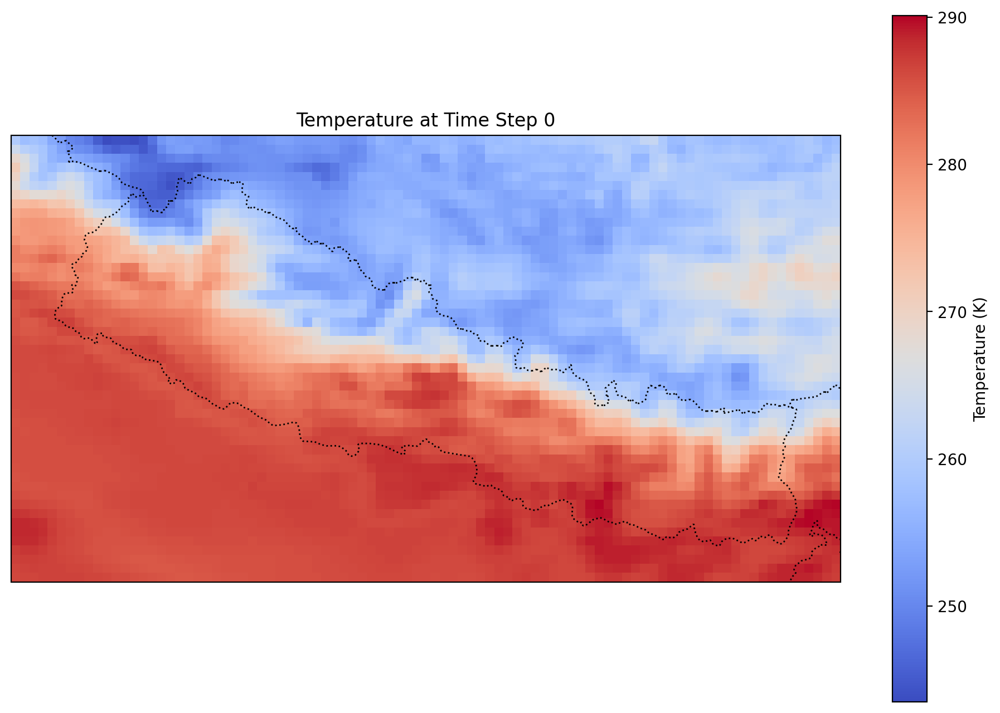

# The ERA5 Spatial Aggregation Pipeline


<!-- WARNING: THIS FILE WAS AUTOGENERATED! DO NOT EDIT! -->

``` python
from era5_sandbox.core import *
```

## era5_sandbox

> Sandbox environment for era5 development

This package documents the development and implementation of functions
and code for the Madagascar ERA5 dataset project. The goal is for
exposure data to be made available at the daily resolution when
possible. Finer resolutions shouldn’t ever be needed for our purposes,
and it should then be relatively easy to aggregate at coarser
resolutions, such as weekly or monthly. Additionally, we’ve extended
this work to Nepal as well.

Variables should generally be made available from 2010 onward, as that’s
where our clinic data starts.

All data are ideally made available at the “healthshed” geographical
level. Healthsheds are defined as geographical areas where people who
live all go to the same clinic. There are a total of ~2700 public
clinics in Madagascar, hence ~2700 healthsheds, with each healthshed
containing ~10000 people on average.

Preliminary list of environmental variables

- [x] 2-m air temperature from ERA5: daily min, max, mean

- [x] 2-m air dew point temperature from ERA5: daily min, max, mean

- [x] Precipitation: daily total (ERA5)

- [x] Soil moisture: daily average (ERA5)

Variables from other sources:

- [ ] Sea surface temperature: daily average and maximum in the nearest
  neighbor for each healthshed.

- [ ] Precipitation: daily total (CHIRPS)

- [ ] Chlorophyll-A (Giacomo)

- [ ] Wealth index: Available from Giacomo

- [ ] NDVI

- [ ] Tropical storm

- [ ] Flooding

- [ ] Deforestation

- [ ] Linking/segmenting healthsheds into climate zones and other

- [ ] Relative humidity: daily average (lower priority)

Those from the ERA5 dataset will be housed here, but we may likely
develop a separate repository for the other datasets.

## Developer Guide

This package is built and maintained with `nbdev`. If you are new to
using `nbdev` here are some useful pointers to get you started.

### Install era5_sandbox in Development mode

``` sh
# make sure era5_sandbox package is installed in development mode
$ pip install -e .
```

To make changes, go to the “notes” directory and edit the notebooks as
necessary. Each notebook refers to a module in the era5_sandbox package.
Cells are exported to the module when the notebook is saved and you run
the following command:

``` sh
$ nbdev_export
```

For e.g., to change functionality of the
[`testAPI()`](https://TinasheMTapera.github.io/era5_sandbox/core.html#testapi)
function in the testAPI Hydra rule, you would edit the
[`testAPI`](https://TinasheMTapera.github.io/era5_sandbox/core.html#testapi)
notebook in the `notes` directory `notes/testAPI.ipynb`, and then save
that notebook and run `nbdev_export` to update the `core` module in the
package.

### How to Run the Pipeline

The pipeline downloads ERA5 variables for a given date range and
geographical bounding box. You can learn how each of these steps was by
following the notebooks in `notes` in numerical order.

> [!IMPORTANT]
>
> The pipeline has two implementations: one using `snakemake` and
> `hydra`, and another using `pytask`. The `pytask` implementation is
> the more recent one, and is recommended for future use. The
> `snakemake` implementation is left here for reference to legacy code.

#### Using `pytask`

To run the pipeline, the `pytask` config at `note/20_pytask_config.qmd`
should be reviewed and updated if necessary. The pipeline can then be
run with the following command:

``` sh
$ sbatch pytask.sbatch
```

#### Using `snakemake` and `hydra`

To run the pipeline, the config at `config/config.yaml` should be
updated with the desired date range and geographical bounding box. The
pipeline can then be run with the following command:

``` sh
sbatch snakemake.sbatch
```

### What Does the Pipeline Produce?

Using `pytask`’s data catalog, you can investigate the downloaded raw
data with python, eg.:

``` python
import xarray as xr
from era5_sandbox.config import data_catalog
from era5_sandbox.core import ClimateDataFileHandler

ex_nc = list(data_catalog['download']['outputs']._entries).pop()
ex_nc_path = data_catalog['download']['outputs'][ex_nc].load()

with ClimateDataFileHandler(ex_nc_path) as handler:
    ds = xr.open_dataset(handler.get_dataset("instant"))

ds
```

<div><svg style="position: absolute; width: 0; height: 0; overflow: hidden">
<defs>
<symbol id="icon-database" viewBox="0 0 32 32">
<path d="M16 0c-8.837 0-16 2.239-16 5v4c0 2.761 7.163 5 16 5s16-2.239 16-5v-4c0-2.761-7.163-5-16-5z"></path>
<path d="M16 17c-8.837 0-16-2.239-16-5v6c0 2.761 7.163 5 16 5s16-2.239 16-5v-6c0 2.761-7.163 5-16 5z"></path>
<path d="M16 26c-8.837 0-16-2.239-16-5v6c0 2.761 7.163 5 16 5s16-2.239 16-5v-6c0 2.761-7.163 5-16 5z"></path>
</symbol>
<symbol id="icon-file-text2" viewBox="0 0 32 32">
<path d="M28.681 7.159c-0.694-0.947-1.662-2.053-2.724-3.116s-2.169-2.030-3.116-2.724c-1.612-1.182-2.393-1.319-2.841-1.319h-15.5c-1.378 0-2.5 1.121-2.5 2.5v27c0 1.378 1.122 2.5 2.5 2.5h23c1.378 0 2.5-1.122 2.5-2.5v-19.5c0-0.448-0.137-1.23-1.319-2.841zM24.543 5.457c0.959 0.959 1.712 1.825 2.268 2.543h-4.811v-4.811c0.718 0.556 1.584 1.309 2.543 2.268zM28 29.5c0 0.271-0.229 0.5-0.5 0.5h-23c-0.271 0-0.5-0.229-0.5-0.5v-27c0-0.271 0.229-0.5 0.5-0.5 0 0 15.499-0 15.5 0v7c0 0.552 0.448 1 1 1h7v19.5z"></path>
<path d="M23 26h-14c-0.552 0-1-0.448-1-1s0.448-1 1-1h14c0.552 0 1 0.448 1 1s-0.448 1-1 1z"></path>
<path d="M23 22h-14c-0.552 0-1-0.448-1-1s0.448-1 1-1h14c0.552 0 1 0.448 1 1s-0.448 1-1 1z"></path>
<path d="M23 18h-14c-0.552 0-1-0.448-1-1s0.448-1 1-1h14c0.552 0 1 0.448 1 1s-0.448 1-1 1z"></path>
</symbol>
</defs>
</svg>
<style>/* CSS stylesheet for displaying xarray objects in jupyterlab.
 *
 */
&#10;:root {
  --xr-font-color0: var(--jp-content-font-color0, rgba(0, 0, 0, 1));
  --xr-font-color2: var(--jp-content-font-color2, rgba(0, 0, 0, 0.54));
  --xr-font-color3: var(--jp-content-font-color3, rgba(0, 0, 0, 0.38));
  --xr-border-color: var(--jp-border-color2, #e0e0e0);
  --xr-disabled-color: var(--jp-layout-color3, #bdbdbd);
  --xr-background-color: var(--jp-layout-color0, white);
  --xr-background-color-row-even: var(--jp-layout-color1, white);
  --xr-background-color-row-odd: var(--jp-layout-color2, #eeeeee);
}
&#10;html[theme="dark"],
html[data-theme="dark"],
body[data-theme="dark"],
body.vscode-dark {
  --xr-font-color0: rgba(255, 255, 255, 1);
  --xr-font-color2: rgba(255, 255, 255, 0.54);
  --xr-font-color3: rgba(255, 255, 255, 0.38);
  --xr-border-color: #1f1f1f;
  --xr-disabled-color: #515151;
  --xr-background-color: #111111;
  --xr-background-color-row-even: #111111;
  --xr-background-color-row-odd: #313131;
}
&#10;.xr-wrap {
  display: block !important;
  min-width: 300px;
  max-width: 700px;
}
&#10;.xr-text-repr-fallback {
  /* fallback to plain text repr when CSS is not injected (untrusted notebook) */
  display: none;
}
&#10;.xr-header {
  padding-top: 6px;
  padding-bottom: 6px;
  margin-bottom: 4px;
  border-bottom: solid 1px var(--xr-border-color);
}
&#10;.xr-header > div,
.xr-header > ul {
  display: inline;
  margin-top: 0;
  margin-bottom: 0;
}
&#10;.xr-obj-type,
.xr-array-name {
  margin-left: 2px;
  margin-right: 10px;
}
&#10;.xr-obj-type {
  color: var(--xr-font-color2);
}
&#10;.xr-sections {
  padding-left: 0 !important;
  display: grid;
  grid-template-columns: 150px auto auto 1fr 0 20px 0 20px;
}
&#10;.xr-section-item {
  display: contents;
}
&#10;.xr-section-item input {
  display: inline-block;
  opacity: 0;
  height: 0;
}
&#10;.xr-section-item input + label {
  color: var(--xr-disabled-color);
}
&#10;.xr-section-item input:enabled + label {
  cursor: pointer;
  color: var(--xr-font-color2);
}
&#10;.xr-section-item input:focus + label {
  border: 2px solid var(--xr-font-color0);
}
&#10;.xr-section-item input:enabled + label:hover {
  color: var(--xr-font-color0);
}
&#10;.xr-section-summary {
  grid-column: 1;
  color: var(--xr-font-color2);
  font-weight: 500;
}
&#10;.xr-section-summary > span {
  display: inline-block;
  padding-left: 0.5em;
}
&#10;.xr-section-summary-in:disabled + label {
  color: var(--xr-font-color2);
}
&#10;.xr-section-summary-in + label:before {
  display: inline-block;
  content: "►";
  font-size: 11px;
  width: 15px;
  text-align: center;
}
&#10;.xr-section-summary-in:disabled + label:before {
  color: var(--xr-disabled-color);
}
&#10;.xr-section-summary-in:checked + label:before {
  content: "▼";
}
&#10;.xr-section-summary-in:checked + label > span {
  display: none;
}
&#10;.xr-section-summary,
.xr-section-inline-details {
  padding-top: 4px;
  padding-bottom: 4px;
}
&#10;.xr-section-inline-details {
  grid-column: 2 / -1;
}
&#10;.xr-section-details {
  display: none;
  grid-column: 1 / -1;
  margin-bottom: 5px;
}
&#10;.xr-section-summary-in:checked ~ .xr-section-details {
  display: contents;
}
&#10;.xr-array-wrap {
  grid-column: 1 / -1;
  display: grid;
  grid-template-columns: 20px auto;
}
&#10;.xr-array-wrap > label {
  grid-column: 1;
  vertical-align: top;
}
&#10;.xr-preview {
  color: var(--xr-font-color3);
}
&#10;.xr-array-preview,
.xr-array-data {
  padding: 0 5px !important;
  grid-column: 2;
}
&#10;.xr-array-data,
.xr-array-in:checked ~ .xr-array-preview {
  display: none;
}
&#10;.xr-array-in:checked ~ .xr-array-data,
.xr-array-preview {
  display: inline-block;
}
&#10;.xr-dim-list {
  display: inline-block !important;
  list-style: none;
  padding: 0 !important;
  margin: 0;
}
&#10;.xr-dim-list li {
  display: inline-block;
  padding: 0;
  margin: 0;
}
&#10;.xr-dim-list:before {
  content: "(";
}
&#10;.xr-dim-list:after {
  content: ")";
}
&#10;.xr-dim-list li:not(:last-child):after {
  content: ",";
  padding-right: 5px;
}
&#10;.xr-has-index {
  font-weight: bold;
}
&#10;.xr-var-list,
.xr-var-item {
  display: contents;
}
&#10;.xr-var-item > div,
.xr-var-item label,
.xr-var-item > .xr-var-name span {
  background-color: var(--xr-background-color-row-even);
  margin-bottom: 0;
}
&#10;.xr-var-item > .xr-var-name:hover span {
  padding-right: 5px;
}
&#10;.xr-var-list > li:nth-child(odd) > div,
.xr-var-list > li:nth-child(odd) > label,
.xr-var-list > li:nth-child(odd) > .xr-var-name span {
  background-color: var(--xr-background-color-row-odd);
}
&#10;.xr-var-name {
  grid-column: 1;
}
&#10;.xr-var-dims {
  grid-column: 2;
}
&#10;.xr-var-dtype {
  grid-column: 3;
  text-align: right;
  color: var(--xr-font-color2);
}
&#10;.xr-var-preview {
  grid-column: 4;
}
&#10;.xr-index-preview {
  grid-column: 2 / 5;
  color: var(--xr-font-color2);
}
&#10;.xr-var-name,
.xr-var-dims,
.xr-var-dtype,
.xr-preview,
.xr-attrs dt {
  white-space: nowrap;
  overflow: hidden;
  text-overflow: ellipsis;
  padding-right: 10px;
}
&#10;.xr-var-name:hover,
.xr-var-dims:hover,
.xr-var-dtype:hover,
.xr-attrs dt:hover {
  overflow: visible;
  width: auto;
  z-index: 1;
}
&#10;.xr-var-attrs,
.xr-var-data,
.xr-index-data {
  display: none;
  background-color: var(--xr-background-color) !important;
  padding-bottom: 5px !important;
}
&#10;.xr-var-attrs-in:checked ~ .xr-var-attrs,
.xr-var-data-in:checked ~ .xr-var-data,
.xr-index-data-in:checked ~ .xr-index-data {
  display: block;
}
&#10;.xr-var-data > table {
  float: right;
}
&#10;.xr-var-name span,
.xr-var-data,
.xr-index-name div,
.xr-index-data,
.xr-attrs {
  padding-left: 25px !important;
}
&#10;.xr-attrs,
.xr-var-attrs,
.xr-var-data,
.xr-index-data {
  grid-column: 1 / -1;
}
&#10;dl.xr-attrs {
  padding: 0;
  margin: 0;
  display: grid;
  grid-template-columns: 125px auto;
}
&#10;.xr-attrs dt,
.xr-attrs dd {
  padding: 0;
  margin: 0;
  float: left;
  padding-right: 10px;
  width: auto;
}
&#10;.xr-attrs dt {
  font-weight: normal;
  grid-column: 1;
}
&#10;.xr-attrs dt:hover span {
  display: inline-block;
  background: var(--xr-background-color);
  padding-right: 10px;
}
&#10;.xr-attrs dd {
  grid-column: 2;
  white-space: pre-wrap;
  word-break: break-all;
}
&#10;.xr-icon-database,
.xr-icon-file-text2,
.xr-no-icon {
  display: inline-block;
  vertical-align: middle;
  width: 1em;
  height: 1.5em !important;
  stroke-width: 0;
  stroke: currentColor;
  fill: currentColor;
}
</style><pre class='xr-text-repr-fallback'>&lt;xarray.Dataset&gt; Size: 53MB
Dimensions:     (valid_time: 744, latitude: 49, longitude: 91)
Coordinates:
    number      int64 8B ...
  * valid_time  (valid_time) datetime64[ns] 6kB 2024-03-01 ... 2024-03-31T23:...
  * latitude    (latitude) float64 392B 30.8 30.7 30.6 30.5 ... 26.2 26.1 26.0
  * longitude   (longitude) float64 728B 79.6 79.7 79.8 79.9 ... 88.4 88.5 88.6
    expver      (valid_time) &lt;U4 12kB ...
Data variables:
    d2m         (valid_time, latitude, longitude) float32 13MB ...
    t2m         (valid_time, latitude, longitude) float32 13MB ...
    tp          (valid_time, latitude, longitude) float32 13MB ...
    swvl1       (valid_time, latitude, longitude) float32 13MB ...
Attributes:
    GRIB_centre:             ecmf
    GRIB_centreDescription:  European Centre for Medium-Range Weather Forecasts
    GRIB_subCentre:          0
    Conventions:             CF-1.7
    institution:             European Centre for Medium-Range Weather Forecasts
    history:                 2025-09-16T20:55 GRIB to CDM+CF via cfgrib-0.9.1...</pre><div class='xr-wrap' style='display:none'><div class='xr-header'><div class='xr-obj-type'>xarray.Dataset</div></div><ul class='xr-sections'><li class='xr-section-item'><input id='section-6c6eec69-3355-47bc-b337-dbdd4d672bfa' class='xr-section-summary-in' type='checkbox' disabled ><label for='section-6c6eec69-3355-47bc-b337-dbdd4d672bfa' class='xr-section-summary'  title='Expand/collapse section'>Dimensions:</label><div class='xr-section-inline-details'><ul class='xr-dim-list'><li><span class='xr-has-index'>valid_time</span>: 744</li><li><span class='xr-has-index'>latitude</span>: 49</li><li><span class='xr-has-index'>longitude</span>: 91</li></ul></div><div class='xr-section-details'></div></li><li class='xr-section-item'><input id='section-c470a98b-ef58-4d60-9fbf-75b18b2b5edf' class='xr-section-summary-in' type='checkbox'  checked><label for='section-c470a98b-ef58-4d60-9fbf-75b18b2b5edf' class='xr-section-summary' >Coordinates: <span>(5)</span></label><div class='xr-section-inline-details'></div><div class='xr-section-details'><ul class='xr-var-list'><li class='xr-var-item'><div class='xr-var-name'><span>number</span></div><div class='xr-var-dims'>()</div><div class='xr-var-dtype'>int64</div><div class='xr-var-preview xr-preview'>...</div><input id='attrs-4308bd7c-3974-405c-ac6a-7ba95aacb19f' class='xr-var-attrs-in' type='checkbox' ><label for='attrs-4308bd7c-3974-405c-ac6a-7ba95aacb19f' title='Show/Hide attributes'><svg class='icon xr-icon-file-text2'><use xlink:href='#icon-file-text2'></use></svg></label><input id='data-66f5fed3-8d61-4507-a36b-140c354bceec' class='xr-var-data-in' type='checkbox'><label for='data-66f5fed3-8d61-4507-a36b-140c354bceec' title='Show/Hide data repr'><svg class='icon xr-icon-database'><use xlink:href='#icon-database'></use></svg></label><div class='xr-var-attrs'><dl class='xr-attrs'><dt><span>long_name :</span></dt><dd>ensemble member numerical id</dd><dt><span>units :</span></dt><dd>1</dd><dt><span>standard_name :</span></dt><dd>realization</dd></dl></div><div class='xr-var-data'><pre>[1 values with dtype=int64]</pre></div></li><li class='xr-var-item'><div class='xr-var-name'><span class='xr-has-index'>valid_time</span></div><div class='xr-var-dims'>(valid_time)</div><div class='xr-var-dtype'>datetime64[ns]</div><div class='xr-var-preview xr-preview'>2024-03-01 ... 2024-03-31T23:00:00</div><input id='attrs-475420e5-e9af-453a-83a9-7283d2a1c6e9' class='xr-var-attrs-in' type='checkbox' ><label for='attrs-475420e5-e9af-453a-83a9-7283d2a1c6e9' title='Show/Hide attributes'><svg class='icon xr-icon-file-text2'><use xlink:href='#icon-file-text2'></use></svg></label><input id='data-d9765823-e761-40c1-8bcf-53ae98bdd422' class='xr-var-data-in' type='checkbox'><label for='data-d9765823-e761-40c1-8bcf-53ae98bdd422' title='Show/Hide data repr'><svg class='icon xr-icon-database'><use xlink:href='#icon-database'></use></svg></label><div class='xr-var-attrs'><dl class='xr-attrs'><dt><span>long_name :</span></dt><dd>time</dd><dt><span>standard_name :</span></dt><dd>time</dd></dl></div><div class='xr-var-data'><pre>array([&#x27;2024-03-01T00:00:00.000000000&#x27;, &#x27;2024-03-01T01:00:00.000000000&#x27;,
       &#x27;2024-03-01T02:00:00.000000000&#x27;, ..., &#x27;2024-03-31T21:00:00.000000000&#x27;,
       &#x27;2024-03-31T22:00:00.000000000&#x27;, &#x27;2024-03-31T23:00:00.000000000&#x27;],
      shape=(744,), dtype=&#x27;datetime64[ns]&#x27;)</pre></div></li><li class='xr-var-item'><div class='xr-var-name'><span class='xr-has-index'>latitude</span></div><div class='xr-var-dims'>(latitude)</div><div class='xr-var-dtype'>float64</div><div class='xr-var-preview xr-preview'>30.8 30.7 30.6 ... 26.2 26.1 26.0</div><input id='attrs-aba4329c-f271-46b3-a763-65bea17a8fa5' class='xr-var-attrs-in' type='checkbox' ><label for='attrs-aba4329c-f271-46b3-a763-65bea17a8fa5' title='Show/Hide attributes'><svg class='icon xr-icon-file-text2'><use xlink:href='#icon-file-text2'></use></svg></label><input id='data-5862fc89-b801-4e0b-b1d7-3f0da2f33dc6' class='xr-var-data-in' type='checkbox'><label for='data-5862fc89-b801-4e0b-b1d7-3f0da2f33dc6' title='Show/Hide data repr'><svg class='icon xr-icon-database'><use xlink:href='#icon-database'></use></svg></label><div class='xr-var-attrs'><dl class='xr-attrs'><dt><span>units :</span></dt><dd>degrees_north</dd><dt><span>standard_name :</span></dt><dd>latitude</dd><dt><span>long_name :</span></dt><dd>latitude</dd><dt><span>stored_direction :</span></dt><dd>decreasing</dd></dl></div><div class='xr-var-data'><pre>array([30.8, 30.7, 30.6, 30.5, 30.4, 30.3, 30.2, 30.1, 30. , 29.9, 29.8, 29.7,
       29.6, 29.5, 29.4, 29.3, 29.2, 29.1, 29. , 28.9, 28.8, 28.7, 28.6, 28.5,
       28.4, 28.3, 28.2, 28.1, 28. , 27.9, 27.8, 27.7, 27.6, 27.5, 27.4, 27.3,
       27.2, 27.1, 27. , 26.9, 26.8, 26.7, 26.6, 26.5, 26.4, 26.3, 26.2, 26.1,
       26. ])</pre></div></li><li class='xr-var-item'><div class='xr-var-name'><span class='xr-has-index'>longitude</span></div><div class='xr-var-dims'>(longitude)</div><div class='xr-var-dtype'>float64</div><div class='xr-var-preview xr-preview'>79.6 79.7 79.8 ... 88.4 88.5 88.6</div><input id='attrs-73e7ddb9-12de-42d1-b625-20dba234846e' class='xr-var-attrs-in' type='checkbox' ><label for='attrs-73e7ddb9-12de-42d1-b625-20dba234846e' title='Show/Hide attributes'><svg class='icon xr-icon-file-text2'><use xlink:href='#icon-file-text2'></use></svg></label><input id='data-9e60abdd-e01d-41f0-823b-31565d18b902' class='xr-var-data-in' type='checkbox'><label for='data-9e60abdd-e01d-41f0-823b-31565d18b902' title='Show/Hide data repr'><svg class='icon xr-icon-database'><use xlink:href='#icon-database'></use></svg></label><div class='xr-var-attrs'><dl class='xr-attrs'><dt><span>units :</span></dt><dd>degrees_east</dd><dt><span>standard_name :</span></dt><dd>longitude</dd><dt><span>long_name :</span></dt><dd>longitude</dd></dl></div><div class='xr-var-data'><pre>array([79.6, 79.7, 79.8, 79.9, 80. , 80.1, 80.2, 80.3, 80.4, 80.5, 80.6, 80.7,
       80.8, 80.9, 81. , 81.1, 81.2, 81.3, 81.4, 81.5, 81.6, 81.7, 81.8, 81.9,
       82. , 82.1, 82.2, 82.3, 82.4, 82.5, 82.6, 82.7, 82.8, 82.9, 83. , 83.1,
       83.2, 83.3, 83.4, 83.5, 83.6, 83.7, 83.8, 83.9, 84. , 84.1, 84.2, 84.3,
       84.4, 84.5, 84.6, 84.7, 84.8, 84.9, 85. , 85.1, 85.2, 85.3, 85.4, 85.5,
       85.6, 85.7, 85.8, 85.9, 86. , 86.1, 86.2, 86.3, 86.4, 86.5, 86.6, 86.7,
       86.8, 86.9, 87. , 87.1, 87.2, 87.3, 87.4, 87.5, 87.6, 87.7, 87.8, 87.9,
       88. , 88.1, 88.2, 88.3, 88.4, 88.5, 88.6])</pre></div></li><li class='xr-var-item'><div class='xr-var-name'><span>expver</span></div><div class='xr-var-dims'>(valid_time)</div><div class='xr-var-dtype'>&lt;U4</div><div class='xr-var-preview xr-preview'>...</div><input id='attrs-e0c5b263-3ea0-47d4-a941-c42e5518f070' class='xr-var-attrs-in' type='checkbox' disabled><label for='attrs-e0c5b263-3ea0-47d4-a941-c42e5518f070' title='Show/Hide attributes'><svg class='icon xr-icon-file-text2'><use xlink:href='#icon-file-text2'></use></svg></label><input id='data-60633ad5-3d97-4d13-b089-2dde6cb25aa8' class='xr-var-data-in' type='checkbox'><label for='data-60633ad5-3d97-4d13-b089-2dde6cb25aa8' title='Show/Hide data repr'><svg class='icon xr-icon-database'><use xlink:href='#icon-database'></use></svg></label><div class='xr-var-attrs'><dl class='xr-attrs'></dl></div><div class='xr-var-data'><pre>[744 values with dtype=&lt;U4]</pre></div></li></ul></div></li><li class='xr-section-item'><input id='section-51b34949-8290-42c7-98f1-bf71e99b2616' class='xr-section-summary-in' type='checkbox'  checked><label for='section-51b34949-8290-42c7-98f1-bf71e99b2616' class='xr-section-summary' >Data variables: <span>(4)</span></label><div class='xr-section-inline-details'></div><div class='xr-section-details'><ul class='xr-var-list'><li class='xr-var-item'><div class='xr-var-name'><span>d2m</span></div><div class='xr-var-dims'>(valid_time, latitude, longitude)</div><div class='xr-var-dtype'>float32</div><div class='xr-var-preview xr-preview'>...</div><input id='attrs-04129c77-9c35-438f-967c-23865f49ff8e' class='xr-var-attrs-in' type='checkbox' ><label for='attrs-04129c77-9c35-438f-967c-23865f49ff8e' title='Show/Hide attributes'><svg class='icon xr-icon-file-text2'><use xlink:href='#icon-file-text2'></use></svg></label><input id='data-024b79a9-81fe-4488-af47-512f78e8c174' class='xr-var-data-in' type='checkbox'><label for='data-024b79a9-81fe-4488-af47-512f78e8c174' title='Show/Hide data repr'><svg class='icon xr-icon-database'><use xlink:href='#icon-database'></use></svg></label><div class='xr-var-attrs'><dl class='xr-attrs'><dt><span>GRIB_paramId :</span></dt><dd>168</dd><dt><span>GRIB_dataType :</span></dt><dd>fc</dd><dt><span>GRIB_numberOfPoints :</span></dt><dd>4459</dd><dt><span>GRIB_typeOfLevel :</span></dt><dd>surface</dd><dt><span>GRIB_stepUnits :</span></dt><dd>1</dd><dt><span>GRIB_stepType :</span></dt><dd>instant</dd><dt><span>GRIB_gridType :</span></dt><dd>regular_ll</dd><dt><span>GRIB_uvRelativeToGrid :</span></dt><dd>0</dd><dt><span>GRIB_NV :</span></dt><dd>0</dd><dt><span>GRIB_Nx :</span></dt><dd>91</dd><dt><span>GRIB_Ny :</span></dt><dd>49</dd><dt><span>GRIB_cfName :</span></dt><dd>unknown</dd><dt><span>GRIB_cfVarName :</span></dt><dd>d2m</dd><dt><span>GRIB_gridDefinitionDescription :</span></dt><dd>Latitude/Longitude Grid</dd><dt><span>GRIB_iDirectionIncrementInDegrees :</span></dt><dd>0.1</dd><dt><span>GRIB_iScansNegatively :</span></dt><dd>0</dd><dt><span>GRIB_jDirectionIncrementInDegrees :</span></dt><dd>0.1</dd><dt><span>GRIB_jPointsAreConsecutive :</span></dt><dd>0</dd><dt><span>GRIB_jScansPositively :</span></dt><dd>0</dd><dt><span>GRIB_latitudeOfFirstGridPointInDegrees :</span></dt><dd>30.8</dd><dt><span>GRIB_latitudeOfLastGridPointInDegrees :</span></dt><dd>26.0</dd><dt><span>GRIB_longitudeOfFirstGridPointInDegrees :</span></dt><dd>79.6</dd><dt><span>GRIB_longitudeOfLastGridPointInDegrees :</span></dt><dd>88.6</dd><dt><span>GRIB_missingValue :</span></dt><dd>3.4028234663852886e+38</dd><dt><span>GRIB_name :</span></dt><dd>2 metre dewpoint temperature</dd><dt><span>GRIB_shortName :</span></dt><dd>2d</dd><dt><span>GRIB_totalNumber :</span></dt><dd>0</dd><dt><span>GRIB_units :</span></dt><dd>K</dd><dt><span>long_name :</span></dt><dd>2 metre dewpoint temperature</dd><dt><span>units :</span></dt><dd>K</dd><dt><span>standard_name :</span></dt><dd>unknown</dd><dt><span>GRIB_surface :</span></dt><dd>0.0</dd></dl></div><div class='xr-var-data'><pre>[3317496 values with dtype=float32]</pre></div></li><li class='xr-var-item'><div class='xr-var-name'><span>t2m</span></div><div class='xr-var-dims'>(valid_time, latitude, longitude)</div><div class='xr-var-dtype'>float32</div><div class='xr-var-preview xr-preview'>...</div><input id='attrs-0ad860bb-1992-4ece-8f80-290662de23b2' class='xr-var-attrs-in' type='checkbox' ><label for='attrs-0ad860bb-1992-4ece-8f80-290662de23b2' title='Show/Hide attributes'><svg class='icon xr-icon-file-text2'><use xlink:href='#icon-file-text2'></use></svg></label><input id='data-4553d935-9907-4c23-895a-551ec9dd75e1' class='xr-var-data-in' type='checkbox'><label for='data-4553d935-9907-4c23-895a-551ec9dd75e1' title='Show/Hide data repr'><svg class='icon xr-icon-database'><use xlink:href='#icon-database'></use></svg></label><div class='xr-var-attrs'><dl class='xr-attrs'><dt><span>GRIB_paramId :</span></dt><dd>167</dd><dt><span>GRIB_dataType :</span></dt><dd>fc</dd><dt><span>GRIB_numberOfPoints :</span></dt><dd>4459</dd><dt><span>GRIB_typeOfLevel :</span></dt><dd>surface</dd><dt><span>GRIB_stepUnits :</span></dt><dd>1</dd><dt><span>GRIB_stepType :</span></dt><dd>instant</dd><dt><span>GRIB_gridType :</span></dt><dd>regular_ll</dd><dt><span>GRIB_uvRelativeToGrid :</span></dt><dd>0</dd><dt><span>GRIB_NV :</span></dt><dd>0</dd><dt><span>GRIB_Nx :</span></dt><dd>91</dd><dt><span>GRIB_Ny :</span></dt><dd>49</dd><dt><span>GRIB_cfName :</span></dt><dd>unknown</dd><dt><span>GRIB_cfVarName :</span></dt><dd>t2m</dd><dt><span>GRIB_gridDefinitionDescription :</span></dt><dd>Latitude/Longitude Grid</dd><dt><span>GRIB_iDirectionIncrementInDegrees :</span></dt><dd>0.1</dd><dt><span>GRIB_iScansNegatively :</span></dt><dd>0</dd><dt><span>GRIB_jDirectionIncrementInDegrees :</span></dt><dd>0.1</dd><dt><span>GRIB_jPointsAreConsecutive :</span></dt><dd>0</dd><dt><span>GRIB_jScansPositively :</span></dt><dd>0</dd><dt><span>GRIB_latitudeOfFirstGridPointInDegrees :</span></dt><dd>30.8</dd><dt><span>GRIB_latitudeOfLastGridPointInDegrees :</span></dt><dd>26.0</dd><dt><span>GRIB_longitudeOfFirstGridPointInDegrees :</span></dt><dd>79.6</dd><dt><span>GRIB_longitudeOfLastGridPointInDegrees :</span></dt><dd>88.6</dd><dt><span>GRIB_missingValue :</span></dt><dd>3.4028234663852886e+38</dd><dt><span>GRIB_name :</span></dt><dd>2 metre temperature</dd><dt><span>GRIB_shortName :</span></dt><dd>2t</dd><dt><span>GRIB_totalNumber :</span></dt><dd>0</dd><dt><span>GRIB_units :</span></dt><dd>K</dd><dt><span>long_name :</span></dt><dd>2 metre temperature</dd><dt><span>units :</span></dt><dd>K</dd><dt><span>standard_name :</span></dt><dd>unknown</dd><dt><span>GRIB_surface :</span></dt><dd>0.0</dd></dl></div><div class='xr-var-data'><pre>[3317496 values with dtype=float32]</pre></div></li><li class='xr-var-item'><div class='xr-var-name'><span>tp</span></div><div class='xr-var-dims'>(valid_time, latitude, longitude)</div><div class='xr-var-dtype'>float32</div><div class='xr-var-preview xr-preview'>...</div><input id='attrs-c5ebb16c-d4f7-4280-8836-e73bdb3bc925' class='xr-var-attrs-in' type='checkbox' ><label for='attrs-c5ebb16c-d4f7-4280-8836-e73bdb3bc925' title='Show/Hide attributes'><svg class='icon xr-icon-file-text2'><use xlink:href='#icon-file-text2'></use></svg></label><input id='data-18ef4be8-9bd2-48eb-b992-dcf44d272b82' class='xr-var-data-in' type='checkbox'><label for='data-18ef4be8-9bd2-48eb-b992-dcf44d272b82' title='Show/Hide data repr'><svg class='icon xr-icon-database'><use xlink:href='#icon-database'></use></svg></label><div class='xr-var-attrs'><dl class='xr-attrs'><dt><span>GRIB_paramId :</span></dt><dd>228</dd><dt><span>GRIB_dataType :</span></dt><dd>fc</dd><dt><span>GRIB_numberOfPoints :</span></dt><dd>4459</dd><dt><span>GRIB_typeOfLevel :</span></dt><dd>surface</dd><dt><span>GRIB_stepUnits :</span></dt><dd>1</dd><dt><span>GRIB_stepType :</span></dt><dd>accum</dd><dt><span>GRIB_gridType :</span></dt><dd>regular_ll</dd><dt><span>GRIB_uvRelativeToGrid :</span></dt><dd>0</dd><dt><span>GRIB_NV :</span></dt><dd>0</dd><dt><span>GRIB_Nx :</span></dt><dd>91</dd><dt><span>GRIB_Ny :</span></dt><dd>49</dd><dt><span>GRIB_cfName :</span></dt><dd>unknown</dd><dt><span>GRIB_cfVarName :</span></dt><dd>tp</dd><dt><span>GRIB_gridDefinitionDescription :</span></dt><dd>Latitude/Longitude Grid</dd><dt><span>GRIB_iDirectionIncrementInDegrees :</span></dt><dd>0.1</dd><dt><span>GRIB_iScansNegatively :</span></dt><dd>0</dd><dt><span>GRIB_jDirectionIncrementInDegrees :</span></dt><dd>0.1</dd><dt><span>GRIB_jPointsAreConsecutive :</span></dt><dd>0</dd><dt><span>GRIB_jScansPositively :</span></dt><dd>0</dd><dt><span>GRIB_latitudeOfFirstGridPointInDegrees :</span></dt><dd>30.8</dd><dt><span>GRIB_latitudeOfLastGridPointInDegrees :</span></dt><dd>26.0</dd><dt><span>GRIB_longitudeOfFirstGridPointInDegrees :</span></dt><dd>79.6</dd><dt><span>GRIB_longitudeOfLastGridPointInDegrees :</span></dt><dd>88.6</dd><dt><span>GRIB_missingValue :</span></dt><dd>3.4028234663852886e+38</dd><dt><span>GRIB_name :</span></dt><dd>Total precipitation</dd><dt><span>GRIB_shortName :</span></dt><dd>tp</dd><dt><span>GRIB_totalNumber :</span></dt><dd>0</dd><dt><span>GRIB_units :</span></dt><dd>m</dd><dt><span>long_name :</span></dt><dd>Total precipitation</dd><dt><span>units :</span></dt><dd>m</dd><dt><span>standard_name :</span></dt><dd>unknown</dd><dt><span>GRIB_surface :</span></dt><dd>0.0</dd></dl></div><div class='xr-var-data'><pre>[3317496 values with dtype=float32]</pre></div></li><li class='xr-var-item'><div class='xr-var-name'><span>swvl1</span></div><div class='xr-var-dims'>(valid_time, latitude, longitude)</div><div class='xr-var-dtype'>float32</div><div class='xr-var-preview xr-preview'>...</div><input id='attrs-fe443bca-d118-48ff-b086-e87f48b372dc' class='xr-var-attrs-in' type='checkbox' ><label for='attrs-fe443bca-d118-48ff-b086-e87f48b372dc' title='Show/Hide attributes'><svg class='icon xr-icon-file-text2'><use xlink:href='#icon-file-text2'></use></svg></label><input id='data-80f02ab8-26bb-4963-bbcb-6a2e094ef7e3' class='xr-var-data-in' type='checkbox'><label for='data-80f02ab8-26bb-4963-bbcb-6a2e094ef7e3' title='Show/Hide data repr'><svg class='icon xr-icon-database'><use xlink:href='#icon-database'></use></svg></label><div class='xr-var-attrs'><dl class='xr-attrs'><dt><span>GRIB_paramId :</span></dt><dd>39</dd><dt><span>GRIB_dataType :</span></dt><dd>an</dd><dt><span>GRIB_numberOfPoints :</span></dt><dd>4459</dd><dt><span>GRIB_typeOfLevel :</span></dt><dd>depthBelowLandLayer</dd><dt><span>GRIB_stepUnits :</span></dt><dd>1</dd><dt><span>GRIB_stepType :</span></dt><dd>instant</dd><dt><span>GRIB_gridType :</span></dt><dd>regular_ll</dd><dt><span>GRIB_uvRelativeToGrid :</span></dt><dd>0</dd><dt><span>GRIB_NV :</span></dt><dd>0</dd><dt><span>GRIB_Nx :</span></dt><dd>91</dd><dt><span>GRIB_Ny :</span></dt><dd>49</dd><dt><span>GRIB_cfName :</span></dt><dd>unknown</dd><dt><span>GRIB_cfVarName :</span></dt><dd>swvl1</dd><dt><span>GRIB_gridDefinitionDescription :</span></dt><dd>Latitude/Longitude Grid</dd><dt><span>GRIB_iDirectionIncrementInDegrees :</span></dt><dd>0.1</dd><dt><span>GRIB_iScansNegatively :</span></dt><dd>0</dd><dt><span>GRIB_jDirectionIncrementInDegrees :</span></dt><dd>0.1</dd><dt><span>GRIB_jPointsAreConsecutive :</span></dt><dd>0</dd><dt><span>GRIB_jScansPositively :</span></dt><dd>0</dd><dt><span>GRIB_latitudeOfFirstGridPointInDegrees :</span></dt><dd>30.8</dd><dt><span>GRIB_latitudeOfLastGridPointInDegrees :</span></dt><dd>26.0</dd><dt><span>GRIB_longitudeOfFirstGridPointInDegrees :</span></dt><dd>79.6</dd><dt><span>GRIB_longitudeOfLastGridPointInDegrees :</span></dt><dd>88.6</dd><dt><span>GRIB_missingValue :</span></dt><dd>3.4028234663852886e+38</dd><dt><span>GRIB_name :</span></dt><dd>Volumetric soil water layer 1</dd><dt><span>GRIB_shortName :</span></dt><dd>swvl1</dd><dt><span>GRIB_totalNumber :</span></dt><dd>0</dd><dt><span>GRIB_units :</span></dt><dd>m**3 m**-3</dd><dt><span>long_name :</span></dt><dd>Volumetric soil water layer 1</dd><dt><span>units :</span></dt><dd>m**3 m**-3</dd><dt><span>standard_name :</span></dt><dd>unknown</dd><dt><span>GRIB_depthBelowLandLayer :</span></dt><dd>0.0</dd></dl></div><div class='xr-var-data'><pre>[3317496 values with dtype=float32]</pre></div></li></ul></div></li><li class='xr-section-item'><input id='section-c0989690-2df7-4085-83f2-0f0c8801f3b7' class='xr-section-summary-in' type='checkbox'  ><label for='section-c0989690-2df7-4085-83f2-0f0c8801f3b7' class='xr-section-summary' >Indexes: <span>(3)</span></label><div class='xr-section-inline-details'></div><div class='xr-section-details'><ul class='xr-var-list'><li class='xr-var-item'><div class='xr-index-name'><div>valid_time</div></div><div class='xr-index-preview'>PandasIndex</div><input type='checkbox' disabled/><label></label><input id='index-d6f228af-f838-4d9e-b60c-c2e0f4956efa' class='xr-index-data-in' type='checkbox'/><label for='index-d6f228af-f838-4d9e-b60c-c2e0f4956efa' title='Show/Hide index repr'><svg class='icon xr-icon-database'><use xlink:href='#icon-database'></use></svg></label><div class='xr-index-data'><pre>PandasIndex(DatetimeIndex([&#x27;2024-03-01 00:00:00&#x27;, &#x27;2024-03-01 01:00:00&#x27;,
               &#x27;2024-03-01 02:00:00&#x27;, &#x27;2024-03-01 03:00:00&#x27;,
               &#x27;2024-03-01 04:00:00&#x27;, &#x27;2024-03-01 05:00:00&#x27;,
               &#x27;2024-03-01 06:00:00&#x27;, &#x27;2024-03-01 07:00:00&#x27;,
               &#x27;2024-03-01 08:00:00&#x27;, &#x27;2024-03-01 09:00:00&#x27;,
               ...
               &#x27;2024-03-31 14:00:00&#x27;, &#x27;2024-03-31 15:00:00&#x27;,
               &#x27;2024-03-31 16:00:00&#x27;, &#x27;2024-03-31 17:00:00&#x27;,
               &#x27;2024-03-31 18:00:00&#x27;, &#x27;2024-03-31 19:00:00&#x27;,
               &#x27;2024-03-31 20:00:00&#x27;, &#x27;2024-03-31 21:00:00&#x27;,
               &#x27;2024-03-31 22:00:00&#x27;, &#x27;2024-03-31 23:00:00&#x27;],
              dtype=&#x27;datetime64[ns]&#x27;, name=&#x27;valid_time&#x27;, length=744, freq=None))</pre></div></li><li class='xr-var-item'><div class='xr-index-name'><div>latitude</div></div><div class='xr-index-preview'>PandasIndex</div><input type='checkbox' disabled/><label></label><input id='index-ee8ef179-b63f-4ee9-a951-a362fc168d5e' class='xr-index-data-in' type='checkbox'/><label for='index-ee8ef179-b63f-4ee9-a951-a362fc168d5e' title='Show/Hide index repr'><svg class='icon xr-icon-database'><use xlink:href='#icon-database'></use></svg></label><div class='xr-index-data'><pre>PandasIndex(Index([              30.8,               30.7, 30.599999999999998,
       30.499999999999996, 30.399999999999995, 30.299999999999994,
       30.199999999999992,  30.09999999999999,  29.99999999999999,
       29.899999999999988, 29.799999999999986, 29.699999999999985,
       29.599999999999984, 29.499999999999982,  29.39999999999998,
        29.29999999999998, 29.199999999999978, 29.099999999999977,
       28.999999999999975, 28.899999999999974, 28.799999999999972,
        28.69999999999997,  28.59999999999997, 28.499999999999968,
       28.399999999999967, 28.299999999999965, 28.199999999999964,
       28.099999999999962,  27.99999999999996,  27.89999999999996,
       27.799999999999958, 27.699999999999957, 27.599999999999955,
       27.499999999999954, 27.399999999999952,  27.29999999999995,
        27.19999999999995, 27.099999999999948, 26.999999999999947,
       26.899999999999945, 26.799999999999944, 26.699999999999942,
        26.59999999999994,  26.49999999999994, 26.399999999999938,
       26.299999999999937, 26.199999999999935, 26.099999999999934,
                     26.0],
      dtype=&#x27;float64&#x27;, name=&#x27;latitude&#x27;))</pre></div></li><li class='xr-var-item'><div class='xr-index-name'><div>longitude</div></div><div class='xr-index-preview'>PandasIndex</div><input type='checkbox' disabled/><label></label><input id='index-1621e2bf-9c1e-4ce9-aa1d-f0e5b460c2c9' class='xr-index-data-in' type='checkbox'/><label for='index-1621e2bf-9c1e-4ce9-aa1d-f0e5b460c2c9' title='Show/Hide index repr'><svg class='icon xr-icon-database'><use xlink:href='#icon-database'></use></svg></label><div class='xr-index-data'><pre>PandasIndex(Index([             79.6, 79.69999999999999, 79.79999999999998,
       79.89999999999998, 79.99999999999997, 80.09999999999997,
       80.19999999999996, 80.29999999999995, 80.39999999999995,
       80.49999999999994, 80.59999999999994, 80.69999999999993,
       80.79999999999993, 80.89999999999992, 80.99999999999991,
       81.09999999999991,  81.1999999999999,  81.2999999999999,
       81.39999999999989, 81.49999999999989, 81.59999999999988,
       81.69999999999987, 81.79999999999987, 81.89999999999986,
       81.99999999999986, 82.09999999999985, 82.19999999999985,
       82.29999999999984, 82.39999999999984, 82.49999999999983,
       82.59999999999982, 82.69999999999982, 82.79999999999981,
        82.8999999999998,  82.9999999999998,  83.0999999999998,
       83.19999999999979, 83.29999999999978, 83.39999999999978,
       83.49999999999977, 83.59999999999977, 83.69999999999976,
       83.79999999999976, 83.89999999999975, 83.99999999999974,
       84.09999999999974, 84.19999999999973, 84.29999999999973,
       84.39999999999972, 84.49999999999972, 84.59999999999971,
        84.6999999999997,  84.7999999999997,  84.8999999999997,
       84.99999999999969, 85.09999999999968, 85.19999999999968,
       85.29999999999967, 85.39999999999966, 85.49999999999966,
       85.59999999999965, 85.69999999999965, 85.79999999999964,
       85.89999999999964, 85.99999999999963, 86.09999999999962,
       86.19999999999962, 86.29999999999961, 86.39999999999961,
        86.4999999999996,  86.5999999999996, 86.69999999999959,
       86.79999999999959, 86.89999999999958, 86.99999999999957,
       87.09999999999957, 87.19999999999956, 87.29999999999956,
       87.39999999999955, 87.49999999999955, 87.59999999999954,
       87.69999999999953, 87.79999999999953, 87.89999999999952,
       87.99999999999952, 88.09999999999951,  88.1999999999995,
        88.2999999999995,  88.3999999999995, 88.49999999999949,
                    88.6],
      dtype=&#x27;float64&#x27;, name=&#x27;longitude&#x27;))</pre></div></li></ul></div></li><li class='xr-section-item'><input id='section-56bd7a29-4158-45b5-a4f3-dbfe16d6744d' class='xr-section-summary-in' type='checkbox'  checked><label for='section-56bd7a29-4158-45b5-a4f3-dbfe16d6744d' class='xr-section-summary' >Attributes: <span>(6)</span></label><div class='xr-section-inline-details'></div><div class='xr-section-details'><dl class='xr-attrs'><dt><span>GRIB_centre :</span></dt><dd>ecmf</dd><dt><span>GRIB_centreDescription :</span></dt><dd>European Centre for Medium-Range Weather Forecasts</dd><dt><span>GRIB_subCentre :</span></dt><dd>0</dd><dt><span>Conventions :</span></dt><dd>CF-1.7</dd><dt><span>institution :</span></dt><dd>European Centre for Medium-Range Weather Forecasts</dd><dt><span>history :</span></dt><dd>2025-09-16T20:55 GRIB to CDM+CF via cfgrib-0.9.15.0/ecCodes-2.42.0 with {&quot;source&quot;: &quot;data.grib&quot;, &quot;filter_by_keys&quot;: {}, &quot;encode_cf&quot;: [&quot;parameter&quot;, &quot;time&quot;, &quot;geography&quot;, &quot;vertical&quot;]}</dd></dl></div></li></ul></div></div>

And plot it with cartopy, eg.:

``` python
import matplotlib.pyplot as plt
import cartopy.crs as ccrs
import cartopy.feature as cfeature

temperature = ds["t2m"]

# Select a specific time step
temperature_at_time = temperature.isel(valid_time=0)

# Plot the data on a map
plt.figure(figsize=(12, 8))
ax = plt.axes(projection=ccrs.PlateCarree())
temperature_at_time.plot(ax=ax, cmap="coolwarm", transform=ccrs.PlateCarree(), cbar_kwargs={"label": "Temperature (K)"})
ax.coastlines()
ax.add_feature(cfeature.BORDERS, linestyle=":")
ax.set_title("Temperature at Time Step 0")
plt.show()
```



You can also load the aggregated data:

``` python
import pandas as pd
import geopandas as gpd
from era5_sandbox.config import data_catalog

ex_agg_path = data_catalog['aggregate']['outputs']['2019_08_madagascar_night_d2m_max.parquet'].load()

gpd.read_parquet(ex_agg_path).describe()
```

<div>
<style scoped>
    .dataframe tbody tr th:only-of-type {
        vertical-align: middle;
    }
&#10;    .dataframe tbody tr th {
        vertical-align: top;
    }
&#10;    .dataframe thead th {
        text-align: right;
    }
</style>

|  | day_01 | day_02 | day_03 | day_04 | day_05 | day_06 | day_07 | day_08 | day_09 | day_10 | day_11 | day_12 | day_13 | day_14 | day_15 | day_16 | day_17 | day_18 | day_19 | day_20 | day_21 | day_22 | day_23 | day_24 | day_25 | day_26 | day_27 | day_28 | day_29 | day_30 | day_31 | day_32 |
|----|----|----|----|----|----|----|----|----|----|----|----|----|----|----|----|----|----|----|----|----|----|----|----|----|----|----|----|----|----|----|----|----|
| count | 2701.000000 | 2701.000000 | 2701.000000 | 2701.000000 | 2701.000000 | 2701.000000 | 2701.000000 | 2701.000000 | 2701.000000 | 2701.000000 | 2701.000000 | 2701.000000 | 2701.000000 | 2701.000000 | 2701.000000 | 2701.000000 | 2701.000000 | 2701.000000 | 2701.000000 | 2701.000000 | 2701.000000 | 2701.000000 | 2701.000000 | 2701.000000 | 2701.000000 | 2701.000000 | 2701.000000 | 2701.000000 | 2701.000000 | 2701.000000 | 2701.000000 | 2701.000000 |
| mean | 290.493048 | 290.145274 | 288.953153 | 288.503714 | 288.439820 | 288.304426 | 286.940995 | 287.186512 | 287.453656 | 287.843029 | 288.301938 | 288.778014 | 288.813762 | 288.667253 | 288.796892 | 288.547945 | 288.197632 | 287.882440 | 287.659818 | 289.291587 | 289.911503 | 288.760939 | 288.257644 | 288.271450 | 287.746390 | 288.379399 | 288.504720 | 287.665699 | 288.149861 | 288.266861 | 288.644028 | 288.224829 |
| std | 2.616922 | 2.832083 | 3.215642 | 3.566019 | 4.401416 | 4.198817 | 5.235795 | 4.444031 | 4.346305 | 3.435444 | 2.735781 | 2.864494 | 2.841268 | 3.080593 | 3.306217 | 2.938165 | 3.018303 | 2.849850 | 2.817690 | 2.600946 | 2.584079 | 3.161855 | 3.171827 | 2.983778 | 3.223380 | 2.918867 | 2.844314 | 3.052635 | 3.077292 | 3.093706 | 3.335983 | 3.296264 |
| min | 284.295898 | 281.673340 | 280.566406 | 280.509521 | 277.348145 | 279.243164 | 274.955078 | 274.682129 | 275.397461 | 279.498291 | 282.339111 | 282.188721 | 282.470703 | 281.371582 | 280.724609 | 280.093506 | 280.849121 | 281.123535 | 281.952148 | 282.186768 | 284.168945 | 282.519287 | 282.015381 | 280.578857 | 281.183838 | 281.146973 | 281.977539 | 281.014648 | 280.787842 | 281.631348 | 281.349854 | 280.615967 |
| 25% | 288.031494 | 287.739014 | 286.978271 | 285.750488 | 284.326904 | 284.071289 | 281.695068 | 283.710449 | 284.153076 | 285.459717 | 286.141846 | 286.444092 | 286.505859 | 286.104004 | 286.114014 | 286.730225 | 286.005371 | 285.420166 | 285.230713 | 287.408203 | 287.744873 | 286.101318 | 285.243652 | 285.488281 | 285.170166 | 285.876465 | 286.145508 | 285.243164 | 285.579346 | 285.322754 | 285.930908 | 285.565186 |
| 50% | 290.674316 | 290.331543 | 288.916260 | 288.472168 | 289.635742 | 289.390381 | 288.382568 | 287.926758 | 288.173096 | 287.859375 | 287.797852 | 288.716064 | 288.806641 | 288.789307 | 289.210938 | 288.769287 | 288.085205 | 287.698975 | 287.252930 | 289.310547 | 289.878418 | 288.511719 | 288.420166 | 288.263916 | 287.717041 | 288.661621 | 288.999023 | 287.485107 | 288.326416 | 288.429199 | 288.576416 | 288.093018 |
| 75% | 292.828369 | 292.707764 | 291.609375 | 291.655762 | 291.987305 | 291.845459 | 291.671631 | 291.051758 | 291.288574 | 291.000244 | 290.813721 | 291.365967 | 291.540039 | 291.393799 | 291.756592 | 291.094727 | 290.893311 | 290.266602 | 290.166748 | 291.649902 | 291.970459 | 291.342285 | 290.443848 | 290.660400 | 290.400146 | 290.360840 | 290.854004 | 290.328125 | 290.827881 | 290.999268 | 291.598877 | 291.072754 |
| max | 296.467285 | 295.717529 | 295.837158 | 295.693604 | 295.723389 | 296.195557 | 295.589600 | 295.345703 | 294.754639 | 294.483154 | 294.952148 | 294.815430 | 294.623779 | 295.088135 | 295.036621 | 294.847900 | 294.224609 | 294.522949 | 294.728760 | 295.268066 | 295.507324 | 295.797363 | 296.297119 | 296.222900 | 295.492432 | 295.406006 | 294.629883 | 295.211670 | 295.363037 | 295.263184 | 295.446533 | 295.408691 |

</div>
