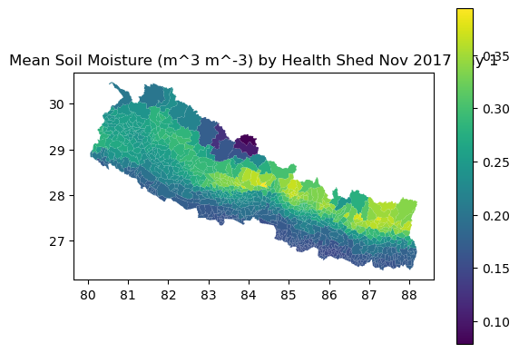
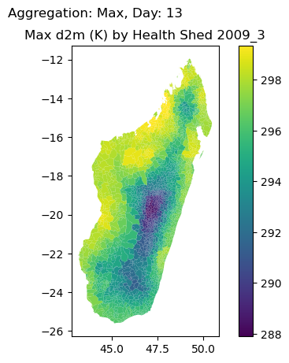
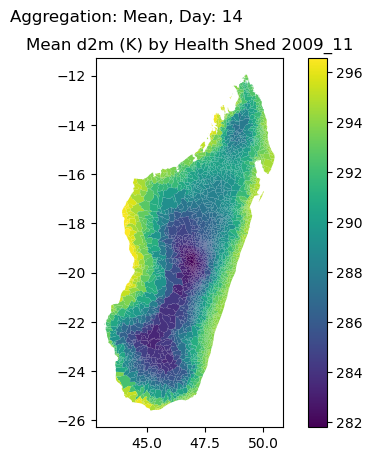
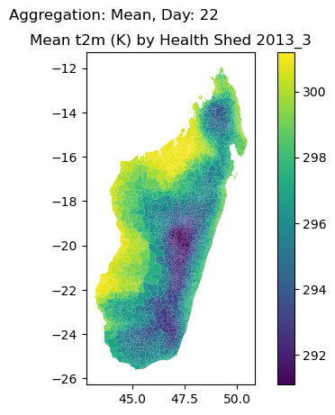
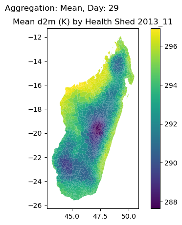
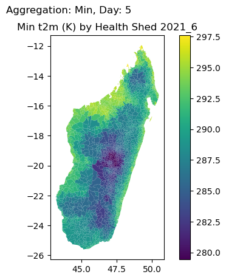
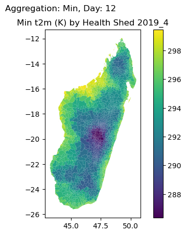
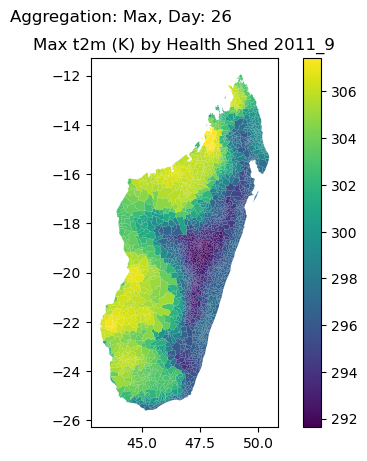
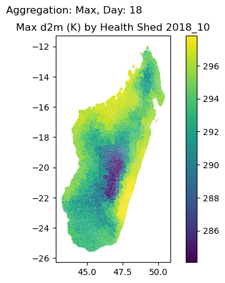
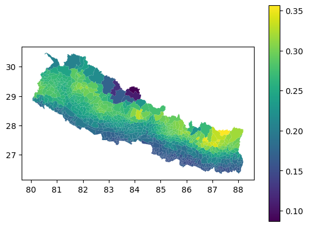

> This module aggregates the downloaded data into the respective output dataframes.


<!-- WARNING: THIS FILE WAS AUTOGENERATED! DO NOT EDIT! -->

We prototyped the code in this module using a Jupyter notebook. The notebook is available in `notes/prototypes/learning_aggregations_w_michelle_20250328.ipynb`. The code in this module is a cleaned-up version of the code in that notebook. The notebook contains additional comments and explanations of the code, which may be helpful for understanding the code in this module.

The basic process is as follows:

1. Load the netCDF data in memory
2. Statistically aggregate the hourly data to daily data per exposure using resample()
3. Write out the data to tiff
4. Read the tiff data back in
5. Read in the shapefile that defines the healthsheds
6. Spatially aggregate the exposure data to the healthsheds
7. Quality check the aggregations
8. Write out final aggregations to tiff

::: {#cell-4 .cell}
``` {.python .cell-code}
try:
    with initialize(version_base=None, config_path="../conf"):
        cfg = compose(config_name='config.yaml')
except Exception as e:
    print(f"Error initializing Hydra: {e}")
    with initialize(version_base=None, config_path="conf"):
        cfg = compose(config_name='config.yaml')
```
:::


We're going to write a function that aggregates the data for a single exposure from a file. This file should be the single month data we got from the previous step in the pipeline.

::: {#cell-6 .cell}
``` {.python .cell-code}
eg_file = here() / "data/input/nepal_2017_11.nc"
```
:::


---

[source](https://github.com/TinasheMTapera/era5_sandbox/blob/main/era5_sandbox/aggregate.py#L34){target="_blank" style="float:right; font-size:smaller"}

### resample_netcdf

>      resample_netcdf (fpath:str, resample:str='1D', agg_func:<built-
>                       infunctioncallable>=<function mean at 0x14b121cd4bb0>,
>                       time_dim:str='valid_time', **xr_open_kwargs)

*Resample a netCDF file to a specified frequency and aggregation method.

Args:
    fpath (str): Path to the netCDF file.
    resample (str): Resampling frequency (e.g., '1H', '1D').
    agg_func (callable): Aggregation function (e.g., np.mean, np.sum).

Returns:
    xarray.Dataset: Resampled dataset.*

|    | **Type** | **Default** | **Details** |
| -- | -------- | ----------- | ----------- |
| fpath | str |  | Path to the netCDF file. |
| resample | str | 1D | Resampling frequency (e.g., '1H', '1D') |
| agg_func | callable | mean | Aggregation function (e.g., np.mean, np.sum). |
| time_dim | str | valid_time | Name of the time dimension in the dataset. |
| xr_open_kwargs | VAR_KEYWORD |  |  |
| **Returns** | **Dataset** |  | **keywords for python's xarray module** |


::: {#cell-8 .cell}
``` {.python .cell-code}
var = 'swvl1'
agg_func = _get_callable(cfg['aggregation']['aggregation'][var]['hourly_to_daily'][0]['function'])
```
:::


::: {#cell-9 .cell}
``` {.python .cell-code}
with ClimateDataFileHandler(eg_file) as handler:

    ds_path = handler.get_dataset("instant")
    resampled_data = resample_netcdf(ds_path, agg_func=agg_func)
```
:::


I'm going to use a dataclass to represent the tiff data. This will allow us to easily pass around the data and metadata associated with the tiff file. Why? Because I can, lol (I've never used dataclasses and I'm curious about them). ChatGPT thinks this will make the code cleaner and easier to read.

---

[source](https://github.com/TinasheMTapera/era5_sandbox/blob/main/era5_sandbox/aggregate.py#L63){target="_blank" style="float:right; font-size:smaller"}

### RasterFile

>      RasterFile (path:str, band:int)


Next, a function to write and read the netCDF to tiff:

---

[source](https://github.com/TinasheMTapera/era5_sandbox/blob/main/era5_sandbox/aggregate.py#L90){target="_blank" style="float:right; font-size:smaller"}

### netcdf_to_tiff

>      netcdf_to_tiff (ds:xarray.core.dataset.Dataset, band:int, variable:str,
>                      crs:str='EPSG:4326')

*Convert a netCDF file to a GeoTIFF file.

Args:
    fpath (str): Path to the netCDF file.
    output_path (str): Path to save the output GeoTIFF file.
    variable_name (str): Name of the variable to convert.
    time_index (int): Index of the time dimension to extract.*

|    | **Type** | **Default** | **Details** |
| -- | -------- | ----------- | ----------- |
| ds | Dataset |  | The aggregated xarray dataset to convert. |
| band | int |  | The day to rasterise; 1 indexed just like human english |
| variable | str |  | The variable name to convert. |
| crs | str | EPSG:4326 | Coordinate reference system (default is WGS84). |


Now to test it:

::: {#cell-15 .cell}
``` {.python .cell-code}
with ClimateDataFileHandler(eg_file) as handler:
    ds_path = handler.get_dataset("instant")
    resampled_nc = resample_netcdf(ds_path)

print(resampled_nc)
resampled_tiff = netcdf_to_tiff(
    ds=resampled_nc,
    band=28,
    variable="swvl1",
    crs="EPSG:4326"
)
```

::: {.cell-output .cell-output-stdout}
```
<xarray.Dataset> Size: 267kB
Dimensions:     (valid_time: 30, latitude: 20, longitude: 37)
Coordinates:
    number      int64 8B 0
  * latitude    (latitude) float64 160B 30.75 30.5 30.25 ... 26.5 26.25 26.0
  * longitude   (longitude) float64 296B 79.6 79.85 80.1 ... 88.1 88.35 88.6
  * valid_time  (valid_time) datetime64[ns] 240B 2017-11-01 ... 2017-11-30
Data variables:
    d2m         (valid_time, latitude, longitude) float32 89kB 261.6 ... 288.1
    t2m         (valid_time, latitude, longitude) float32 89kB 267.3 ... 293.1
    swvl1       (valid_time, latitude, longitude) float32 89kB 0.2773 ... 0.1922
Attributes:
    GRIB_centre:             ecmf
    GRIB_centreDescription:  European Centre for Medium-Range Weather Forecasts
    GRIB_subCentre:          0
    Conventions:             CF-1.7
    institution:             European Centre for Medium-Range Weather Forecasts
    history:                 2025-05-14T20:49 GRIB to CDM+CF via cfgrib-0.9.1...
```
:::
:::


::: {#cell-16 .cell}
``` {.python .cell-code}
resampled_tiff.data.shape, resampled_tiff.transform, resampled_tiff.crs, resampled_tiff.bounds
```

::: {.cell-output .cell-output-display}
```
((20, 37),
 Affine(0.25, 0.0, 79.475,
        0.0, -0.25, 30.875),
 CRS.from_wkt('GEOGCS["WGS 84",DATUM["WGS_1984",SPHEROID["WGS 84",6378137,298.257223563,AUTHORITY["EPSG","7030"]],AUTHORITY["EPSG","6326"]],PRIMEM["Greenwich",0,AUTHORITY["EPSG","8901"]],UNIT["degree",0.0174532925199433,AUTHORITY["EPSG","9122"]],AXIS["Latitude",NORTH],AXIS["Longitude",EAST],AUTHORITY["EPSG","4326"]]'),
 BoundingBox(left=79.475, bottom=25.875, right=88.725, top=30.875))
```
:::
:::


Super cool! The tiff file is created and the data is read back in correctly. Now we can move on to the next step, which is to aggregate the data by healthshed.

## Polygon to Raster Cells

This function was initially shared from a previous NSAPH aggregation pipeline [here](https://github.com/NSAPH-Data-Processing/air_pollution__aqdh/blob/2a8109075fe7a8fbf7c435cc34ffa97b63f5e133/utils/faster_zonal_stats.py#L17). To better understand this, here is a ChatGPT explanation of the code:

> This function, [`polygon_to_raster_cells`](https://TinasheMTapera.github.io/era5_sandbox/aggregate.html#polygon_to_raster_cells), is doing a crucial first step in spatial alignment: it determines which raster cells are “touched” by each polygon geometry (e.g., administrative areas, watersheds, etc.).    
Essentially, this function helps figure out which pixels from a raster image fall inside each polygon (like a district, region, or shape). It does this by looking at each polygon one by one, zooming in on just the part of the raster that overlaps with that shape, and marking the pixels that are inside. This is kind of like placing a cookie cutter (the polygon) on a pixelated map (the raster) and seeing which pixels get cut.  
The result is a list where each item tells you the pixel locations that match a specific polygon. You can then use those pixel locations to pull out data from the raster, like temperatures or rainfall, and calculate statistics (like the average) for each shape. This is a key step when you want to summarize raster data within specific regions, like figuring out the average temperature in each county or how much vegetation is in each park.

---

[source](https://github.com/TinasheMTapera/era5_sandbox/blob/main/era5_sandbox/aggregate.py#L121){target="_blank" style="float:right; font-size:smaller"}

### polygon_to_raster_cells

>      polygon_to_raster_cells (vectors, raster, nodata=None, affine=None,
>                               all_touched=False, verbose=False, **kwargs)

*Returns an index map for each vector geometry to indices in the raster source.*

|    | **Type** | **Default** | **Details** |
| -- | -------- | ----------- | ----------- |
| vectors |  |  |  |
| raster |  |  |  |
| nodata | NoneType | None |  |
| affine | NoneType | None |  |
| all_touched | bool | False |  |
| verbose | bool | False |  |
| kwargs | VAR_KEYWORD |  |  |
| **Returns** | **dict** |  | **A dictionary mapping vector the ids of geometries to locations (indices) in the raster source.** |


To use this, we must define the polygon and raster data. The polygon data is the healthshed shapefile, and the raster data is the tiff file we created earlier. We can use the [`GoogleDriver`](https://TinasheMTapera.github.io/era5_sandbox/core.html#googledriver) class we defined in `core` to read in the shapefile.

::: {#cell-20 .cell}
``` {.python .cell-code}
try:
    with initialize(version_base=None, config_path="../conf"):
        cfg = compose(config_name='config.yaml')
except Exception as e:
    print(f"Error initializing Hydra: {e}")
    with initialize(version_base=None, config_path="conf"):
        cfg = compose(config_name='config.yaml')

driver = GoogleDriver(json_key_path=here() / cfg.GOOGLE_DRIVE_AUTH_JSON.path)
drive = driver.get_drive()
healthsheds = driver.read_healthsheds("Nepal_Healthsheds2024.zip")
```
:::


::: {#cell-21 .cell}
``` {.python .cell-code}
res_poly2cell=polygon_to_raster_cells(
    vectors = healthsheds.geometry.values, # the geometries of the shapefile of the regions
    raster=resampled_tiff.data, # the raster data above
    nodata=resampled_tiff.nodata, # any intersections with no data, may have to be np.nan
    affine=resampled_tiff.transform, # some math thing need to revise
    all_touched=True, 
    verbose=True
)
```

::: {.cell-output .cell-output-stderr}
```
  0%|          | 0/777 [00:00<?, ?it/s]/n/home03/ttapera/.conda/envs/era5_sandbox/lib/python3.11/site-packages/rasterstats/io.py:335: NodataWarning: Setting nodata to -999; specify nodata explicitly
  warnings.warn(
100%|██████████| 777/777 [00:00<00:00, 1161.19it/s]
```
:::
:::


The data below maps which grid entries fall into each of the regions in the shapefile (e.g. which pixel is in which state)

::: {#cell-23 .cell}
``` {.python .cell-code}
res_poly2cell[:5]
```

::: {.cell-output .cell-output-display}
```
[(array([14]), array([32])),
 (array([13, 13, 14, 14]), array([33, 34, 33, 34])),
 (array([12, 13, 13, 14]), array([34, 33, 34, 33])),
 (array([15, 15]), array([33, 34])),
 (array([15, 15, 16, 16]), array([32, 33, 32, 33]))]
```
:::
:::


Last but not least, we aggregate these data to the healthshed level. We can use the `rasterstats` package to do this.

---

[source](https://github.com/TinasheMTapera/era5_sandbox/blob/main/era5_sandbox/aggregate.py#L195){target="_blank" style="float:right; font-size:smaller"}

### aggregate_to_healthsheds

>      aggregate_to_healthsheds (res_poly2cell:list, raster:__main__.RasterFile,
>                                shapes:geopandas.geodataframe.GeoDataFrame,
>                                names_column:str='fs_uid',
>                                aggregation_func:<built-
>                                infunctioncallable>=<function nanmean at
>                                0x14b121c598f0>, aggregation_name:str='mean')

*Aggregate the raster data to the health sheds.*

|    | **Type** | **Default** | **Details** |
| -- | -------- | ----------- | ----------- |
| res_poly2cell | list |  | the result of polygon_to_raster_cells |
| raster | RasterFile |  | the raster data |
| shapes | GeoDataFrame |  | the shapes of the health sheds |
| names_column | str | fs_uid | the unique identifier column name of the health sheds |
| aggregation_func | callable | nanmean | the aggregation function |
| aggregation_name | str | mean | the name of the aggregation function |
| **Returns** | **GeoDataFrame** |  |  |


And now we apply it:

::: {#cell-27 .cell}
``` {.python .cell-code}
result = aggregate_to_healthsheds(
    res_poly2cell=res_poly2cell,
    raster=resampled_tiff,
    shapes=healthsheds,
    names_column="fid",
    aggregation_func=np.nanmean,
    aggregation_name="mean_soil_moisture"
)
result.head()
```

::: {.cell-output .cell-output-display}

```{=html}
<div>
<style scoped>
    .dataframe tbody tr th:only-of-type {
        vertical-align: middle;
    }

    .dataframe tbody tr th {
        vertical-align: top;
    }

    .dataframe thead th {
        text-align: right;
    }
</style>
<table border="1" class="dataframe">
  <thead>
    <tr style="text-align: right;">
      <th></th>
      <th>healthshed</th>
      <th>mean_soil_moisture</th>
      <th>geometry</th>
    </tr>
  </thead>
  <tbody>
    <tr>
      <th>0</th>
      <td>1</td>
      <td>0.331351</td>
      <td>POLYGON ((87.60719 27.37069, 87.60841 27.36969...</td>
    </tr>
    <tr>
      <th>1</th>
      <td>7</td>
      <td>0.360747</td>
      <td>POLYGON ((88.04438 27.4203, 88.04365 27.41925,...</td>
    </tr>
    <tr>
      <th>2</th>
      <td>8</td>
      <td>0.332805</td>
      <td>POLYGON ((88.14528 27.67003, 88.14526 27.66966...</td>
    </tr>
    <tr>
      <th>3</th>
      <td>23</td>
      <td>0.270567</td>
      <td>POLYGON ((88.0766 27.03545, 88.07695 27.03533,...</td>
    </tr>
    <tr>
      <th>4</th>
      <td>24</td>
      <td>0.212768</td>
      <td>POLYGON ((87.76435 26.92431, 87.76435 26.924, ...</td>
    </tr>
  </tbody>
</table>
</div>
```

:::
:::


And plot for QA:

::: {#cell-29 .cell}
``` {.python .cell-code}
result.plot(column="mean_soil_moisture", legend=True)
plt.title("Mean Soil Moisture (m^3 m^-3) by Health Shed Nov 2017 day 1")
plt.show()
```

::: {.cell-output .cell-output-display}
{}
:::
:::


That looks great! The data is aggregated to the healthshed level, and we can see the differences in exposure across the healthsheds. We can also see that the data is not uniform across the healthsheds, which is what we expect.

## Tests and Main

Now we can wrap this up in a main function that will simply take in the input file and generate this output. We can also add some tests to make sure the data is aggregated correctly; tests will run automatically in this notebook.

::: {#cell-31 .cell}
``` {.python .cell-code}
import random

variables = ["t2m", "d2m"]
years = ["20{:02d}".format(m) for m in range(9, 24)]
months = [str(m) for m in range(1, 13)]
aggregations = [
    ("Mean", np.nanmean),
    ("Max", np.nanmax),
    ("Min", np.nanmin)
]

exposure_variable = random.choice(variables)
year = random.choice(years)
month = random.choice(months)
aggregation_str, agg_func = random.choice(aggregations)
input_file = here() / "data/input/{}_{}.nc".format(year, month)

with initialize(version_base=None, config_path="../conf"):
    cfg = compose(config_name='config.yaml')

driver = GoogleDriver(json_key_path=here() / cfg.GOOGLE_DRIVE_AUTH_JSON.path)
drive = driver.get_drive()
healthsheds = driver.read_healthsheds(cfg.GOOGLE_DRIVE_AUTH_JSON.healthsheds_id)

with ClimateDataFileHandler(input_file) as handler:
    ds_path = handler.get_dataset("instant")
    resampled_nc_file = resample_netcdf(ds_path, agg_func=agg_func)

days = len(resampled_nc_file.valid_time.values)
day = random.choice(range(1, days + 1))

resampled_tiff = netcdf_to_tiff(
    ds=resampled_nc_file,
    band=day, # the day we're aggregating
    variable=exposure_variable,
    crs="EPSG:4326"
)

res_poly2cell=polygon_to_raster_cells(
    vectors = healthsheds.geometry.values, # the geometries of the shapefile of the regions
    raster=resampled_tiff.data, # the raster data above
    nodata=resampled_tiff.nodata, # any intersections with no data, may have to be np.nan
    affine=resampled_tiff.transform, # some math thing need to revise
    all_touched=True, 
    verbose=True
)

result = aggregate_to_healthsheds(
    res_poly2cell=res_poly2cell,
    raster=resampled_tiff,
    shapes=healthsheds,
    names_column="fs_uid",
    aggregation_func=agg_func,
    aggregation_name=exposure_variable
)

result.plot(column=exposure_variable, legend=True)
plt.title("{} {} (K) by Health Shed {}".format(aggregation_str, exposure_variable, input_file.stem))
plt.suptitle("Aggregation: {}, Day: {}".format(aggregation_str, str(day)))
plt.show()
```

::: {.cell-output .cell-output-stderr}
```
100%|██████████| 2766/2766 [00:01<00:00, 1672.67it/s]
```
:::

::: {.cell-output .cell-output-display}
{}
:::

::: {.cell-output .cell-output-stderr}
```
100%|██████████| 2766/2766 [00:01<00:00, 1664.84it/s]
```
:::

::: {.cell-output .cell-output-display}
{}
:::

::: {.cell-output .cell-output-stderr}
```
100%|██████████| 2766/2766 [00:01<00:00, 1684.77it/s]
```
:::

::: {.cell-output .cell-output-display}
{}
:::

::: {.cell-output .cell-output-stderr}
```
100%|██████████| 2766/2766 [00:01<00:00, 1691.20it/s]
```
:::

::: {.cell-output .cell-output-display}
{}
:::

::: {.cell-output .cell-output-stderr}
```
/n/home03/ttapera/.conda/envs/era5_sandbox/lib/python3.11/site-packages/xarray/namedarray/core.py:919: RuntimeWarning: All-NaN slice encountered
  data = func(self.data, axis=axis, **kwargs)
/n/home03/ttapera/.conda/envs/era5_sandbox/lib/python3.11/site-packages/xarray/namedarray/core.py:919: RuntimeWarning: All-NaN slice encountered
  data = func(self.data, axis=axis, **kwargs)
/n/home03/ttapera/.conda/envs/era5_sandbox/lib/python3.11/site-packages/xarray/namedarray/core.py:919: RuntimeWarning: All-NaN slice encountered
  data = func(self.data, axis=axis, **kwargs)
/n/home03/ttapera/.conda/envs/era5_sandbox/lib/python3.11/site-packages/xarray/namedarray/core.py:919: RuntimeWarning: All-NaN slice encountered
  data = func(self.data, axis=axis, **kwargs)
/n/home03/ttapera/.conda/envs/era5_sandbox/lib/python3.11/site-packages/xarray/namedarray/core.py:919: RuntimeWarning: All-NaN slice encountered
  data = func(self.data, axis=axis, **kwargs)
/n/home03/ttapera/.conda/envs/era5_sandbox/lib/python3.11/site-packages/xarray/namedarray/core.py:919: RuntimeWarning: All-NaN slice encountered
  data = func(self.data, axis=axis, **kwargs)
/n/home03/ttapera/.conda/envs/era5_sandbox/lib/python3.11/site-packages/xarray/namedarray/core.py:919: RuntimeWarning: All-NaN slice encountered
  data = func(self.data, axis=axis, **kwargs)
/n/home03/ttapera/.conda/envs/era5_sandbox/lib/python3.11/site-packages/xarray/namedarray/core.py:919: RuntimeWarning: All-NaN slice encountered
  data = func(self.data, axis=axis, **kwargs)
/n/home03/ttapera/.conda/envs/era5_sandbox/lib/python3.11/site-packages/xarray/namedarray/core.py:919: RuntimeWarning: All-NaN slice encountered
  data = func(self.data, axis=axis, **kwargs)
/n/home03/ttapera/.conda/envs/era5_sandbox/lib/python3.11/site-packages/xarray/namedarray/core.py:919: RuntimeWarning: All-NaN slice encountered
  data = func(self.data, axis=axis, **kwargs)
/n/home03/ttapera/.conda/envs/era5_sandbox/lib/python3.11/site-packages/xarray/namedarray/core.py:919: RuntimeWarning: All-NaN slice encountered
  data = func(self.data, axis=axis, **kwargs)
/n/home03/ttapera/.conda/envs/era5_sandbox/lib/python3.11/site-packages/xarray/namedarray/core.py:919: RuntimeWarning: All-NaN slice encountered
  data = func(self.data, axis=axis, **kwargs)
/n/home03/ttapera/.conda/envs/era5_sandbox/lib/python3.11/site-packages/xarray/namedarray/core.py:919: RuntimeWarning: All-NaN slice encountered
  data = func(self.data, axis=axis, **kwargs)
/n/home03/ttapera/.conda/envs/era5_sandbox/lib/python3.11/site-packages/xarray/namedarray/core.py:919: RuntimeWarning: All-NaN slice encountered
  data = func(self.data, axis=axis, **kwargs)
/n/home03/ttapera/.conda/envs/era5_sandbox/lib/python3.11/site-packages/xarray/namedarray/core.py:919: RuntimeWarning: All-NaN slice encountered
  data = func(self.data, axis=axis, **kwargs)
/n/home03/ttapera/.conda/envs/era5_sandbox/lib/python3.11/site-packages/xarray/namedarray/core.py:919: RuntimeWarning: All-NaN slice encountered
  data = func(self.data, axis=axis, **kwargs)
/n/home03/ttapera/.conda/envs/era5_sandbox/lib/python3.11/site-packages/xarray/namedarray/core.py:919: RuntimeWarning: All-NaN slice encountered
  data = func(self.data, axis=axis, **kwargs)
/n/home03/ttapera/.conda/envs/era5_sandbox/lib/python3.11/site-packages/xarray/namedarray/core.py:919: RuntimeWarning: All-NaN slice encountered
  data = func(self.data, axis=axis, **kwargs)
/n/home03/ttapera/.conda/envs/era5_sandbox/lib/python3.11/site-packages/xarray/namedarray/core.py:919: RuntimeWarning: All-NaN slice encountered
  data = func(self.data, axis=axis, **kwargs)
/n/home03/ttapera/.conda/envs/era5_sandbox/lib/python3.11/site-packages/xarray/namedarray/core.py:919: RuntimeWarning: All-NaN slice encountered
  data = func(self.data, axis=axis, **kwargs)
/n/home03/ttapera/.conda/envs/era5_sandbox/lib/python3.11/site-packages/xarray/namedarray/core.py:919: RuntimeWarning: All-NaN slice encountered
  data = func(self.data, axis=axis, **kwargs)
/n/home03/ttapera/.conda/envs/era5_sandbox/lib/python3.11/site-packages/xarray/namedarray/core.py:919: RuntimeWarning: All-NaN slice encountered
  data = func(self.data, axis=axis, **kwargs)
/n/home03/ttapera/.conda/envs/era5_sandbox/lib/python3.11/site-packages/xarray/namedarray/core.py:919: RuntimeWarning: All-NaN slice encountered
  data = func(self.data, axis=axis, **kwargs)
/n/home03/ttapera/.conda/envs/era5_sandbox/lib/python3.11/site-packages/xarray/namedarray/core.py:919: RuntimeWarning: All-NaN slice encountered
  data = func(self.data, axis=axis, **kwargs)
/n/home03/ttapera/.conda/envs/era5_sandbox/lib/python3.11/site-packages/xarray/namedarray/core.py:919: RuntimeWarning: All-NaN slice encountered
  data = func(self.data, axis=axis, **kwargs)
/n/home03/ttapera/.conda/envs/era5_sandbox/lib/python3.11/site-packages/xarray/namedarray/core.py:919: RuntimeWarning: All-NaN slice encountered
  data = func(self.data, axis=axis, **kwargs)
/n/home03/ttapera/.conda/envs/era5_sandbox/lib/python3.11/site-packages/xarray/namedarray/core.py:919: RuntimeWarning: All-NaN slice encountered
  data = func(self.data, axis=axis, **kwargs)
/n/home03/ttapera/.conda/envs/era5_sandbox/lib/python3.11/site-packages/xarray/namedarray/core.py:919: RuntimeWarning: All-NaN slice encountered
  data = func(self.data, axis=axis, **kwargs)
/n/home03/ttapera/.conda/envs/era5_sandbox/lib/python3.11/site-packages/xarray/namedarray/core.py:919: RuntimeWarning: All-NaN slice encountered
  data = func(self.data, axis=axis, **kwargs)
/n/home03/ttapera/.conda/envs/era5_sandbox/lib/python3.11/site-packages/xarray/namedarray/core.py:919: RuntimeWarning: All-NaN slice encountered
  data = func(self.data, axis=axis, **kwargs)
/n/home03/ttapera/.conda/envs/era5_sandbox/lib/python3.11/site-packages/xarray/namedarray/core.py:919: RuntimeWarning: All-NaN slice encountered
  data = func(self.data, axis=axis, **kwargs)
/n/home03/ttapera/.conda/envs/era5_sandbox/lib/python3.11/site-packages/xarray/namedarray/core.py:919: RuntimeWarning: All-NaN slice encountered
  data = func(self.data, axis=axis, **kwargs)
/n/home03/ttapera/.conda/envs/era5_sandbox/lib/python3.11/site-packages/xarray/namedarray/core.py:919: RuntimeWarning: All-NaN slice encountered
  data = func(self.data, axis=axis, **kwargs)
/n/home03/ttapera/.conda/envs/era5_sandbox/lib/python3.11/site-packages/xarray/namedarray/core.py:919: RuntimeWarning: All-NaN slice encountered
  data = func(self.data, axis=axis, **kwargs)
/n/home03/ttapera/.conda/envs/era5_sandbox/lib/python3.11/site-packages/xarray/namedarray/core.py:919: RuntimeWarning: All-NaN slice encountered
  data = func(self.data, axis=axis, **kwargs)
/n/home03/ttapera/.conda/envs/era5_sandbox/lib/python3.11/site-packages/xarray/namedarray/core.py:919: RuntimeWarning: All-NaN slice encountered
  data = func(self.data, axis=axis, **kwargs)
/n/home03/ttapera/.conda/envs/era5_sandbox/lib/python3.11/site-packages/xarray/namedarray/core.py:919: RuntimeWarning: All-NaN slice encountered
  data = func(self.data, axis=axis, **kwargs)
/n/home03/ttapera/.conda/envs/era5_sandbox/lib/python3.11/site-packages/xarray/namedarray/core.py:919: RuntimeWarning: All-NaN slice encountered
  data = func(self.data, axis=axis, **kwargs)
/n/home03/ttapera/.conda/envs/era5_sandbox/lib/python3.11/site-packages/xarray/namedarray/core.py:919: RuntimeWarning: All-NaN slice encountered
  data = func(self.data, axis=axis, **kwargs)
/n/home03/ttapera/.conda/envs/era5_sandbox/lib/python3.11/site-packages/xarray/namedarray/core.py:919: RuntimeWarning: All-NaN slice encountered
  data = func(self.data, axis=axis, **kwargs)
/n/home03/ttapera/.conda/envs/era5_sandbox/lib/python3.11/site-packages/xarray/namedarray/core.py:919: RuntimeWarning: All-NaN slice encountered
  data = func(self.data, axis=axis, **kwargs)
/n/home03/ttapera/.conda/envs/era5_sandbox/lib/python3.11/site-packages/xarray/namedarray/core.py:919: RuntimeWarning: All-NaN slice encountered
  data = func(self.data, axis=axis, **kwargs)
/n/home03/ttapera/.conda/envs/era5_sandbox/lib/python3.11/site-packages/xarray/namedarray/core.py:919: RuntimeWarning: All-NaN slice encountered
  data = func(self.data, axis=axis, **kwargs)
/n/home03/ttapera/.conda/envs/era5_sandbox/lib/python3.11/site-packages/xarray/namedarray/core.py:919: RuntimeWarning: All-NaN slice encountered
  data = func(self.data, axis=axis, **kwargs)
/n/home03/ttapera/.conda/envs/era5_sandbox/lib/python3.11/site-packages/xarray/namedarray/core.py:919: RuntimeWarning: All-NaN slice encountered
  data = func(self.data, axis=axis, **kwargs)
/n/home03/ttapera/.conda/envs/era5_sandbox/lib/python3.11/site-packages/xarray/namedarray/core.py:919: RuntimeWarning: All-NaN slice encountered
  data = func(self.data, axis=axis, **kwargs)
/n/home03/ttapera/.conda/envs/era5_sandbox/lib/python3.11/site-packages/xarray/namedarray/core.py:919: RuntimeWarning: All-NaN slice encountered
  data = func(self.data, axis=axis, **kwargs)
/n/home03/ttapera/.conda/envs/era5_sandbox/lib/python3.11/site-packages/xarray/namedarray/core.py:919: RuntimeWarning: All-NaN slice encountered
  data = func(self.data, axis=axis, **kwargs)
/n/home03/ttapera/.conda/envs/era5_sandbox/lib/python3.11/site-packages/xarray/namedarray/core.py:919: RuntimeWarning: All-NaN slice encountered
  data = func(self.data, axis=axis, **kwargs)
/n/home03/ttapera/.conda/envs/era5_sandbox/lib/python3.11/site-packages/xarray/namedarray/core.py:919: RuntimeWarning: All-NaN slice encountered
  data = func(self.data, axis=axis, **kwargs)
/n/home03/ttapera/.conda/envs/era5_sandbox/lib/python3.11/site-packages/xarray/namedarray/core.py:919: RuntimeWarning: All-NaN slice encountered
  data = func(self.data, axis=axis, **kwargs)
/n/home03/ttapera/.conda/envs/era5_sandbox/lib/python3.11/site-packages/xarray/namedarray/core.py:919: RuntimeWarning: All-NaN slice encountered
  data = func(self.data, axis=axis, **kwargs)
/n/home03/ttapera/.conda/envs/era5_sandbox/lib/python3.11/site-packages/xarray/namedarray/core.py:919: RuntimeWarning: All-NaN slice encountered
  data = func(self.data, axis=axis, **kwargs)
/n/home03/ttapera/.conda/envs/era5_sandbox/lib/python3.11/site-packages/xarray/namedarray/core.py:919: RuntimeWarning: All-NaN slice encountered
  data = func(self.data, axis=axis, **kwargs)
/n/home03/ttapera/.conda/envs/era5_sandbox/lib/python3.11/site-packages/xarray/namedarray/core.py:919: RuntimeWarning: All-NaN slice encountered
  data = func(self.data, axis=axis, **kwargs)
/n/home03/ttapera/.conda/envs/era5_sandbox/lib/python3.11/site-packages/xarray/namedarray/core.py:919: RuntimeWarning: All-NaN slice encountered
  data = func(self.data, axis=axis, **kwargs)
/n/home03/ttapera/.conda/envs/era5_sandbox/lib/python3.11/site-packages/xarray/namedarray/core.py:919: RuntimeWarning: All-NaN slice encountered
  data = func(self.data, axis=axis, **kwargs)
/n/home03/ttapera/.conda/envs/era5_sandbox/lib/python3.11/site-packages/xarray/namedarray/core.py:919: RuntimeWarning: All-NaN slice encountered
  data = func(self.data, axis=axis, **kwargs)
/n/home03/ttapera/.conda/envs/era5_sandbox/lib/python3.11/site-packages/xarray/namedarray/core.py:919: RuntimeWarning: All-NaN slice encountered
  data = func(self.data, axis=axis, **kwargs)
/n/home03/ttapera/.conda/envs/era5_sandbox/lib/python3.11/site-packages/xarray/namedarray/core.py:919: RuntimeWarning: All-NaN slice encountered
  data = func(self.data, axis=axis, **kwargs)
100%|██████████| 2766/2766 [00:02<00:00, 1179.36it/s]
```
:::

::: {.cell-output .cell-output-display}
{}
:::

::: {.cell-output .cell-output-stderr}
```
100%|██████████| 2766/2766 [00:01<00:00, 1701.19it/s]
```
:::

::: {.cell-output .cell-output-display}
{}
:::

::: {.cell-output .cell-output-stderr}
```
100%|██████████| 2766/2766 [00:01<00:00, 1705.77it/s]
```
:::

::: {.cell-output .cell-output-display}
{}
:::

::: {.cell-output .cell-output-stderr}
```
100%|██████████| 2766/2766 [00:01<00:00, 1685.08it/s]
```
:::

::: {.cell-output .cell-output-display}
{}
:::

::: {.cell-output .cell-output-stdout}
```
5.9 s ± 2.07 s per loop (mean ± std. dev. of 7 runs, 1 loop each)
```
:::
:::


3.2 seconds per aggregation is pretty cool!

::: {#cell-33 .cell}
``` {.python .cell-code}
result.to_parquet(here() / "data/testing/test_aggregation.parquet")
```
:::


For QA, we should come up with the following:

- [x] A way to list NAs in the data
- [ ] A way to visualize the data temporally
- [ ] A function to convert K to celsius

---

[source](https://github.com/TinasheMTapera/era5_sandbox/blob/main/era5_sandbox/aggregate.py#L235){target="_blank" style="float:right; font-size:smaller"}

### aggregate_data

>      aggregate_data (cfg:omegaconf.dictconfig.DictConfig, input_file:str,
>                      output_file:str, exposure_variable:str)

*Aggregate raster data day-by-day and store all days and statistics as separate columns in a single Parquet file.*


::: {#cell-36 .cell}
``` {.python .cell-code}
try:
    with initialize(version_base=None, config_path="../conf"):
        cfg = compose(config_name='config.yaml')
except Exception as e:
    print(f"Error initializing Hydra: {e}")
    with initialize(version_base=None, config_path="conf"):
        cfg = compose(config_name='config.yaml')

cfg.development_mode = False
cfg.query['year'] = 2017
cfg.query['month'] = 11
cfg.query['geography'] = "nepal"

variable = "swvl1"

aggregate_data(cfg, here() / "data/input/nepal_2017_11.nc", here() / "data/testing/test_nepal_aggregation.parquet", exposure_variable=variable)
```

::: {.cell-output .cell-output-stdout}
```
Processing daily aggregation: mean...
Aggregating to healthshed by: mean...
Processing day 1...
```
:::

::: {.cell-output .cell-output-stderr}
```
100%|██████████| 777/777 [00:00<00:00, 1320.29it/s]
```
:::

::: {.cell-output .cell-output-stdout}
```
Processing day 2...
```
:::

::: {.cell-output .cell-output-stderr}
```
100%|██████████| 777/777 [00:00<00:00, 1335.20it/s]
```
:::

::: {.cell-output .cell-output-stdout}
```
Processing day 3...
```
:::

::: {.cell-output .cell-output-stderr}
```
100%|██████████| 777/777 [00:00<00:00, 1340.34it/s]
```
:::

::: {.cell-output .cell-output-stdout}
```
Processing day 4...
```
:::

::: {.cell-output .cell-output-stderr}
```
100%|██████████| 777/777 [00:00<00:00, 1339.33it/s]
```
:::

::: {.cell-output .cell-output-stdout}
```
Processing day 5...
```
:::

::: {.cell-output .cell-output-stderr}
```
100%|██████████| 777/777 [00:00<00:00, 1335.60it/s]
```
:::

::: {.cell-output .cell-output-stdout}
```
Processing day 6...
```
:::

::: {.cell-output .cell-output-stderr}
```
100%|██████████| 777/777 [00:00<00:00, 1316.73it/s]
```
:::

::: {.cell-output .cell-output-stdout}
```
Processing day 7...
```
:::

::: {.cell-output .cell-output-stderr}
```
100%|██████████| 777/777 [00:00<00:00, 1338.61it/s]
```
:::

::: {.cell-output .cell-output-stdout}
```
Processing day 8...
```
:::

::: {.cell-output .cell-output-stderr}
```
100%|██████████| 777/777 [00:00<00:00, 1342.36it/s]
```
:::

::: {.cell-output .cell-output-stdout}
```
Processing day 9...
```
:::

::: {.cell-output .cell-output-stderr}
```
100%|██████████| 777/777 [00:00<00:00, 1332.98it/s]
```
:::

::: {.cell-output .cell-output-stdout}
```
Processing day 10...
```
:::

::: {.cell-output .cell-output-stderr}
```
100%|██████████| 777/777 [00:00<00:00, 1335.13it/s]
```
:::

::: {.cell-output .cell-output-stdout}
```
Processing day 11...
```
:::

::: {.cell-output .cell-output-stderr}
```
100%|██████████| 777/777 [00:00<00:00, 1337.44it/s]
```
:::

::: {.cell-output .cell-output-stdout}
```
Processing day 12...
```
:::

::: {.cell-output .cell-output-stderr}
```
100%|██████████| 777/777 [00:00<00:00, 1341.64it/s]
```
:::

::: {.cell-output .cell-output-stdout}
```
Processing day 13...
```
:::

::: {.cell-output .cell-output-stderr}
```
100%|██████████| 777/777 [00:00<00:00, 1352.69it/s]
```
:::

::: {.cell-output .cell-output-stdout}
```
Processing day 14...
```
:::

::: {.cell-output .cell-output-stderr}
```
100%|██████████| 777/777 [00:00<00:00, 1320.19it/s]
```
:::

::: {.cell-output .cell-output-stdout}
```
Processing day 15...
```
:::

::: {.cell-output .cell-output-stderr}
```
100%|██████████| 777/777 [00:00<00:00, 1339.35it/s]
```
:::

::: {.cell-output .cell-output-stdout}
```
Processing day 16...
```
:::

::: {.cell-output .cell-output-stderr}
```
100%|██████████| 777/777 [00:00<00:00, 1342.23it/s]
```
:::

::: {.cell-output .cell-output-stdout}
```
Processing day 17...
```
:::

::: {.cell-output .cell-output-stderr}
```
100%|██████████| 777/777 [00:00<00:00, 1339.31it/s]
```
:::

::: {.cell-output .cell-output-stdout}
```
Processing day 18...
```
:::

::: {.cell-output .cell-output-stderr}
```
100%|██████████| 777/777 [00:00<00:00, 1350.07it/s]
```
:::

::: {.cell-output .cell-output-stdout}
```
Processing day 19...
```
:::

::: {.cell-output .cell-output-stderr}
```
100%|██████████| 777/777 [00:00<00:00, 1343.50it/s]
```
:::

::: {.cell-output .cell-output-stdout}
```
Processing day 20...
```
:::

::: {.cell-output .cell-output-stderr}
```
100%|██████████| 777/777 [00:00<00:00, 1343.47it/s]
```
:::

::: {.cell-output .cell-output-stdout}
```
Processing day 21...
```
:::

::: {.cell-output .cell-output-stderr}
```
100%|██████████| 777/777 [00:00<00:00, 1338.76it/s]
```
:::

::: {.cell-output .cell-output-stdout}
```
Processing day 22...
```
:::

::: {.cell-output .cell-output-stderr}
```
100%|██████████| 777/777 [00:00<00:00, 1345.87it/s]
```
:::

::: {.cell-output .cell-output-stdout}
```
Processing day 23...
```
:::

::: {.cell-output .cell-output-stderr}
```
100%|██████████| 777/777 [00:00<00:00, 1313.05it/s]
```
:::

::: {.cell-output .cell-output-stdout}
```
Processing day 24...
```
:::

::: {.cell-output .cell-output-stderr}
```
100%|██████████| 777/777 [00:00<00:00, 1333.91it/s]
```
:::

::: {.cell-output .cell-output-stdout}
```
Processing day 25...
```
:::

::: {.cell-output .cell-output-stderr}
```
100%|██████████| 777/777 [00:00<00:00, 1339.70it/s]
```
:::

::: {.cell-output .cell-output-stdout}
```
Processing day 26...
```
:::

::: {.cell-output .cell-output-stderr}
```
100%|██████████| 777/777 [00:00<00:00, 1344.57it/s]
```
:::

::: {.cell-output .cell-output-stdout}
```
Processing day 27...
```
:::

::: {.cell-output .cell-output-stderr}
```
100%|██████████| 777/777 [00:00<00:00, 1341.49it/s]
```
:::

::: {.cell-output .cell-output-stdout}
```
Processing day 28...
```
:::

::: {.cell-output .cell-output-stderr}
```
100%|██████████| 777/777 [00:00<00:00, 1346.30it/s]
```
:::

::: {.cell-output .cell-output-stdout}
```
Processing day 29...
```
:::

::: {.cell-output .cell-output-stderr}
```
100%|██████████| 777/777 [00:00<00:00, 1350.70it/s]
```
:::

::: {.cell-output .cell-output-stdout}
```
Processing day 30...
```
:::

::: {.cell-output .cell-output-stderr}
```
100%|██████████| 777/777 [00:00<00:00, 1341.89it/s]
```
:::

::: {.cell-output .cell-output-stdout}
```
Processing daily aggregation: min...
Aggregating to healthshed by: mean...
Processing day 1...
```
:::

::: {.cell-output .cell-output-stderr}
```
100%|██████████| 777/777 [00:00<00:00, 1335.62it/s]
```
:::

::: {.cell-output .cell-output-stdout}
```
Processing day 2...
```
:::

::: {.cell-output .cell-output-stderr}
```
100%|██████████| 777/777 [00:00<00:00, 1339.63it/s]
```
:::

::: {.cell-output .cell-output-stdout}
```
Processing day 3...
```
:::

::: {.cell-output .cell-output-stderr}
```
100%|██████████| 777/777 [00:00<00:00, 1331.38it/s]
```
:::

::: {.cell-output .cell-output-stdout}
```
Processing day 4...
```
:::

::: {.cell-output .cell-output-stderr}
```
100%|██████████| 777/777 [00:00<00:00, 1335.21it/s]
```
:::

::: {.cell-output .cell-output-stdout}
```
Processing day 5...
```
:::

::: {.cell-output .cell-output-stderr}
```
100%|██████████| 777/777 [00:00<00:00, 1335.53it/s]
```
:::

::: {.cell-output .cell-output-stdout}
```
Processing day 6...
```
:::

::: {.cell-output .cell-output-stderr}
```
100%|██████████| 777/777 [00:00<00:00, 1328.71it/s]
```
:::

::: {.cell-output .cell-output-stdout}
```
Processing day 7...
```
:::

::: {.cell-output .cell-output-stderr}
```
100%|██████████| 777/777 [00:00<00:00, 1334.22it/s]
```
:::

::: {.cell-output .cell-output-stdout}
```
Processing day 8...
```
:::

::: {.cell-output .cell-output-stderr}
```
100%|██████████| 777/777 [00:00<00:00, 1337.60it/s]
```
:::

::: {.cell-output .cell-output-stdout}
```
Processing day 9...
```
:::

::: {.cell-output .cell-output-stderr}
```
100%|██████████| 777/777 [00:00<00:00, 1339.99it/s]
```
:::

::: {.cell-output .cell-output-stdout}
```
Processing day 10...
```
:::

::: {.cell-output .cell-output-stderr}
```
100%|██████████| 777/777 [00:00<00:00, 1347.46it/s]
```
:::

::: {.cell-output .cell-output-stdout}
```
Processing day 11...
```
:::

::: {.cell-output .cell-output-stderr}
```
100%|██████████| 777/777 [00:00<00:00, 1338.94it/s]
```
:::

::: {.cell-output .cell-output-stdout}
```
Processing day 12...
```
:::

::: {.cell-output .cell-output-stderr}
```
100%|██████████| 777/777 [00:00<00:00, 1364.01it/s]
```
:::

::: {.cell-output .cell-output-stdout}
```
Processing day 13...
```
:::

::: {.cell-output .cell-output-stderr}
```
100%|██████████| 777/777 [00:00<00:00, 1340.33it/s]
```
:::

::: {.cell-output .cell-output-stdout}
```
Processing day 14...
```
:::

::: {.cell-output .cell-output-stderr}
```
100%|██████████| 777/777 [00:00<00:00, 1348.86it/s]
```
:::

::: {.cell-output .cell-output-stdout}
```
Processing day 15...
```
:::

::: {.cell-output .cell-output-stderr}
```
100%|██████████| 777/777 [00:00<00:00, 1317.32it/s]
```
:::

::: {.cell-output .cell-output-stdout}
```
Processing day 16...
```
:::

::: {.cell-output .cell-output-stderr}
```
100%|██████████| 777/777 [00:00<00:00, 1340.36it/s]
```
:::

::: {.cell-output .cell-output-stdout}
```
Processing day 17...
```
:::

::: {.cell-output .cell-output-stderr}
```
100%|██████████| 777/777 [00:00<00:00, 1343.05it/s]
```
:::

::: {.cell-output .cell-output-stdout}
```
Processing day 18...
```
:::

::: {.cell-output .cell-output-stderr}
```
100%|██████████| 777/777 [00:00<00:00, 1353.25it/s]
```
:::

::: {.cell-output .cell-output-stdout}
```
Processing day 19...
```
:::

::: {.cell-output .cell-output-stderr}
```
100%|██████████| 777/777 [00:00<00:00, 1340.31it/s]
```
:::

::: {.cell-output .cell-output-stdout}
```
Processing day 20...
```
:::

::: {.cell-output .cell-output-stderr}
```
100%|██████████| 777/777 [00:00<00:00, 1338.36it/s]
```
:::

::: {.cell-output .cell-output-stdout}
```
Processing day 21...
```
:::

::: {.cell-output .cell-output-stderr}
```
100%|██████████| 777/777 [00:00<00:00, 1350.63it/s]
```
:::

::: {.cell-output .cell-output-stdout}
```
Processing day 22...
```
:::

::: {.cell-output .cell-output-stderr}
```
100%|██████████| 777/777 [00:00<00:00, 1344.67it/s]
```
:::

::: {.cell-output .cell-output-stdout}
```
Processing day 23...
```
:::

::: {.cell-output .cell-output-stderr}
```
100%|██████████| 777/777 [00:00<00:00, 1338.49it/s]
```
:::

::: {.cell-output .cell-output-stdout}
```
Processing day 24...
```
:::

::: {.cell-output .cell-output-stderr}
```
100%|██████████| 777/777 [00:00<00:00, 1348.88it/s]
```
:::

::: {.cell-output .cell-output-stdout}
```
Processing day 25...
```
:::

::: {.cell-output .cell-output-stderr}
```
100%|██████████| 777/777 [00:00<00:00, 1347.15it/s]
```
:::

::: {.cell-output .cell-output-stdout}
```
Processing day 26...
```
:::

::: {.cell-output .cell-output-stderr}
```
100%|██████████| 777/777 [00:00<00:00, 1338.24it/s]
```
:::

::: {.cell-output .cell-output-stdout}
```
Processing day 27...
```
:::

::: {.cell-output .cell-output-stderr}
```
100%|██████████| 777/777 [00:00<00:00, 1329.62it/s]
```
:::

::: {.cell-output .cell-output-stdout}
```
Processing day 28...
```
:::

::: {.cell-output .cell-output-stderr}
```
100%|██████████| 777/777 [00:00<00:00, 1123.19it/s]
```
:::

::: {.cell-output .cell-output-stdout}
```
Processing day 29...
```
:::

::: {.cell-output .cell-output-stderr}
```
100%|██████████| 777/777 [00:00<00:00, 1291.02it/s]
```
:::

::: {.cell-output .cell-output-stdout}
```
Processing day 30...
```
:::

::: {.cell-output .cell-output-stderr}
```
100%|██████████| 777/777 [00:00<00:00, 1307.35it/s]
```
:::

::: {.cell-output .cell-output-stdout}
```
Processing daily aggregation: max...
Aggregating to healthshed by: mean...
Processing day 1...
```
:::

::: {.cell-output .cell-output-stderr}
```
100%|██████████| 777/777 [00:00<00:00, 1308.85it/s]
```
:::

::: {.cell-output .cell-output-stdout}
```
Processing day 2...
```
:::

::: {.cell-output .cell-output-stderr}
```
100%|██████████| 777/777 [00:00<00:00, 1310.41it/s]
```
:::

::: {.cell-output .cell-output-stdout}
```
Processing day 3...
```
:::

::: {.cell-output .cell-output-stderr}
```
100%|██████████| 777/777 [00:00<00:00, 1319.41it/s]
```
:::

::: {.cell-output .cell-output-stdout}
```
Processing day 4...
```
:::

::: {.cell-output .cell-output-stderr}
```
100%|██████████| 777/777 [00:00<00:00, 1316.19it/s]
```
:::

::: {.cell-output .cell-output-stdout}
```
Processing day 5...
```
:::

::: {.cell-output .cell-output-stderr}
```
100%|██████████| 777/777 [00:00<00:00, 1314.42it/s]
```
:::

::: {.cell-output .cell-output-stdout}
```
Processing day 6...
```
:::

::: {.cell-output .cell-output-stderr}
```
100%|██████████| 777/777 [00:00<00:00, 1315.80it/s]
```
:::

::: {.cell-output .cell-output-stdout}
```
Processing day 7...
```
:::

::: {.cell-output .cell-output-stderr}
```
100%|██████████| 777/777 [00:00<00:00, 1311.11it/s]
```
:::

::: {.cell-output .cell-output-stdout}
```
Processing day 8...
```
:::

::: {.cell-output .cell-output-stderr}
```
100%|██████████| 777/777 [00:00<00:00, 1313.18it/s]
```
:::

::: {.cell-output .cell-output-stdout}
```
Processing day 9...
```
:::

::: {.cell-output .cell-output-stderr}
```
100%|██████████| 777/777 [00:00<00:00, 1312.84it/s]
```
:::

::: {.cell-output .cell-output-stdout}
```
Processing day 10...
```
:::

::: {.cell-output .cell-output-stderr}
```
100%|██████████| 777/777 [00:00<00:00, 1303.94it/s]
```
:::

::: {.cell-output .cell-output-stdout}
```
Processing day 11...
```
:::

::: {.cell-output .cell-output-stderr}
```
100%|██████████| 777/777 [00:00<00:00, 1304.27it/s]
```
:::

::: {.cell-output .cell-output-stdout}
```
Processing day 12...
```
:::

::: {.cell-output .cell-output-stderr}
```
100%|██████████| 777/777 [00:00<00:00, 1303.86it/s]
```
:::

::: {.cell-output .cell-output-stdout}
```
Processing day 13...
```
:::

::: {.cell-output .cell-output-stderr}
```
100%|██████████| 777/777 [00:00<00:00, 1268.31it/s]
```
:::

::: {.cell-output .cell-output-stdout}
```
Processing day 14...
```
:::

::: {.cell-output .cell-output-stderr}
```
100%|██████████| 777/777 [00:00<00:00, 1293.69it/s]
```
:::

::: {.cell-output .cell-output-stdout}
```
Processing day 15...
```
:::

::: {.cell-output .cell-output-stderr}
```
100%|██████████| 777/777 [00:00<00:00, 1295.31it/s]
```
:::

::: {.cell-output .cell-output-stdout}
```
Processing day 16...
```
:::

::: {.cell-output .cell-output-stderr}
```
100%|██████████| 777/777 [00:00<00:00, 1297.64it/s]
```
:::

::: {.cell-output .cell-output-stdout}
```
Processing day 17...
```
:::

::: {.cell-output .cell-output-stderr}
```
100%|██████████| 777/777 [00:00<00:00, 1293.98it/s]
```
:::

::: {.cell-output .cell-output-stdout}
```
Processing day 18...
```
:::

::: {.cell-output .cell-output-stderr}
```
100%|██████████| 777/777 [00:00<00:00, 1302.08it/s]
```
:::

::: {.cell-output .cell-output-stdout}
```
Processing day 19...
```
:::

::: {.cell-output .cell-output-stderr}
```
100%|██████████| 777/777 [00:00<00:00, 1305.69it/s]
```
:::

::: {.cell-output .cell-output-stdout}
```
Processing day 20...
```
:::

::: {.cell-output .cell-output-stderr}
```
100%|██████████| 777/777 [00:00<00:00, 1310.11it/s]
```
:::

::: {.cell-output .cell-output-stdout}
```
Processing day 21...
```
:::

::: {.cell-output .cell-output-stderr}
```
100%|██████████| 777/777 [00:00<00:00, 1297.10it/s]
```
:::

::: {.cell-output .cell-output-stdout}
```
Processing day 22...
```
:::

::: {.cell-output .cell-output-stderr}
```
100%|██████████| 777/777 [00:00<00:00, 1302.97it/s]
```
:::

::: {.cell-output .cell-output-stdout}
```
Processing day 23...
```
:::

::: {.cell-output .cell-output-stderr}
```
100%|██████████| 777/777 [00:00<00:00, 1312.90it/s]
```
:::

::: {.cell-output .cell-output-stdout}
```
Processing day 24...
```
:::

::: {.cell-output .cell-output-stderr}
```
100%|██████████| 777/777 [00:00<00:00, 1298.07it/s]
```
:::

::: {.cell-output .cell-output-stdout}
```
Processing day 25...
```
:::

::: {.cell-output .cell-output-stderr}
```
100%|██████████| 777/777 [00:00<00:00, 1311.84it/s]
```
:::

::: {.cell-output .cell-output-stdout}
```
Processing day 26...
```
:::

::: {.cell-output .cell-output-stderr}
```
100%|██████████| 777/777 [00:00<00:00, 1299.80it/s]
```
:::

::: {.cell-output .cell-output-stdout}
```
Processing day 27...
```
:::

::: {.cell-output .cell-output-stderr}
```
100%|██████████| 777/777 [00:00<00:00, 1308.52it/s]
```
:::

::: {.cell-output .cell-output-stdout}
```
Processing day 28...
```
:::

::: {.cell-output .cell-output-stderr}
```
100%|██████████| 777/777 [00:00<00:00, 1302.54it/s]
```
:::

::: {.cell-output .cell-output-stdout}
```
Processing day 29...
```
:::

::: {.cell-output .cell-output-stderr}
```
100%|██████████| 777/777 [00:00<00:00, 1309.99it/s]
```
:::

::: {.cell-output .cell-output-stdout}
```
Processing day 30...
```
:::

::: {.cell-output .cell-output-stderr}
```
100%|██████████| 777/777 [00:00<00:00, 1312.36it/s]
```
:::

::: {.cell-output .cell-output-stdout}
```
Saving final monthly parquet file: /net/rcstorenfs02/ifs/rc_labs/dominici_lab/lab/data_processing/csph-era5_sandbox/data/testing/test_nepal_aggregation.parquet
```
:::
:::


::: {#cell-37 .cell}
``` {.python .cell-code}
parquet_file = gpd.read_parquet(here() / "data/testing/test_nepal_aggregation.parquet")
```
:::


::: {#cell-38 .cell}
``` {.python .cell-code}
parquet_file
```

::: {.cell-output .cell-output-display}

```{=html}
<div>
<style scoped>
    .dataframe tbody tr th:only-of-type {
        vertical-align: middle;
    }

    .dataframe tbody tr th {
        vertical-align: top;
    }

    .dataframe thead th {
        text-align: right;
    }
</style>
<table border="1" class="dataframe">
  <thead>
    <tr style="text-align: right;">
      <th></th>
      <th>fid</th>
      <th>geometry</th>
      <th>day_01_daily_mean</th>
      <th>day_02_daily_mean</th>
      <th>day_03_daily_mean</th>
      <th>day_04_daily_mean</th>
      <th>day_05_daily_mean</th>
      <th>day_06_daily_mean</th>
      <th>day_07_daily_mean</th>
      <th>day_08_daily_mean</th>
      <th>...</th>
      <th>day_21_daily_max</th>
      <th>day_22_daily_max</th>
      <th>day_23_daily_max</th>
      <th>day_24_daily_max</th>
      <th>day_25_daily_max</th>
      <th>day_26_daily_max</th>
      <th>day_27_daily_max</th>
      <th>day_28_daily_max</th>
      <th>day_29_daily_max</th>
      <th>day_30_daily_max</th>
    </tr>
  </thead>
  <tbody>
    <tr>
      <th>0</th>
      <td>1</td>
      <td>POLYGON ((87.60719 27.37069, 87.60841 27.36969...</td>
      <td>0.383672</td>
      <td>0.377233</td>
      <td>0.369139</td>
      <td>0.362931</td>
      <td>0.354971</td>
      <td>0.346820</td>
      <td>0.341629</td>
      <td>0.337301</td>
      <td>...</td>
      <td>0.294565</td>
      <td>0.293651</td>
      <td>0.294963</td>
      <td>0.294908</td>
      <td>0.290727</td>
      <td>0.296405</td>
      <td>0.332105</td>
      <td>0.334571</td>
      <td>0.332729</td>
      <td>0.329162</td>
    </tr>
    <tr>
      <th>1</th>
      <td>7</td>
      <td>POLYGON ((88.04438 27.4203, 88.04365 27.41925,...</td>
      <td>0.381573</td>
      <td>0.380015</td>
      <td>0.371765</td>
      <td>0.363708</td>
      <td>0.354919</td>
      <td>0.347900</td>
      <td>0.342081</td>
      <td>0.340566</td>
      <td>...</td>
      <td>0.302097</td>
      <td>0.303436</td>
      <td>0.304555</td>
      <td>0.313228</td>
      <td>0.312255</td>
      <td>0.329439</td>
      <td>0.358197</td>
      <td>0.366628</td>
      <td>0.359987</td>
      <td>0.351963</td>
    </tr>
    <tr>
      <th>2</th>
      <td>8</td>
      <td>POLYGON ((88.14528 27.67003, 88.14526 27.66966...</td>
      <td>0.363034</td>
      <td>0.361521</td>
      <td>0.355031</td>
      <td>0.348671</td>
      <td>0.341576</td>
      <td>0.335982</td>
      <td>0.331347</td>
      <td>0.331406</td>
      <td>...</td>
      <td>0.297989</td>
      <td>0.297441</td>
      <td>0.297165</td>
      <td>0.303161</td>
      <td>0.301673</td>
      <td>0.314521</td>
      <td>0.331630</td>
      <td>0.337640</td>
      <td>0.332611</td>
      <td>0.327341</td>
    </tr>
    <tr>
      <th>3</th>
      <td>23</td>
      <td>POLYGON ((88.0766 27.03545, 88.07695 27.03533,...</td>
      <td>0.352829</td>
      <td>0.344123</td>
      <td>0.335327</td>
      <td>0.326504</td>
      <td>0.317680</td>
      <td>0.309570</td>
      <td>0.302362</td>
      <td>0.295332</td>
      <td>...</td>
      <td>0.240855</td>
      <td>0.241183</td>
      <td>0.243329</td>
      <td>0.242583</td>
      <td>0.240088</td>
      <td>0.238021</td>
      <td>0.268717</td>
      <td>0.272461</td>
      <td>0.268131</td>
      <td>0.259376</td>
    </tr>
    <tr>
      <th>4</th>
      <td>24</td>
      <td>POLYGON ((87.76435 26.92431, 87.76435 26.924, ...</td>
      <td>0.327445</td>
      <td>0.316594</td>
      <td>0.306994</td>
      <td>0.298528</td>
      <td>0.289753</td>
      <td>0.281589</td>
      <td>0.274974</td>
      <td>0.268731</td>
      <td>...</td>
      <td>0.214412</td>
      <td>0.212532</td>
      <td>0.210186</td>
      <td>0.208751</td>
      <td>0.206306</td>
      <td>0.204233</td>
      <td>0.212965</td>
      <td>0.213644</td>
      <td>0.212993</td>
      <td>0.211268</td>
    </tr>
    <tr>
      <th>...</th>
      <td>...</td>
      <td>...</td>
      <td>...</td>
      <td>...</td>
      <td>...</td>
      <td>...</td>
      <td>...</td>
      <td>...</td>
      <td>...</td>
      <td>...</td>
      <td>...</td>
      <td>...</td>
      <td>...</td>
      <td>...</td>
      <td>...</td>
      <td>...</td>
      <td>...</td>
      <td>...</td>
      <td>...</td>
      <td>...</td>
      <td>...</td>
    </tr>
    <tr>
      <th>772</th>
      <td>768</td>
      <td>POLYGON ((84.22202 27.77631, 84.22261 27.77579...</td>
      <td>0.291114</td>
      <td>0.285880</td>
      <td>0.278808</td>
      <td>0.271473</td>
      <td>0.263919</td>
      <td>0.256679</td>
      <td>0.252915</td>
      <td>0.249857</td>
      <td>...</td>
      <td>0.220242</td>
      <td>0.218315</td>
      <td>0.214310</td>
      <td>0.211847</td>
      <td>0.210479</td>
      <td>0.204872</td>
      <td>0.209167</td>
      <td>0.210570</td>
      <td>0.211685</td>
      <td>0.211818</td>
    </tr>
    <tr>
      <th>773</th>
      <td>769</td>
      <td>POLYGON ((84.2888 27.79734, 84.28906 27.79733,...</td>
      <td>0.280667</td>
      <td>0.275939</td>
      <td>0.269500</td>
      <td>0.262813</td>
      <td>0.255804</td>
      <td>0.248722</td>
      <td>0.245642</td>
      <td>0.243134</td>
      <td>...</td>
      <td>0.212930</td>
      <td>0.211494</td>
      <td>0.207653</td>
      <td>0.205488</td>
      <td>0.203574</td>
      <td>0.197317</td>
      <td>0.202446</td>
      <td>0.204245</td>
      <td>0.205096</td>
      <td>0.204812</td>
    </tr>
    <tr>
      <th>774</th>
      <td>770</td>
      <td>POLYGON ((84.03688 27.78054, 84.03733 27.78037...</td>
      <td>0.270798</td>
      <td>0.265672</td>
      <td>0.259132</td>
      <td>0.253095</td>
      <td>0.247469</td>
      <td>0.241719</td>
      <td>0.237829</td>
      <td>0.235414</td>
      <td>...</td>
      <td>0.208286</td>
      <td>0.206634</td>
      <td>0.203829</td>
      <td>0.201943</td>
      <td>0.200845</td>
      <td>0.198613</td>
      <td>0.200442</td>
      <td>0.201081</td>
      <td>0.203404</td>
      <td>0.203787</td>
    </tr>
    <tr>
      <th>775</th>
      <td>771</td>
      <td>POLYGON ((84.15643 27.73728, 84.15631 27.73716...</td>
      <td>0.256707</td>
      <td>0.251776</td>
      <td>0.246144</td>
      <td>0.239937</td>
      <td>0.234515</td>
      <td>0.229369</td>
      <td>0.226260</td>
      <td>0.224577</td>
      <td>...</td>
      <td>0.201497</td>
      <td>0.200210</td>
      <td>0.197316</td>
      <td>0.195745</td>
      <td>0.194815</td>
      <td>0.192438</td>
      <td>0.193253</td>
      <td>0.193823</td>
      <td>0.196438</td>
      <td>0.196811</td>
    </tr>
    <tr>
      <th>776</th>
      <td>772</td>
      <td>POLYGON ((83.92166 27.72665, 83.92192 27.72664...</td>
      <td>0.255851</td>
      <td>0.251059</td>
      <td>0.245400</td>
      <td>0.240266</td>
      <td>0.235614</td>
      <td>0.230438</td>
      <td>0.227055</td>
      <td>0.225045</td>
      <td>...</td>
      <td>0.201493</td>
      <td>0.200124</td>
      <td>0.197491</td>
      <td>0.196033</td>
      <td>0.195192</td>
      <td>0.193565</td>
      <td>0.194235</td>
      <td>0.194550</td>
      <td>0.197598</td>
      <td>0.197932</td>
    </tr>
  </tbody>
</table>
<p>777 rows × 92 columns</p>
</div>
```

:::
:::


::: {#cell-39 .cell}
``` {.python .cell-code}
parquet_file.plot(column="day_22_daily_mean", legend=True)
```

::: {.cell-output .cell-output-display}
{}
:::
:::


---

[source](https://github.com/TinasheMTapera/era5_sandbox/blob/main/era5_sandbox/aggregate.py#L322){target="_blank" style="float:right; font-size:smaller"}

### main

>      main (cfg:omegaconf.dictconfig.DictConfig)


